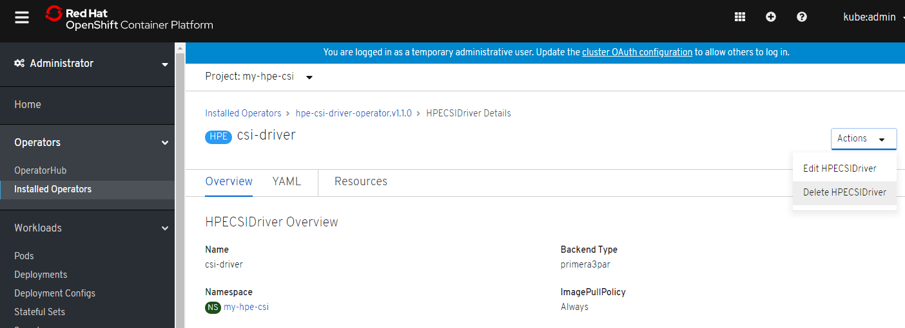
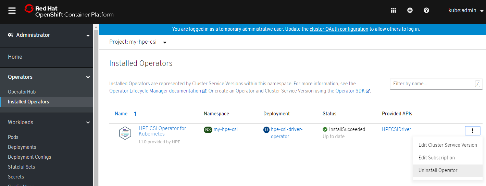

# Overview

The HPE 3PAR and Primera CSP is the reference implementation for the [HPE CSI Driver for Kubernetes](../../csi_driver/index.md). The CSP abstract the data management capabilities of the array for use by Kubernetes.

[TOC]

## Platform requirements

### HPE 3PAR and Primera Storage Platform Requirements

|  CSI |  CSP |  Linux OS  |  OpenShift  |  Kubernetes  | 3PAR and Primera OS  |
|------|------|------------|-------------|--------------|----------------------|
|v1.1.1|v1.0.0|<ul><li>CentOS: 7.7</li><li>RHEL: 7.6, 7.7 / RHCOS</li></ul>|<ul><li>OpenShift 4.2 with RHEL 7.6 or 7.7 or RHCOS as worker nodes</li></ul>| K8s 1.16, 1.17 |<ul><li>3PAR OS: 3.3.1 (FC & iSCSI)</li><li>Primera OS: 4.0.0, 4.1.0 (FC only)</li><ul>|

!!! Important
    &emsp;- Minimum 2 iSCSI IP ports should be in ready state<br>
    &emsp;- FC array should be in ready state and zoned with initiator hosts<br>
    &emsp;- FC supported only on Bare metal and Fabric SAN

## Deployment
Refer [Deployment](../../csi_driver/deployment.md).

### Deploying to Kubernetes

#### Install
[Deploy using Helm](../../csi_driver/deployment.md#helm)

!!! Important
    Only Helm3 supported

#### Post-Install

Verify helm deployment
```markdown
$ helm ls -n kube-system
NAME    NAMESPACE       REVISION        UPDATED                                 STATUS          CHART                   APP VERSION
hpe-csi kube-system     1               2020-04-20 10:12:52.625989599 +0530 IST deployed        hpe-csi-driver-1.2.0    1.1.1
```

Verify CSI resources are deployed and running
```markdown
$ kubectl get all -n kube-system | grep csi
pod/hpe-csi-controller-84d8569476-t27gb                          5/5     Running   0          30m
pod/hpe-csi-node-mbxmd                                           2/2     Running   0          30m
pod/hpe-csi-node-zqn8l                                           2/2     Running   0          30m
daemonset.apps/hpe-csi-node   2         2         2       2            2           <none>                        30m
deployment.apps/hpe-csi-controller   1/1     1            1           30m
replicaset.apps/hpe-csi-controller-84d8569476   1         1         1       30m
```

Verify 3PAR/Primera CSP resources are deployed and running
```markdown
$ kubectl get all -n kube-system | grep primera
pod/primera3par-csp-66f775b555-fst5r                             1/1     Running   0          32m
service/primera3par-csp-svc   ClusterIP   10.106.209.207   <none>        8080/TCP                 32m
deployment.apps/primera3par-csp      1/1     1            1           32m
replicaset.apps/primera3par-csp-66f775b555      1         1         1       32m

$ kubectl get secret -n kube-system |grep primera
primera3par-secret                               Opaque                                5      34m
```

Verify images for CSI and CSP driver version installed
```markdown
$ kubectl describe pod/hpe-csi-controller-84d8569476-t27gb -n kube-system | grep csi-driver | grep Image
    Image:         hpestorage/csi-driver:v1.1.1
    Image ID:      docker-pullable://docker.io/hpestorage/csi-driver@sha256:ee34278175e4fdba0f323c8c86a8292a9fdb60af796f2f1b83f62b7bfb5f4974

$ kubectl describe pod/primera3par-csp-66f775b555-fst5r -n kube-system | grep Image
    Image:          hpestorage/primera3par-csp:v1.0.0
    Image ID:       docker-pullable://docker.io/hpestorage/primera3par-csp@sha256:7697caceed28f7d369b81a215666a1bfb4303e6209383a07e7eff0d4cca1f9df
```

Verify CRDs are installed
```markdown
$ kubectl get crd |grep hpe
hpenodeinfos.storage.hpe.com                     2020-04-20T05:23:15Z
hpevolumeinfos.storage.hpe.com                   2020-04-20T05:23:15Z
```

#### Un-install

Uninstall helm chart
```markdown
$ helm uninstall hpe-csi -n kube-system
release "hpe-csi" uninstalled
```

Verify Chart is deleted
```markdown
$ helm ls -n kube-system
NAME    NAMESPACE       REVISION        UPDATED STATUS  CHART   APP VERSION
```

Verify no **hpe*** resources found other than the default pods
```markdown
$ kubectl get pods -n kube-system |grep hpe
etcd-k8s-master00.in.rdlabs.hpecorp.net                      1/1     Running   5          73d
kube-apiserver-k8s-master00.in.rdlabs.hpecorp.net            1/1     Running   5          73d
kube-controller-manager-k8s-master00.in.rdlabs.hpecorp.net   1/1     Running   5          73d
kube-scheduler-k8s-master00.in.rdlabs.hpecorp.net            1/1     Running   4          73d
```

!!! Caution
    CRDs will not be removed as part of helm uninstall

### Deploying to OpenShift

#### Install
[Deploy using Operator](../../csi_driver/deployment.md#operator)

#### Post-Install

#### Un-install
Delete HPECSIDriver via OCP web console



Verify controller and node pods are deleted
```markdown
$ oc get all -n my-hpe-csi
NAME                                          READY   STATUS    RESTARTS   AGE
pod/hpe-csi-driver-operator-f875b5879-4lxqc   1/1     Running   0          28m

NAME                                      READY   UP-TO-DATE   AVAILABLE   AGE
deployment.apps/hpe-csi-driver-operator   1/1     1            1           28m

NAME                                                DESIRED   CURRENT   READY   AGE
replicaset.apps/hpe-csi-driver-operator-f875b5879   1         1         1       28m
```

Delete HPE CSI Operator via OCP web console



Verify no resources found after deletion
```markdown
$ oc get all -n my-hpe-csi
No resources found.
```

## Getting Started
Get started using the Container Storage Provider by setting up `Secret`, `StorageClass`, `PVC` API objects.

### Block storage Usage Table
| CSP for 3PAR and Primera v1.0.0| Feature supported on K8S | Feature supported on OpenShift | Notes    |
|--------------------------------|--------------------------|--------------------------------|----------|
|<br>Dynamic provisioning:<br><ul><li>Create volume</li><li>Delete volume</li><li>List volume</li></ul>|YES|  YES ||
| Volume Expansion | YES   |   NO   | k8s version 1.16 onwards |
| Multi User        | YES   |   YES  | |
| Publish/Unpublish volumes |  YES   |   YES  |      |
| Snapshot and Clone  |  YES  |   NO  | k8s version 1.17 onwards|

!!! Note
    Multi-domain support<br>
    &emsp;- CPG can be associated with a domain<br>
    &emsp;- The user supplied in the secret file of the backend, should have access to all domains<br>
    &emsp;- Role of this user should be either super/edit

### Step 1: Create a secret
Replace the `password` string (`YWRtaW4=`) below with a base64 encoded version of your password and replace the `backend` with your array IP address and save it as `hpe3parprimera-secret.yaml`.

```yaml
apiVersion: v1
kind: Secret
metadata:
  name: hpe3parprimera-secret 
  namespace: kube-system
stringData:
  serviceName: primera3par-csp-svc
  servicePort: "8080"
  backend: 192.168.1.1
  username: admin  
data:
  # echo -n "admin" | base64
  password: YWRtaW4=
```

Create the secret:

```markdown
$ kubectl create -f hpe-secret.yaml
secret "hpe3parprimera-secret" created
```

You should now see the HPE secret in the `kube-system`(K8S)/`hpe-csi`(OpenShift) namespace.

### Step 2: Create a storage class

**Common parameters for provisioning**

These parameters are used for volume provisioning on supported platform.

|    Parameter      |  Option | Description | 3PAR | Primera |
| ----------------- | ------- | ----------- | ---- | ------- |
| accessProtocol    |   fc    | The access protocol to use when accessing the persistent volume | X | X |
| accessProtocol    |  iscsi  | The access protocol to use when accessing the persistent volume | X |   |
| cpg               |  Text   | The name of existing CPG to be used for volume provisioning     | X | X |
| snap_cpg          |  Text   | The name of the snapshot CPG to be used for volume provisioning. Defaults to value of `cpg` if not specified. | X | X |
| compression       | Boolean | Indicates that the volume should be compressed | X | |
| provisioning_type |  tpvv   | Indicates Thin provisioned volume type | X | X |
| provisioning_type |  full   | Indicates Full provisioned volume type | X | |
| provisioning_type |  dedup  | Indicates Thin Deduplication volume type | X | |
| provisioning_type |  reduce | Indicates Thin Deduplication/Compression volume type | | X |

Save below file as `3par-sc.yaml`.

```yaml
apiVersion: storage.k8s.io/v1
kind: StorageClass
metadata:
  name: 3par-sc
provisioner: csi.hpe.com
allowVolumeExpansion: true
parameters:
  csi.storage.k8s.io/fstype: ext4
  csi.storage.k8s.io/provisioner-secret-name: hpe3parprimera-secret
  csi.storage.k8s.io/provisioner-secret-namespace: kube-system
  csi.storage.k8s.io/controller-publish-secret-name: hpe3parprimera-secret
  csi.storage.k8s.io/controller-publish-secret-namespace: kube-system
  csi.storage.k8s.io/node-stage-secret-name: hpe3parprimera-secret
  csi.storage.k8s.io/node-stage-secret-namespace: kube-system
  csi.storage.k8s.io/node-publish-secret-name: hpe3parprimera-secret
  csi.storage.k8s.io/node-publish-secret-namespace: kube-system
  csi.storage.k8s.io/controller-expand-secret-name: hpe3parprimera-secret
  csi.storage.k8s.io/controller-expand-secret-namespace: kube-system
  # Use pre-existing CPG on 3PAR/Primera
  cpg: "FC_r6"
  provisioning_type: "tpvv"
  accessProtocol: "iscsi"
```

create a storage class
```markdown
$ kubectl create -f 3par-sc.yaml
```

### Step 3: Create a PVC

Save below file as `pvc-minio.yaml`.

```yaml
kind: PersistentVolumeClaim
apiVersion: v1
metadata:
  name: pvc-minio
spec:
  accessModes:
    - ReadWriteOnce
  resources:
    requests:
      storage: 19Gi
  storageClassName: 3par-sc
```

create a PVC
```
$ kubectl create -f pvc-minio.yaml
```

### Step 4: Create a POD

Save below file as `pod-hpe.yaml`.

```yaml
kind: Pod
apiVersion: v1
metadata:
  name: pod-hpe
spec:
  containers:
  - name: minio
    image: minio/minio:latest
    args:
    - server
    - /export
    env:
    - name: MINIO_ACCESS_KEY
      value: minio
    - name: MINIO_SECRET_KEY
     value: doryspeakswhale
    ports:
    - containerPort: 9000
    volumeMounts:
    - name: export
      mountPath: /export
  volumes:
    - name: export
      persistentVolumeClaim:
        claimName: pvc-minio
```

create a POD
```markdown
$ kubectl create -f pod-hpe.yaml
```

### Step 5: Create a snapshot
Refer [enable CSI snapshot](../../csi_driver/using.md#enabling_csi_snapshots) for more details.

**VolumeSnapshotClass parameters**

These parameters are for `VolumeSnapshotClass` objects when using CSI snapshots. Please see [using CSI snapshots](../../csi_driver/using.md#using_csi_snapshots) for more details.

| Parameter   | String  | Description |
| ----------- | ------  | ----------- |
|  read_only  | Boolean | <li><b>true</b>: Specifies that the copied volume is read-only</li><li><b>false</b>: (default) The volume is read/write</li> |

### Step 6: Create a clone

Save below file as `clonePVC.yaml`.

```yaml
apiVersion: v1
kind: PersistentVolumeClaim
metadata:
  name: pvc-clone-1
spec:
  storageClassName: 3par-sc
  dataSource:  
    name: pvc-minio
    kind: PersistentVolumeClaim
  accessModes:
    - ReadWriteOnce
  resources:
    requests:
      storage: 19Gi
```

create a clone
```markdown
$ kubectl create -f clonePVC.yaml
```

!!! Note
    While creating a clone of a PVC, storage should be of same size that of PVC. Only online copy is supported.

### Step 7: Expand Volume
Refer [expand volume](../../csi_driver/using.md#expanding_pvcs) for more details.

## Diagnostics and Troubleshooting
### Pre-requisites check
#### Check if all the pods are running 

* One node plugin on every worker node
* One controller pod across the cluster, and
* One csp pod across the cluster

Confirm it, by

* Check for worker nodes
```markdown
$ kubectl get nodes -o wide
NAME               STATUS   ROLES    AGE   VERSION   INTERNAL-IP      EXTERNAL-IP   OS-IMAGE                KERNEL-VERSION          CONTAINER-RUNTIME
cssosbe01-196119   Ready    master   39d   v1.16.6   192.168.196.119   <none>        CentOS Linux 7 (Core)   3.10.0-957.el7.x86_64   docker://18.9.7
cssosbe01-196120   Ready    master   39d   v1.16.6   192.168.196.120   <none>        CentOS Linux 7 (Core)   3.10.0-957.el7.x86_64   docker://18.9.7
cssosbe01-196121   Ready    master   39d   v1.16.6   192.168.196.121   <none>        CentOS Linux 7 (Core)   3.10.0-957.el7.x86_64   docker://18.9.7
cssosbe01-196150   Ready    <none>   39d   v1.16.6   192.168.196.150   <none>        CentOS Linux 7 (Core)   3.10.0-957.el7.x86_64   docker://18.9.7
cssosbe01-196151   Ready    <none>   39d   v1.16.6   192.168.196.151   <none>        CentOS Linux 7 (Core)   3.10.0-957.el7.x86_64   docker://18.9.7
```
* Check for Controller, CSP and Node Plugin pods
```markdown
$ kubectl get pods -o wide -n kube-system | grep hpe
hpe-csi-controller-84bdfc8df6-m2wxk        4/4     Running   0          42h   192.168.196.150   cssosbe01-196150   <none>           <none>
hpe-csi-node-cbvcl                         2/2     Running   0          42h   192.168.196.151   cssosbe01-196151   <none>           <none>
hpe-csi-node-w8hx5                         2/2     Running   0          42h   192.168.196.150   cssosbe01-196150   <none>           <none>
primera3par-csp-778cf87c8b-mffh2           1/1     Running   0          42h   192.168.196.150   cssosbe01-196150   <none>           <none>
```
* Check for REST endpoint of CSP service is reachable
    - CSP (Container Storage Provider) hosts a REST server on port 8080 for the CSI controller/node plugin to communicate
    - If the CSP REST endpoint on above port is not reachable, it will lead to failure in provisioning and pod mount operations.

To check whether this Service is up or not, the user can confirm it by
```markdown
$ kubectl get services -n kube-system
NAME                     TYPE        CLUSTER-IP       EXTERNAL-IP   PORT(S)                  AGE
primera3par-csp-svc   ClusterIP   10.111.253.102   <none>        8080/TCP                 14h
kube-dns                 ClusterIP   10.96.0.10       <none>        53/UDP,53/TCP,9153/TCP   141d
``` 
`primera3par-csp-svc` is the kubernetes service which exposes the REST server running in the CSP pod to the external services via kubernetes internal networking
Try making a health check call like
```markdown
export no_proxy=$no_proxy,10.111.253.102
curl http://10.111.253.102:8080/
```
If the above call goes fine "Welcome!" will be listed

- Check for the multipath file in worker nodes
Eg. /etc/multipath.conf
```markdown
defaults {
    find_multipaths     no
    user_friendly_names yes
}
blacklist {
    devnode "^(ram|raw|loop|fd|md|dm-|sr|scd|st)[0-9]*"
    devnode "^hd[a-z]"
    device {
        product ".*"
        vendor  ".*"
    }
}
blacklist_exceptions {
    property "(ID_WWN|SCSI_IDENT_.*|ID_SERIAL)"
    device {
        vendor  "Nimble"
        product "Server"
    }
    device {
        product "VV"
        vendor  "3PARdata"
    }
}
devices {
    device {
        prio                 alua
        dev_loss_tmo         infinity
        rr_weight            uniform
        path_checker         tur
        hardware_handler     "1 alua"
        rr_min_io_rq         1
        no_path_retry        30
        path_grouping_policy group_by_prio
        vendor               "Nimble"
        failback             immediate
        product              "Server"
        fast_io_fail_tmo     5
        path_selector        "service-time 0"
    }
}
```
* CSP log file is in the node which runs the csp service (cssosbe01-196150 in above example), Log location `/var/log/hpe-3par-primera-csp.log`
* Controller plugin log is in node where the hpe-csi-controller* pod (eg 192.168.196.150) is running. Log location: `/var/log/hpe-csi-controller.log`
* Node plugin log is in node where the  hpe-csi-node* pod is running (eg. ip ending with 150,151) , Log location: `/var/log/hpe-csi-node.log`

### Logging levels 
* Log levels are controlled by the environment variable LOG_LEVEL
* Log level `trace` is the most extensive logging
```yaml
 - name: hpe-csi-driver
          image: hpestorage/csi-driver:v1.1.1
          args :
            - "--endpoint=$(CSI_ENDPOINT)"
            - "--flavor=kubernetes"
          env:
            - name: CSI_ENDPOINT
              value: unix:///var/lib/csi/sockets/pluginproxy/csi.sock
            - name: LOG_LEVEL
              value: trace
```

### Steps to debug if the pods are in "ContainerCreating" state
* Identify the pod which is in "ContainerCreating" state
```markdown
$ kubectl get pods --all-namespaces -o wide
NAMESPACE     NAME                                                             READY   STATUS              RESTARTS   AGE    IP               NODE                                     NOMINATED NODE   READINESS GATES
kube-system   coredns-6955765f44-pfwwj                                         1/1     Running             0          2d2h   10.244.0.2       cssosbe01-196113.in.rdlabs.hpecorp.net   <none>           <none>
kube-system   coredns-6955765f44-wlm5g                                         1/1     Running             0          2d2h   10.244.0.3       cssosbe01-196113.in.rdlabs.hpecorp.net   <none>           <none>
kube-system   etcd-cssosbe01-196113.in.rdlabs.hpecorp.net                      1/1     Running             0          2d2h   192.168.196.113   cssosbe01-196113.in.rdlabs.hpecorp.net   <none>           <none>
kube-system   hpe-csi-controller-5b69668588-mk74b                              4/4     Running             0          21h    192.168.196.115   cssosbe01-196115.in.rdlabs.hpecorp.net   <none>           <none>
kube-system   hpe-csi-node-96b5c                                               0/2     ContainerCreating   0          21h    192.168.196.115   cssosbe01-196115.in.rdlabs.hpecorp.net   <none>           <none>
kube-system   hpe-csi-node-p9655                                               0/2     ContainerCreating   0          21h    192.168.196.114   cssosbe01-196114.in.rdlabs.hpecorp.net   <none>           <none>
```

* Execute `kubectl describe pod <pod-name> -n kube-system`
```markdown
$ kubectl describe pod hpe-csi-node-96b5c -n kube-system
Name:                 hpe-csi-node-96b5c
Namespace:            kube-system
Priority:             2000001000
Priority Class Name:  system-node-critical
Node:                 cssosbe01-196115.in.rdlabs.hpecorp.net/192.168.196.115
Start Time:           Wed, 05 Feb 2020 06:46:05 -0500
Labels:               app=hpe-csi-node
                      controller-revision-hash=764cb85467
                      pod-template-generation=1
                      role=hpe-csi
Annotations:          <none>
Status:               Pending
IP:                   192.168.196.115
IPs:
  IP:           192.168.196.115
Controlled By:  DaemonSet/hpe-csi-node
Containers:
  csi-node-driver-registrar:
    Container ID:
    Image:         quay.io/k8scsi/csi-node-driver-registrar:v1.1.0
    Image ID:
    Port:          <none>
    Host Port:     <none>
    Args:
      --csi-address=$(ADDRESS)
      --kubelet-registration-path=$(DRIVER_REG_SOCK_PATH)
      --v=5
    State:          Waiting
      Reason:       ContainerCreating
    Ready:          False
    Restart Count:  0
    Environment:
      ADDRESS:               /csi/csi.sock
      DRIVER_REG_SOCK_PATH:  /var/lib/kubelet/plugins/csi.hpe.com/csi.sock
    Mounts:
      /csi/ from plugin-dir (rw)
      /registration from registration-dir (rw)
      /var/run/secrets/kubernetes.io/serviceaccount from hpe-csi-node-sa-token-kx95r (ro)
  hpe-csi-driver:
    Container ID:
    Image:         hpestorage/csi-driver:v1.1.1
    Image ID:
    Port:          <none>
    Host Port:     <none>
    Args:
      --endpoint=$(CSI_ENDPOINT)
      --node-service
      --flavor=kubernetes
    State:          Waiting
      Reason:       ContainerCreating
    Ready:          False
    Restart Count:  0
    Environment:
      CSI_ENDPOINT:  unix:///csi/csi.sock
    Mounts:
      /csi from plugin-dir (rw)
      /dev from device-dir (rw)
      /etc/hpe-storage from etc-hpe-storage-dir (rw)
      /etc/iscsi from etc-iscsi (rw)
      /etc/kubernetes from etc-kubernetes (rw)
      /etc/multipath from etc-multipath (rw)
      /etc/multipath.conf from etc-multipath-conf (rw)
      /etc/os-release from etc-os-release (rw)
      /etc/redhat-release from etc-redhat-release (rw)
      /lib/modules from lib-modules (rw)
      /lib/systemd/system from libsystemd (rw)
      /opt/hpe-storage/nimbletune/config.json from linux-config-file (rw,path="config.json")
      /run/lock from runlock (rw)
      /run/systemd from runsystemd (rw)
      /sbin/iscsiadm from iscsiadm (rw)
      /sys from sys (rw)
      /usr_local from usrlocal (rw)
      /var/lib/iscsi from var-lib-iscsi (rw)
      /var/lib/kubelet from pods-mount-dir (rw)
      /var/log from log-dir (rw)
      /var/run/secrets/kubernetes.io/serviceaccount from hpe-csi-node-sa-token-kx95r (ro)
Conditions:
  Type              Status
  Initialized       True
  Ready             False
  ContainersReady   False
  PodScheduled      True
Volumes:
  registration-dir:
    Type:          HostPath (bare host directory volume)
    Path:          /var/lib/kubelet/plugins_registry
    HostPathType:
  plugin-dir:
    Type:          HostPath (bare host directory volume)
    Path:          /var/lib/kubelet/plugins/csi.hpe.com
    HostPathType:
  pods-mount-dir:
    Type:          HostPath (bare host directory volume)
    Path:          /var/lib/kubelet
    HostPathType:
  device-dir:
    Type:          HostPath (bare host directory volume)
    Path:          /dev
    HostPathType:
  log-dir:
    Type:          HostPath (bare host directory volume)
    Path:          /var/log
    HostPathType:
  var-lib-iscsi:
    Type:          HostPath (bare host directory volume)
    Path:          /var/lib/iscsi
    HostPathType:
  etc-iscsi:
    Type:          HostPath (bare host directory volume)
    Path:          /etc/iscsi
    HostPathType:
  etc-multipath:
    Type:          HostPath (bare host directory volume)
    Path:          /etc/multipath
    HostPathType:
  etc-multipath-conf:
    Type:          HostPath (bare host directory volume)
    Path:          /etc/multipath.conf
    HostPathType:  FileOrCreate
  etc-redhat-release:
    Type:          HostPath (bare host directory volume)
    Path:          /etc/redhat-release
    HostPathType:  FileOrCreate
  etc-os-release:
    Type:          HostPath (bare host directory volume)
    Path:          /etc/os-release
    HostPathType:  FileOrCreate
  etc-hpe-storage-dir:
    Type:          HostPath (bare host directory volume)
    Path:          /etc/hpe-storage
    HostPathType:
  etc-kubernetes:
    Type:          HostPath (bare host directory volume)
    Path:          /etc/kubernetes
    HostPathType:
  iscsiadm:
    Type:          HostPath (bare host directory volume)
    Path:          /sbin/iscsiadm
    HostPathType:  FileOrCreate
  runlock:
    Type:          HostPath (bare host directory volume)
    Path:          /run/lock
    HostPathType:
  lib-modules:
    Type:          HostPath (bare host directory volume)
    Path:          /lib/modules
    HostPathType:
  runsystemd:
    Type:          HostPath (bare host directory volume)
    Path:          /run/systemd
    HostPathType:
  libsystemd:
    Type:          HostPath (bare host directory volume)
    Path:          /lib/systemd/system
    HostPathType:
  usrlocal:
    Type:          HostPath (bare host directory volume)
    Path:          /usr
    HostPathType:
  sys:
    Type:          HostPath (bare host directory volume)
    Path:          /sys
    HostPathType:
  linux-config-file:
    Type:      ConfigMap (a volume populated by a ConfigMap)
    Name:      hpe-linux-config
    Optional:  false
  hpe-csi-node-sa-token-kx95r:
    Type:        Secret (a volume populated by a Secret)
    SecretName:  hpe-csi-node-sa-token-kx95r
    Optional:    false
QoS Class:       BestEffort
Node-Selectors:  <none>
Tolerations:     node.kubernetes.io/disk-pressure:NoSchedule
                 node.kubernetes.io/memory-pressure:NoSchedule
                 node.kubernetes.io/network-unavailable:NoSchedule
                 node.kubernetes.io/not-ready:NoExecute
                 node.kubernetes.io/pid-pressure:NoSchedule
                 node.kubernetes.io/unreachable:NoExecute
                 node.kubernetes.io/unschedulable:NoSchedule
Events:
  Type     Reason       Age                        From                                             Message
  ----     ------       ----                       ----                                             -------
  Warning  FailedMount  <invalid> (x667 over 20h)  kubelet, cssosbe01-196115.in.rdlabs.hpecorp.net  (combined from similar events): Unable to attach or mount volumes: unmounted volumes=[linux-config-file], unattached volumes=[etc-kubernetes log-dir etc-os-release usrlocal pods-mount-dir device-dir lib-modules etc-hpe-storage-dir libsystemd etc-redhat-release plugin-dir registration-dir etc-multipath var-lib-iscsi runsystemd hpe-csi-node-sa-token-kx95r sys iscsiadm linux-config-file runlock etc-iscsi etc-multipath-conf]: timed out waiting for the condition
  Warning  FailedMount  <invalid> (x537 over 21h)  kubelet, cssosbe01-196115.in.rdlabs.hpecorp.net  MountVolume.SetUp failed for volume "linux-config-file" : configmap "hpe-linux-config" not found
```
- In the above example you can see the configmap "hpe-linux-config" is missing due to which the pods is not getting initialized.
- Execute `wget https://github.com/hpe-storage/co-deployments/raw/master/yaml/csi-driver/v1.1.0/hpe-linux-config.yaml` to get the hpe-linux-config.yaml to create the above configmap
- Execute `kubectl create -f hpe-linux-config.yaml`

### PVC Creation in "Pending" state
* Log in to the worker node where the CSP pod is running
* vi `/var/log/hpe-3par-primera-csp.log`

Eg. Here the volume creation fails for "Invalid CPG" as shown in the below log.
```markdown
time="2020-02-06T05:08:06-05:00" level=info msg="<<<<<< Get Volume By Name" file="request_handler.go:187"
time="2020-02-06T05:08:06-05:00" level=info msg=">>>>> Create Volume Call " file="request_handler.go:85"
time="2020-02-06T05:08:06-05:00" level=info msg="Create volume request is : %v {\"data\":{\"name\":\"pvc-0647b318-1291-4c93-b77e-1dcbeeb3ccc2\",\"size\":20401094656,\"config\":{\"access_protocol\":\"iscsi\",\"cpg\":\"FC_rq\",\"multi_initiator\":false,\"provisioning_type\":\"tpvv\"}}}\n" file="create_volume_request.go:72"
time="2020-02-06T05:08:06-05:00" level=info msg="Create volume request (after unmarshal): \n &{{pvc-0647b318-1291-4c93-b77e-1dcbeeb3ccc2 20401094656  {FC_rq  tpvv false}}}" file="request_handler.go:94"
time="2020-02-06T05:08:06-05:00" level=info msg="Session key from request header:  0-f980989b2c51e09f427212939181b9e9-7de93b5e" file="request_handler.go:97"
time="2020-02-06T05:08:06-05:00" level=info msg="Array IP received:  15.212.195.246" file="request_handler.go:99"
time="2020-02-06T05:08:06-05:00" level=info msg="<<<<< Create Volume Cmd" file="create_volume_cmd.go:50"
time="2020-02-06T05:08:06-05:00" level=info msg="Create Volume Request: [&{pvc-0647b318-1291-4c93-b77e-1dc %!s(int64=19456)  FC_rq FC_rq %!s(bool=true) %!s(bool=false) %!s(bool=false)}]" file="volume_client.go:16"
time="2020-02-06T05:08:06-05:00" level=info msg="OK: Response status is :  404 Not Found" file="rest_client.go:27"
time="2020-02-06T05:08:06-05:00" level=info msg="Create volumes response: {\"code\":15,\"desc\":\"CPG does not exist\"}" file="client.go:73"
time="2020-02-06T05:08:06-05:00" level=info msg="Error creating volume:  404 Not Found" file="create_volume_cmd.go:58"
time="2020-02-06T05:08:06-05:00" level=info msg=">>>>> Create Volume Cmd" file="create_volume_cmd.go:79"
time="2020-02-06T05:08:06-05:00" level=info msg=" <<<<< Create Volume Call" file="request_handler.go:114"
```

### Known Limitations
* If StorageClass (SC), Persistent Volume Claim (PVC), POD definitions are present in same YAML file, and if `kubectl delete -f <file>.yaml`
is done, there is a possibility of StorageClass or PVC being deleted before the POD is deleted. And this will
lead to accidental deletion of SC/PVC. It's recommended to get the individual objects like `kubectl get <object>` and issue `kubectl delete <object>`
* Array users (in both 3PAR and Primera) should have super/edit privileges to allow these users to do host creation.
* OpenShift 4.2 runs on Kubernetes 1.14.x due to which there is no support for volume expansion, clone/snapshot capability.
* Due to RWO (constraint) in `accessMode` of PVC, the block volume associated with the PVC can only be used exclusively on a single worker node of kubernetes
* Clone volume creation requires the user to provide the same size as that of the source volume to be created. For eg. if the source volume is 20GiB, then the clone volume size also should match the same size.
This operation is performed on the target array as online copy process and there will be asynchronous task created for the same.
`kubectl describe hpevolumeinfo <pv-name>` can be used for getting the status of the clone operation.
* Uninstall of the CSI driver does'nt remove Custom Resource Definitions like HPEVolumeInfo, HPENodeInfo etc.
Also this operation doesn't delete the user created PVC/PV and SC objects.
* CHAP must be enabled on the host before deploying CSI driver on the cluster if user wants CHAP feature.
Set `node.session.auth.authmethod`, `node.session.auth.username` and `node.session.auth.password` in `/etc/iscsi/iscsid.conf` to enable CHAP on host.
Value for `node.session.auth.authmethod` must be set to `CHAP`.

### Responsibilities for Controller/Node/CSP plugin
* Controller pod is responsible for create volume/delete volume calls. Also calls "Create host", "publish volume" calls via CSP
* Node plugin is responsible for rescan of the scsi devices (as part of `NodeStageVolume`) and creating a temporary staging location for node
* Node plugin as initiates `NodePublishVolume` after doing staging process in step 2, and does the bind mount of the staging location to the actual pod mount directory.
* CSP plugin supplies the REST response for each of the controller/node plugin operation

### Support
Limited to the plug-in only, best effort support is available for HPE 3PAR and HPE Primera controllers supported by the plug-in and bundled with All Inclusive software with an active HPE Pointnext support agreement. Since the HPE Pointnext support for the plug-in is best effort only, any other support levels like Warranty, Foundation Care, Proactive Care, Proactive Care Advanced and Datacenter Care or other support levels do not apply to the plug-in. Best effort response times are based on local standard business days and working hours. If your location is outside the customary service zone, response time may be longer.