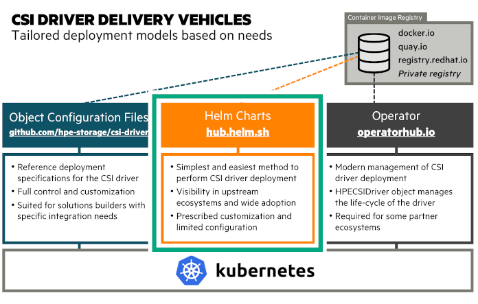

# Overview

The HPE CSI Driver is deployed by using industry standard means, either a Helm chart or an Operator. An "advanced install" from object configuration files is provided as reference for partners, OEMs and users wanting to perform customizations and their own packaging or deployment methodologies.

[TOC]

## Delivery Vehicles

As different methods of installation are provided, it might not be too obvious which delivery vehicle is the right one.



### Need Help Deciding?

| I have a...                       | Then you need...              |
| --------------------------------- | ----------------------------- |
| Vanilla upstream Kubernetes cluster on a supported host OS. | The [Helm chart](#helm) |
| Red Hat OpenShift 4.x cluster.         | The [certified CSI operator for OpenShift](partners/redhat_openshift/index.md) |
| Supported environment with multiple backends. | [Helm chart](#helm) with additional [Secrets](#secret_parameters) and [StorageClasses](using.md#base_storageclass_parameters) |
| HPE Ezmeral Runtime Enterprise environment. | The [Helm chart](#helm) |
| Operator Life-cycle Manager (OLM) environment. | The [CSI operator](#operator) |
| Unsupported host OS/Kubernetes cluster and like to tinker. | The [advanced install](#advanced_install) |
| Supported platform in an air-gapped environment | The [Helm chart](#helm) using the air-gapped procedure |

!!! error "Undecided?"
    If it's not clear what you should use for your environment, the Helm chart is most likely the correct answer.

## Helm

[Helm](https://helm.sh) is the package manager for Kubernetes. Software is being delivered in a format designated as a "chart". Helm is a [standalone CLI](https://helm.sh/docs/intro/install/) that interacts with the Kubernetes API server using your `KUBECONFIG` file.

The official Helm chart for the HPE CSI Driver for Kubernetes is hosted on [Artifact Hub](https://artifacthub.io/packages/helm/hpe-storage/hpe-csi-driver). The chart only supports Helm 3 from version 1.3.0 of the HPE CSI Driver. In an effort to avoid duplicate documentation, please see the chart for instructions on how to deploy the CSI driver using Helm.

- Go to the chart on [Artifact Hub](https://artifacthub.io/packages/helm/hpe-storage/hpe-csi-driver).

### Helm for Air-gapped Environments

In the event of deploying the HPE CSI Driver in a secure air-gapped environment, Helm is the recommended method. For sake of completeness, it's also possible to follow the [advanced install](#advanced_install) procedures and replace "quay.io" in the deployment manifests with the internal private registry location.

Establish a working directory on a bastion Linux host that has HTTP access to the Internet, the private registry and the Kubernetes cluster where the CSI driver needs to be installed. The bastion host is assumed to have the `docker`, `helm` and `curl` command installed. It's also assumed throughout that the user executing `docker` has logged in to the private registry and that pulling images from the private registry is allowed anonymously by the Kubernetes compute nodes.

!!! note
    Only the HPE CSI Driver 1.4.0 and later is supported using this methodology.

Create a working directory and set environment variables referenced throughout the procedure. In this example, we'll use HPE CSI Driver v2.5.0 on Kubernetes 1.30. Available versions are found in the [co-deployments GitHub repo](https://github.com/hpe-storage/co-deployments/tree/master/yaml/csi-driver).

```text
mkdir hpe-csi-driver
cd hpe-csi-driver
export MY_REGISTRY=registry.enterprise.example.com
export MY_CSI_DRIVER=2.5.0
export MY_K8S=1.30
```

Next, create a list with the CSI driver images. Copy and paste the entire text blob in one chunk.

```text
curl -s https://raw.githubusercontent.com/hpe-storage/co-deployments/master/yaml/csi-driver/v${MY_CSI_DRIVER}/hpe-csi-k8s-${MY_K8S}.yaml \
        https://raw.githubusercontent.com/hpe-storage/co-deployments/master/yaml/csi-driver/v${MY_CSI_DRIVER}/nimble-csp.yaml \
        https://raw.githubusercontent.com/hpe-storage/co-deployments/master/yaml/csi-driver/v${MY_CSI_DRIVER}/3par-primera-csp.yaml \
| grep image: | awk '{print $2}' | sort | uniq > images
echo quay.io/hpestorage/nfs-provisioner:v3.0.5 >> images
```

!!! important
    In HPE CSI Driver 2.4.2 and earlier the NFS Server Provisioner image is not automatically pulled from the private registry once installed. Use the "nfsProvisionerImage" parameter in the [`StorageClass`](using.md#base_storageclass_parameters).

The above command should not output anything. A list of images should be in the file "images".

Pull, tag and push the images to the private registry.

```text
cat images | xargs -n 1 docker pull
awk '{ print $1" "$1 }' images | sed -E -e "s/ quay.io| registry.k8s.io/ ${MY_REGISTRY}/" | xargs -n 2 docker tag
sed -E -e "s/quay.io|registry.k8s.io/${MY_REGISTRY}/" images | xargs -n 1 docker push
```

!!! tip
    Depending on what kind of private registry being used, the base repositories `hpestorage` and `sig-storage` might need to be created and given write access to the user pushing the images.

Next, install the chart as normal with the additional `registry` parameter. This is an example, please refer to the Helm [chart documentation](https://artifacthub.io/packages/helm/hpe-storage/hpe-csi-driver#installing-the-chart) on ArtifactHub.

```text
helm repo add hpe-storage https://hpe-storage.github.io/co-deployments/
kubectl create ns hpe-storage
```

Version 2.4.2 or earlier.

```text
helm install my-hpe-csi-driver hpe-storage/hpe-csi-driver -n hpe-storage --version ${MY_CSI_DRIVER} --set registry=${MY_REGISTRY}
```

Version 2.5.0 or newer, skip to → [Version 2.5.0 and newer](#version_250_and_newer).

!!! note
    If the client running `helm` is in the air-gapped environment as well, the [docs](https://github.com/hpe-storage/co-deployments/tree/master/docs) directory needs to be hosted on a web server in the air-gapped environment, and then use `helm repo add hpe-storage https://my-web-server.internal/docs` above instead.

#### Version 2.5.0 and newer

In version 2.5.0 and onwards, all images used by the HPE CSI Driver for Kubernetes Helm Chart are parameterized individually with the fully qualified URL.

Use the procedure above to mirror the images to an internal registry. Once mirrored, replace the registry names in the reference `values.yaml` file.

```text
curl -s https://raw.githubusercontent.com/hpe-storage/co-deployments/master/helm/values/csi-driver/v${MY_CSI_DRIVER}/values.yaml | sed -E -e "s/ quay.io| registry.k8s.io/ ${MY_REGISTRY}/g" > my-values.yaml
```

Use the `my-values.yaml` file to install the Helm Chart.

```text
helm install my-hpe-csi-driver hpe-storage/hpe-csi-driver \
-n hpe-storage --version ${MY_CSI_DRIVER} \
-f my-values.yaml
```

## Operator

The [Operator pattern](https://kubernetes.io/docs/concepts/extend-kubernetes/operator/) is based on the idea that software should be instantiated and run with a set of custom controllers in Kubernetes. It creates a native experience for any software running on Kubernetes.

The official HPE CSI Operator for Kubernetes is hosted on [OperatorHub.io](https://operatorhub.io/operator/hpe-csi-operator). The CSI Operator images are hosted both on quay.io and officially certified containers in the Red Hat Ecosystem Catalog.

### Red Hat OpenShift Container Platform

The HPE CSI Operator for Kubernetes is a fully certified Operator for OpenShift. There are a few tweaks needed and there's a separate section for OpenShift.

- See [Red Hat OpenShift](partners/redhat_openshift/index.md) in the partner ecosystem section

### Upstream Kubernetes and Others

Follow the documentation from the respective upstream distributions on how to deploy an Operator. In most cases, the Operator Lifecyle Manager (OLM) needs to be installed separately (does NOT apply to OpenShift 4 and later).

Visit the [documentation](https://github.com/operator-framework/operator-lifecycle-manager/blob/master/doc/install/install.md) in the OLM GitHub repo to learn how to install OLM.

Once OLM is operational, install the HPE CSI Operator.

```text
kubectl create -f https://operatorhub.io/install/hpe-csi-operator.yaml
```

The Operator will be installed in `my-hpe-csi-operator` namespace. Watch it come up by inspecting the `ClusterServiceVersion` (CSV).

```text
kubectl get csv -n my-hpe-csi-operator
```

Next, a `HPECSIDriver` object needs to be instantiated. Create a file named `hpe-csi-operator.yaml`, edit and apply (or copy the command from the top of the content).

```yaml fct_label="HPE CSI Operator v2.5.2"
# kubectl apply -n hpe-storage -f {{ config.site_url }}csi_driver/examples/deployment/hpecsidriver-v2.5.2-sample.yaml
FIXME
```

```yaml fct_label="v2.5.1"
# kubectl apply -n hpe-storage -f {{ config.site_url }}csi_driver/examples/deployment/hpecsidriver-v2.5.1-sample.yaml
```

```yaml fct_label="v2.4.2"
# kubectl apply -n hpe-storage -f {{ config.site_url }}csi_driver/examples/deployment/hpecsidriver-v2.4.2-sample.yaml
```

!!! tip
    The contents depends on which version of the CSI driver is installed. Please visit [OperatorHub](https://operatorhub.io/operator/hpe-csi-operator) or [ArtifactHub](https://artifacthub.io/packages/olm/community-operators/hpe-csi-operator) for more details.

The CSI driver is now ready for use. Proceed to the next section to learn about [adding an HPE storage backend](#add_an_hpe_storage_backend).

## Add an HPE Storage Backend

<a style="display: flex" id="add_a_hpe_storage_backend" class="headerlink" href="#add_a_hpe_storage_backend" title="Permanent link"></a>Once the CSI driver is deployed, two additional objects needs to be created to get started with dynamic provisioning of persistent storage, a `Secret` and a `StorageClass`.

!!! tip
    Naming the `Secret` and `StorageClass` is entirely up to the user, however, to keep up with the examples on SCOD, it's highly recommended to use the names illustrated here.

### Secret Parameters

All parameters are mandatory and described below.

| Parameter   | Description
| ----------- | -
| serviceName | This hostname or IP address where the Container Storage Provider (CSP) is running, usually a Kubernetes `Service`, such as "alletra6000-csp-svc" or "alletra9000-csp-svc"
| servicePort | This is port the `serviceName` is listening to.
| backend     | This is the management hostname or IP address of the actual backend storage system, such as an Alletra 5000/6000 or 9000 array.
| username    | Backend storage system username with the correct privileges to perform storage management.
| password    | Backend storage system password.

Example:

```yaml fct_label="Alletra Storage MP B10000"
apiVersion: v1
kind: Secret
metadata:
  name: hpe-backend
  namespace: hpe-storage
stringData:
  serviceName: alletrastoragemp-csp-svc
  servicePort: "8080"
  backend: 10.10.0.20:443
  username: 3paradm
  password: 3pardata
```

```yaml fct_label="Alletra 5000/6000"
apiVersion: v1
kind: Secret
metadata:
  name: hpe-backend
  namespace: hpe-storage
stringData:
  serviceName: alletra6000-csp-svc
  servicePort: "8080"
  backend: 192.168.1.110
  username: admin
  password: admin
```

```yaml fct_label="Alletra 9000"
apiVersion: v1
kind: Secret
metadata:
  name: hpe-backend
  namespace: hpe-storage
stringData:
  serviceName: alletra9000-csp-svc
  servicePort: "8080"
  backend: 10.10.0.20:443
  username: 3paradm
  password: 3pardata
```

```yaml fct_label="Nimble Storage"
apiVersion: v1
kind: Secret
metadata:
  name: hpe-backend
  namespace: hpe-storage
stringData:
  serviceName: nimble-csp-svc
  servicePort: "8080"
  backend: 192.168.1.2
  username: admin
  password: admin
```

```yaml fct_label="Primera"
apiVersion: v1
kind: Secret
metadata:
  name: hpe-backend
  namespace: hpe-storage
stringData:
  serviceName: primera3par-csp-svc
  servicePort: "8080"
  backend: 10.10.0.2:443
  username: 3paradm
  password: 3pardata
```

```yaml fct_label="3PAR"
apiVersion: v1
kind: Secret
metadata:
  name: hpe-backend
  namespace: hpe-storage
stringData:
  serviceName: primera3par-csp-svc
  servicePort: "8080"
  backend: 10.10.0.2
  username: 3paradm
  password: 3pardata
```

!!! caution "Improved Security"
    From v2.5.2 onwards, all HPE Alletra Storage MP B10000 derived platforms except 3PAR should include port 443 with the backend IP address (i.e "10.10.0.2:443") to prevent the CSP from using SSH.

Create the `Secret` using `kubectl`:

```text
kubectl create -f secret.yaml
```

!!! tip
    In a real world scenario it's more practical to name the `Secret` something that makes sense for the organization. It could be the hostname of the backend or the role it carries, i.e "hpe-alletra-sanjose-prod".

Next step involves [creating a default StorageClass](using.md#base_storageclass_parameters).

## Configuring Additional Storage Backends

It's not uncommon to have multiple HPE primary storage systems within the same environment, either the same family or different ones. This section walks through the scenario of managing multiple `StorageClass` and `Secret` API objects to represent an environment with multiple systems.

There's a [brief tutorial available](../learn/video_gallery/index.md#managing_multiple_hpe_storage_backends_using_the_hpe_csi_driver) in the Video Gallery that walks through these steps.

!!! Note
    Make note of the Kubernetes `Namespace` or OpenShift project name used during the deployment. In the following examples, we will be using the "hpe-storage" `Namespace`.

To view the current `Secrets` in the "hpe-storage" `Namespace` (assuming default names):

```text
kubectl -n hpe-storage get secret/hpe-backend
NAME                     TYPE          DATA      AGE
hpe-backend              Opaque        5         2m
```

This `Secret` is used by the CSI sidecars in the `StorageClass` to authenticate to a specific backend for CSI operations. In order to add a new `Secret` or manage access to multiple backends, additional `Secrets` will need to be created per backend.

!!! Note "Secret Requirements"
    * Each `Secret` name must be unique.
    * **servicePort** should be set to **8080**.

To create a new `Secret`, specify the name, `Namespace`, backend username, backend password and the backend IP address to be used by the CSP and save it as `custom-secret.yaml` (a detailed description of the parameters are [available above](#secret_parameters)).

```yaml fct_label="HPE Alletra Storage MP B10000"
apiVersion: v1
kind: Secret
metadata:
  name: custom-secret
  namespace: hpe-storage
stringData:
  serviceName: alletrastoragemp-csp-svc
  servicePort: "8080"
  backend: 10.10.0.20
  username: 3paradm
  password: 3pardata
```

```yaml fct_label="HPE Alletra 5000/6000"
apiVersion: v1
kind: Secret
metadata:
  name: custom-secret
  namespace: hpe-storage
stringData:
  serviceName: alletra6000-csp-svc
  servicePort: "8080"
  backend: 192.168.1.110
  username: admin
  password: admin
```

```yaml fct_label="HPE Alletra 9000"
apiVersion: v1
kind: Secret
metadata:
  name: custom-secret
  namespace: hpe-storage
stringData:
  serviceName: alletra9000-csp-svc
  servicePort: "8080"
  backend: 10.10.0.20
  username: 3paradm
  password: 3pardata
```

```yaml fct_label="HPE Nimble Storage"
apiVersion: v1
kind: Secret
metadata:
  name: custom-secret
  namespace: hpe-storage
stringData:
  serviceName: nimble-csp-svc
  servicePort: "8080"
  backend: 192.168.1.2
  username: admin
  password: admin
```

```yaml fct_label="HPE Primera and 3PAR"
apiVersion: v1
kind: Secret
metadata:
  name: custom-secret
  namespace: hpe-storage
stringData:
  serviceName: primera3par-csp-svc
  servicePort: "8080"
  backend: 10.10.0.2
  username: 3paradm
  password: 3pardata
```

Create the `Secret` using `kubectl`:

```text
kubectl create -f custom-secret.yaml
```

You should now see the `Secret` in the "hpe-storage" `Namespace`:

```text
kubectl -n hpe-storage get secret/custom-secret
NAME                     TYPE          DATA      AGE
custom-secret            Opaque        5         1m
```

### Create a StorageClass with the Custom Secret

To use the new `Secret` "custom-secret", create a new `StorageClass` using the `Secret` and the necessary `StorageClass` parameters. Please see the requirements section of the respective [CSP](container_storage_provider/index.md).

```yaml fct_label="K8s 1.15+"
apiVersion: storage.k8s.io/v1
kind: StorageClass
metadata:
  name: hpe-custom
provisioner: csi.hpe.com
parameters:
  csi.storage.k8s.io/fstype: xfs
  csi.storage.k8s.io/controller-expand-secret-name: custom-secret
  csi.storage.k8s.io/controller-expand-secret-namespace: hpe-storage
  csi.storage.k8s.io/controller-publish-secret-name: custom-secret
  csi.storage.k8s.io/controller-publish-secret-namespace: hpe-storage
  csi.storage.k8s.io/node-publish-secret-name: custom-secret
  csi.storage.k8s.io/node-publish-secret-namespace: hpe-storage
  csi.storage.k8s.io/node-stage-secret-name: custom-secret
  csi.storage.k8s.io/node-stage-secret-namespace: hpe-storage
  csi.storage.k8s.io/provisioner-secret-name: custom-secret
  csi.storage.k8s.io/provisioner-secret-namespace: hpe-storage
  description: "Volume created by using a custom Secret with the HPE CSI Driver for Kubernetes"
reclaimPolicy: Delete
allowVolumeExpansion: true
```

```yaml fct_label="K8s 1.14"
apiVersion: storage.k8s.io/v1
kind: StorageClass
metadata:
  name: hpe-custom
provisioner: csi.hpe.com
parameters:
  csi.storage.k8s.io/fstype: xfs
  csi.storage.k8s.io/resizer-secret-name: custom-secret
  csi.storage.k8s.io/resizer-secret-namespace: hpe-storage
  csi.storage.k8s.io/controller-publish-secret-name: custom-secret
  csi.storage.k8s.io/controller-publish-secret-namespace: hpe-storage
  csi.storage.k8s.io/node-publish-secret-name: custom-secret
  csi.storage.k8s.io/node-publish-secret-namespace: hpe-storage
  csi.storage.k8s.io/node-stage-secret-name: custom-secret
  csi.storage.k8s.io/node-stage-secret-namespace: hpe-storage
  csi.storage.k8s.io/provisioner-secret-name: custom-secret
  csi.storage.k8s.io/provisioner-secret-namespace: hpe-storage
  description: "Volume created by using a custom Secret with the HPE CSI Driver for Kubernetes"
reclaimPolicy: Delete
allowVolumeExpansion: true
```

!!! note
    Don't forget to call out the `StorageClass` explicitly when creating `PVCs` from non-default `StorageClasses`.

Next, [Create a PersistentVolumeClaim from a StorageClass](using.md#create_a_persistentvolumeclaim_from_a_storageclass).

## Advanced Install

This guide is primarily written to accommodate a highly manual installation on upstream Kubernetes or partner OEMs engaged with HPE to bundle the HPE CSI Driver in a custom distribution. Installation steps may vary for different vendors and flavors of Kubernetes.

The following example walks through deployment of the **latest** CSI driver.

!!! caution "Critical"
    It's highly recommended to use either the Helm chart or Operator to install the HPE CSI Driver for Kubernetes and the associated Container Storage Providers. Only venture down manual installation if your requirements can't be met by the [Helm chart](deployment.md#helm) or [Operator](deployment.md#operator).

### Manual CSI Driver Install

Deploy the CSI driver and sidecars for the relevant Kubernetes version.

!!! important "Uninstalling the CSI driver when installed manually"
    The manifests below create a number of objects, including `CustomResourceDefinitions` (CRDs) which may hold critical information about storage resources. Simply deleting the below manifests in order to uninstall the CSI driver may render `PersistentVolumes` unusable. 

### Common

These object configuration files are common for all versions of Kubernetes.

All components below are deployed in the "hpe-storage" `Namespace`.

```text
kubectl create ns hpe-storage
```

Worker node IO settings and common `CRDs`:

```text
kubectl apply -f https://raw.githubusercontent.com/hpe-storage/co-deployments/master/yaml/csi-driver/v2.4.2/hpe-linux-config.yaml
kubectl apply -f https://raw.githubusercontent.com/hpe-storage/co-deployments/master/yaml/csi-driver/v2.4.2/hpe-volumegroup-snapshotgroup-crds.yaml
```

Container Storage Provider:

```text fct_label="HPE Alletra 5000/6000 and Nimble Storage"
kubectl apply -f https://raw.githubusercontent.com/hpe-storage/co-deployments/master/yaml/csi-driver/v2.4.2/nimble-csp.yaml
```

```text fct_label="HPE Alletra Storage MP B10000, HPE Alletra 9000, Primera and 3PAR"
kubectl apply -f https://raw.githubusercontent.com/hpe-storage/co-deployments/master/yaml/csi-driver/v2.4.2/3par-primera-csp.yaml
kubectl apply -f https://raw.githubusercontent.com/hpe-storage/co-deployments/master/yaml/csi-driver/v2.4.2/3par-primera-crd.yaml
```

!!! important
    The above instructions assumes you have an array with a supported platform OS installed. Please see the requirements section of the respective [CSP](container_storage_provider/index.md).

Install the CSI driver:

```text fct_label="Kubernetes 1.29"
kubectl apply -f https://raw.githubusercontent.com/hpe-storage/co-deployments/master/yaml/csi-driver/v2.4.2/hpe-csi-k8s-1.29.yaml
```

```text fct_label="Kubernetes 1.28"
kubectl apply -f https://raw.githubusercontent.com/hpe-storage/co-deployments/master/yaml/csi-driver/v2.4.2/hpe-csi-k8s-1.28.yaml
```

```text fct_label="Kubernetes 1.27"
kubectl apply -f https://raw.githubusercontent.com/hpe-storage/co-deployments/master/yaml/csi-driver/v2.4.2/hpe-csi-k8s-1.27.yaml
```

```text fct_label="Kubernetes 1.26"
kubectl apply -f https://raw.githubusercontent.com/hpe-storage/co-deployments/master/yaml/csi-driver/v2.4.2/hpe-csi-k8s-1.26.yaml
```

!!! seealso
    Older and unsupported versions of Kubernetes and the CSI driver are [archived on this page](install_legacy.md).

Depending on which version is being deployed, different API objects gets created. Next step: [Add an HPE Storage Backend](#add_an_hpe_storage_backend).

## Advanced Uninstall

The following steps outline how to uninstall the CSI driver that has been deployed using the [Advanced Install](#advanced_install) above. 

Uninstall Worker node settings:

```text
kubectl delete -f https://raw.githubusercontent.com/hpe-storage/co-deployments/master/yaml/csi-driver/v2.4.2/hpe-linux-config.yaml
```

Uninstall relevant Container Storage Provider:

```text fct_label="HPE Alletra 5000/6000 and Nimble Storage"
kubectl delete -f https://raw.githubusercontent.com/hpe-storage/co-deployments/master/yaml/csi-driver/v2.4.2/nimble-csp.yaml
```

```text fct_label="HPE Alletra Storage MP B10000, Alletra 9000, Primera and 3PAR"
kubectl delete -f https://raw.githubusercontent.com/hpe-storage/co-deployments/master/yaml/csi-driver/v2.4.2/3par-primera-csp.yaml
```

!!! error "HPE Alletra Storage MP B10000, Alletra 9000, Primera and 3PAR users"
    If you are reinstalling the HPE CSI Driver, **DO NOT** remove the `crd/hpevolumeinfos.storage.hpe.com` resource. This `CustomResourceDefinition` contains important volume metadata used by the HPE Alletra Storage MP B10000, Alletra 9000, Primera and 3PAR CSP. HPE CSI Driver **v2.0.0 and below** share the same YAML file for `crds` and CSP and would require a manual removal of the individual `Service` and `Deployment` in the "hpe-storage" `Namespace`.

Uninstall the CSI driver:

```text fct_label="Kubernetes 1.29"
kubectl delete -f https://raw.githubusercontent.com/hpe-storage/co-deployments/master/yaml/csi-driver/v2.4.2/hpe-csi-k8s-1.29.yaml
```

```text fct_label="Kubernetes 1.28"
kubectl delete -f https://raw.githubusercontent.com/hpe-storage/co-deployments/master/yaml/csi-driver/v2.4.2/hpe-csi-k8s-1.28.yaml
```

```text fct_label="Kubernetes 1.27"
kubectl delete -f https://raw.githubusercontent.com/hpe-storage/co-deployments/master/yaml/csi-driver/v2.4.2/hpe-csi-k8s-1.27.yaml
```

```text fct_label="Kubernetes 1.26"
kubectl delete -f https://raw.githubusercontent.com/hpe-storage/co-deployments/master/yaml/csi-driver/v2.4.2/hpe-csi-k8s-1.26.yaml
```

If no longer needed, delete the "hpe-storage" `Namespace`.

```text
kubectl delete ns hpe-storage
```

## Downgrading the CSI driver

Downgrading the CSI driver is currently not supported. It will work between certain minor versions. HPE does not test or document procedures to downgrade between incompatible versions.
