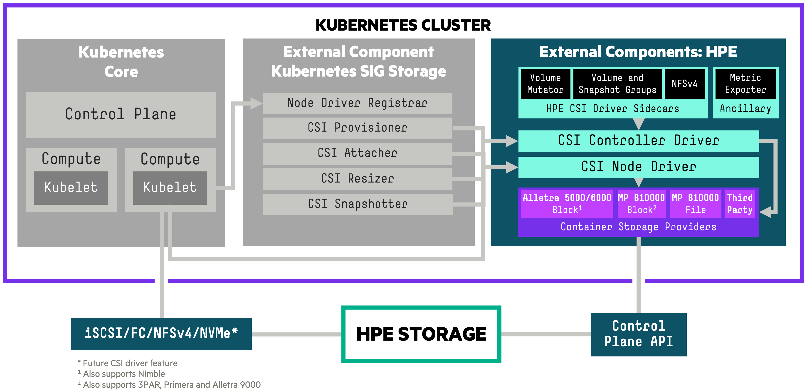

# Introduction

A Container Storage Interface ([CSI](https://github.com/container-storage-interface/spec)) Driver for Kubernetes. The HPE CSI Driver for Kubernetes allows you to use a [Container Storage Provider](container_storage_provider/index.md) (CSP) to perform data management operations on storage resources. The architecture of the CSI driver allows block (iSCSI/FC) and file (NFS) storage vendors to implement a CSP that follows the [specification](https://github.com/hpe-storage/container-storage-provider) (a [browser friendly version](https://developer.hpe.com/api/hpe-nimble-csp/)).

The CSI driver architecture allows a complete separation of concerns between upstream Kubernetes core, SIG Storage (CSI owners), CSI driver author (HPE) and the backend CSP developer.

!!! tip
    The HPE CSI Driver for Kubernetes is vendor agnostic. Any entity may leverage the driver and provide their own Container Storage Provider.

## Table of Contents

[TOC]

## Features and Capabilities

CSI gradually mature features and capabilities in the specification at the pace of the community. HPE keep a close watch on differentiating features the primary storage family of products may be suitable for implementing in CSI and Kubernetes. HPE experiment early and often. That's why it's sometimes possible to observe a certain feature being available in the CSI driver although it hasn't been announced or isn't documented.

Below is the official table for CSI features we track and deem readily available for use after we've officially tested and validated it in the [platform matrix](#compatibility_and_support).

| Feature                                | K8s maturity      | Since K8s version | HPE CSI Driver |
|----------------------------------------|-------------------|-------------------|----------------|
| Dynamic Provisioning                   | Stable            | 1.13              | 1.0.0          |
| Volume Expansion                       | Stable            | 1.24              | 1.1.0          |
| Volume Snapshots                       | Stable            | 1.20              | 1.1.0          |
| PVC Data Source                        | Stable            | 1.18              | 1.1.0          |
| Raw Block Volume                       | Stable            | 1.18              | 1.2.0          |
| Inline Ephemeral Volumes               | Stable            | 1.25              | 1.2.0          |
| Volume Limits                          | Stable            | 1.17              | 1.2.0          |
| Generic Ephemeral Volumes              | Stable            | 1.23              | 1.3.0          |
| Volume Mutator1             | N/A               | 1.15              | 1.3.0          |
| Volume Groups1              | N/A               | 1.17              | 1.4.0          |
| Snapshot Groups1            | N/A               | 1.17              | 1.4.0          |
| NFS Server Provisioner1     | N/A               | 1.17              | 1.4.0          |
| Volume Encryption1          | N/A               | 1.18              | 2.0.0          |
| Basic Topology3             | Stable            | 1.17              | 2.5.0          |
| Native NFS (via CSP)                   | Stable            | 1.13              | 3.0.0          |
| Volume Expansion From Source           | Stable            | 1.27              | 3.0.0          |
| Advanced Topology3          | Stable            | 1.17              | Future         |
| Storage Capacity Tracking              | Stable            | 1.24              | Future         |
| ReadWriteOncePod                       | Stable            | 1.29              | Future         |
| Volume Populator                       | Beta              | 1.24              | Future         |
| Volume Attribute Classes               | Beta              | 1.31              | Future         |
| Upstream Volume Group Snapshot         | Beta              | 1.32              | Future         |
| Volume Health                          | Alpha             | 1.21              | Future         |
| Cross Namespace Snapshots              | Alpha             | 1.26              | Future         |
| Mutable CSI Node Allocatable Count     | Alpha             | 1.33              | Future         |

<small>
 1 = HPE CSI Driver for Kubernetes specific CSI sidecar. CSP support may vary. 
 2 = Alpha features are enabled by [Kubernetes feature gates](https://kubernetes.io/docs/reference/command-line-tools-reference/feature-gates/) and are not formally supported by HPE. 
 3 = Topology information can only be used to describe accessibility relationships between a set of nodes and a single backend using a `StorageClass`. See [Topology and volumeBindingMode](using.md#topology_and_volumebindingmode) for more information.
</small>

Depending on the CSP, it may support a number of different snapshotting, cloning and restoring operations by taking advantage of `StorageClass` parameter overloading. Please see the respective [CSP](container_storage_provider/index.md) for additional functionality.

Refer to the [official table](https://kubernetes.io/docs/reference/command-line-tools-reference/feature-gates/) of feature gates in the Kubernetes docs to find availability of beta and alpha features. HPE provide limited support on non-GA CSI features. Please file any issues, questions or feature requests [here](https://github.com/hpe-storage/csi-driver/issues). You may also join our Slack community to chat with HPE folks close to this project. We hang out in `#Alletra` and `#Kubernetes`, sign up at [slack.hpedev.io](https://slack.hpedev.io/) and login at [hpedev.slack.com](https://hpedev.slack.com).

!!! tip
    Familiarize yourself with the basic requirements below for running the CSI driver on your Kubernetes cluster. It's then highly recommended to continue installing the CSI driver with either a [Helm chart](deployment.md#helm) or an [Operator](deployment.md#operator).

## Compatibility and Support

These are the combinations HPE has tested and can provide official support services around for each of the CSI driver releases. Each [Container Storage Provider](container_storage_provider/index.md) has it's own requirements in terms of storage platform OS and may have other constraints not listed here.

!!! note
    For Kubernetes 1.12 and earlier please see [legacy FlexVolume drivers](../flexvolume_driver/index.md), do note that the FlexVolume drivers are being deprecated.

#### HPE CSI Driver for Kubernetes 3.0.1

Release highlights:

* Fixed an upgrade issue between 2.5.2 and 3.0.0. Go directly to 3.0.1 where applicable.
* Addressed issues related to Active Peer Persistence with Alletra Storage MP B10000.

!!! tip "Good to know"
    This release only contains updates to the 3PAR CSP and only affects 3PAR derived platforms such as Primera, Alletra 9000 and Alletra Storage MP B10000. Customers on Nimble derived platforms do not need to update.

<table>
  <tr>
    <th>Kubernetes</th>
    <td>1.30-1.331</td>
  </tr>
  <tr>
    <th>Helm Chart</th>
    <td><a href="https://artifacthub.io/packages/helm/hpe-storage/hpe-csi-driver/3.0.1">v3.0.1</a> on ArtifactHub</td>
  </tr>
  <tr>
    <th>Operators</th>
    <td>
     <a href="https://operatorhub.io/operator/hpe-csi-operator/stable/hpe-csi-operator.v3.0.1">v3.0.1</a> on OperatorHub 
     <a href="https://catalog.redhat.com/software/container-stacks/detail/5e9874643f398525a0ceb004">v3.0.1</a> via OpenShift console
    </td>
  </tr>
  <tr>
    <th>Worker&nbsp;OS</th>
    <td>
      Red Hat Enterprise Linux (including CoreOS)2 8.x, 9.x, 10.x 
      Ubuntu 16.04, 18.04, 20.04, 22.04, 24.04 
      SUSE Linux Enterprise Server (including SLE Micro4) 15 SP4, SP5, SP6
  </tr>
  <tr>
    <th>CPU architecture</th>
    <td>AMD64, ARM64</td>
  </tr>
  <tr>
    <th>Platforms3</th>
    <td>
      Alletra Storage MP B10000 10.2.x - 10.5.x 
      Alletra OS 9000 9.3.x - 9.6.x 
      Alletra OS 5000/6000 6.0.0.x - 6.1.2.x 
      Nimble OS 5.0.10.x, 5.2.1.x, 6.0.0.x, 6.1.2.x 
      Primera OS 4.3.x - 4.6.x 
      3PAR OS 3.3.x
    </td>
  </tr>
  <tr>
    <th>Data&nbsp;protocols</th>
    <td>Fibre Channel, iSCSI, NFS</td>
  </tr>
  <tr>
    <th>Filesystems</th>
    <td>XFS, ext3/ext4, btrfs, NFSv4&ast;</td>
  </tr>
  <tr>
    <th>Release&nbsp;notes</th>
    <td><a href="https://github.com/hpe-storage/csi-driver/blob/master/release-notes/v3.0.1.md">v3.0.1</a> on GitHub</td>
  </tr>
</table>

<small>
 &ast; = The HPE CSI Driver for Kubernetes is a block and file storage driver. For block only platforms it includes an [NFS Server Provisioner](using.md#using_the_nfs_server_provisioner) that allows "ReadWriteMany" `PersistentVolumeClaims` for `volumeMode: Filesystem`. 
 1 = For Morpheus Kubernetes Service, HPE Ezmeral Runtime Enterprise, SUSE Rancher, Mirantis Kubernetes Engine and others; Kubernetes clusters must be deployed within the currently supported range of "Worker OS" platforms listed in the above table. See [partner ecosystems](partners/index.md) for other variations. Lowest tested and known working version is Kubernetes 1.21 and it has been field tested with Kubernetes 1.34. 
 2 = The HPE CSI Driver will recognize AlmaLinux, Amazon Linux, CentOS, Oracle Linux and Rocky Linux as RHEL derives and they are supported by HPE. While RHEL 7 and its derives will work, the host OS have been EOL'd and support is limited. 
 3 = Learn about each data platform's team [support commitment](../legal/support/index.md#container_storage_providers). 
 4 = SLE Micro nodes may need to be conformed manually, run `transactional-update -n pkg install multipath-tools open-iscsi nfs-client sg3_utils` and reboot if the CSI node driver doesn't start. The HPE CSI Driver is unable to conform nodes with SL Micro 6.0 and later at this time. 
</small>

#### HPE CSI Driver for Kubernetes 3.0.0

!!! caution
    An issue has been identified when upgrading 2.5.2 to 3.0.0 with Alletra Storage MP B10000, Alletra 9000, Primera and 3PAR. Only use 3.0.0 for those platform on clusters with no current workloads running. Contact support if this has already been done and see issues with unpublishing volumes. Upgrading from 2.5.2 directly to upcoming 3.0.1 is recommended.

Release highlights:

* Introducing support for Kubernetes 1.33 and OpenShift 4.19
* Introducing HPE Alletra Storage MP B10000 File Service CSP
* Active Peer Persistence support with automatic workload recovery
* Official support for HPE ProLiant RL300 Gen11 and DL384 Gen12 (ARM-based CPUs)
* Several enhancements to the NFS Server Provisioner
* Volume expansion on clone creation

Upgrade considerations:

* Existing claims provisioned with the NFS Server Provisioner [needs to be upgraded](operations.md#upgrade_to_v301).

<table>
  <tr>
    <th>Kubernetes</th>
    <td>1.30-1.331</td>
  </tr>
  <tr>
    <th>Helm Chart</th>
    <td><a href="https://artifacthub.io/packages/helm/hpe-storage/hpe-csi-driver/3.0.0">v3.0.0</a> on ArtifactHub</td>
  </tr>
  <tr>
    <th>Operators</th>
    <td>
     <a href="https://operatorhub.io/operator/hpe-csi-operator/stable/hpe-csi-operator.v3.0.0">v3.0.0</a> on OperatorHub 
     <a href="https://catalog.redhat.com/software/container-stacks/detail/5e9874643f398525a0ceb004">v3.0.0</a> via OpenShift console
    </td>
  </tr>
  <tr>
    <th>Worker&nbsp;OS</th>
    <td>
      Red Hat Enterprise Linux (including CoreOS)2 8.x, 9.x, 10.x 
      Ubuntu 16.04, 18.04, 20.04, 22.04, 24.04 
      SUSE Linux Enterprise Server (including SLE Micro4) 15 SP4, SP5, SP6
  </tr>
  <tr>
    <th>CPU architecture</th>
    <td>AMD64, ARM64</td>
  </tr>
  <tr>
    <th>Platforms3</th>
    <td>
      Alletra Storage MP B10000 10.2.x - 10.5.x 
      Alletra OS 9000 9.3.x - 9.6.x 
      Alletra OS 5000/6000 6.0.0.x - 6.1.2.x 
      Nimble OS 5.0.10.x, 5.2.1.x, 6.0.0.x, 6.1.2.x 
      Primera OS 4.3.x - 4.6.x 
      3PAR OS 3.3.x
    </td>
  </tr>
  <tr>
    <th>Data&nbsp;protocols</th>
    <td>Fibre Channel, iSCSI, NFS</td>
  </tr>
  <tr>
    <th>Filesystems</th>
    <td>XFS, ext3/ext4, btrfs, NFSv4&ast;</td>
  </tr>
  <tr>
    <th>Release&nbsp;notes</th>
    <td><a href="https://github.com/hpe-storage/csi-driver/blob/master/release-notes/v3.0.0.md">v3.0.0</a> on GitHub</td>
  </tr>
  <tr>
   <th>Blogs</th>
   <td>
    <a href="https://community.hpe.com/t5/around-the-storage-block/introducing-hpe-alletra-storage-mp-b10000-file-service-with-hpe/ba-p/7252531">Introducing HPE Alletra Storage MP B10000 File Service with HPE CSI Driver for Kubernetes 3.0.0</a>
   </td>
 </tr>
</table>

<small>
 &ast; = The HPE CSI Driver for Kubernetes is a block and file storage driver. For block only platforms it includes an [NFS Server Provisioner](using.md#using_the_nfs_server_provisioner) that allows "ReadWriteMany" `PersistentVolumeClaims` for `volumeMode: Filesystem`. 
 1 = For Morpheus Kubernetes Service, HPE Ezmeral Runtime Enterprise, SUSE Rancher, Mirantis Kubernetes Engine and others; Kubernetes clusters must be deployed within the currently supported range of "Worker OS" platforms listed in the above table. See [partner ecosystems](partners/index.md) for other variations. Lowest tested and known working version is Kubernetes 1.21. 
 2 = The HPE CSI Driver will recognize AlmaLinux, Amazon Linux, CentOS, Oracle Linux and Rocky Linux as RHEL derives and they are supported by HPE. While RHEL 7 and its derives will work, the host OS have been EOL'd and support is limited. 
 3 = Learn about each data platform's team [support commitment](../legal/support/index.md#container_storage_providers). 
 4 = SLE Micro nodes may need to be conformed manually, run `transactional-update -n pkg install multipath-tools open-iscsi nfs-client sg3_utils` and reboot if the CSI node driver doesn't start. The HPE CSI Driver is unable to conform nodes with SL Micro 6.0 and later at this time. 
</small>

#### HPE CSI Driver for Kubernetes 2.5.2

Release highlights:

* Support for [Morpheus Kubernetes Service](partners/hpe_morpheus/install.md)
* Introducing support for Kubernetes 1.31-1.32 and OpenShift 4.17-4.18
* Renamed HPE CSI Operator for Kubernetes to HPE CSI Operator for OpenShift in the Red Hat Ecosystem Catalog
* LDAP account support for the HPE Alletra Storage MP B10000 CSP
* Removed SSH requirement for HPE Primera and newer HPE Alletra Storage MP B10000 CSP platforms, see [Deployment](deployment.md#add_an_hpe_storage_backend)
* Several reliability, availability and serviceability improvements to the HPE Alletra Storage MP B10000 CSP
* NFS Server Provisioner `PersistentVolumeClaim` expansion support
* Support for "volumeMode: Block" backup for [Veeam Kasten](partners/kasten/index.md)

Upgrade considerations:

* Existing claims provisioned with the NFS Server Provisioner [needs to be upgraded](operations.md#upgrade_to_v252).

!!! note
    There is no v2.5.1 release of the CSI driver, only downstream artifacts such as the Helm chart and Operator.

<table>
  <tr>
    <th>Kubernetes</th>
    <td>1.29-1.321</td>
  </tr>
  <tr>
    <th>Helm Chart</th>
    <td><a href="https://artifacthub.io/packages/helm/hpe-storage/hpe-csi-driver/2.5.2">v2.5.2</a> on ArtifactHub</td>
  </tr>
  <tr>
    <th>Operators</th>
    <td>
     <a href="https://operatorhub.io/operator/hpe-csi-operator/stable/hpe-csi-operator.v2.5.2">v2.5.2</a> on OperatorHub 
     <a href="https://catalog.redhat.com/software/container-stacks/detail/5e9874643f398525a0ceb004">v2.5.2</a> via OpenShift console
    </td>
  </tr>
  <tr>
    <th>Worker&nbsp;OS</th>
    <td>
      Red Hat Enterprise Linux2 8.x, 9.x, Red Hat CoreOS 4.14-4.18 
      Ubuntu 16.04, 18.04, 20.04, 22.04, 24.04 
      SUSE Linux Enterprise Server 15 SP4, SP5, SP6 and SLE Micro4 equivalents
  </tr>
  <tr>
    <th>CPU architecture</th>
    <td>AMD64, ARM64</td>
  </tr>
  <tr>
    <th>Platforms3</th>
    <td>
      Alletra Storage MP B10000 10.2.x - 10.4.x 
      Alletra OS 9000 9.3.x - 9.6.x 
      Alletra OS 5000/6000 6.0.0.x - 6.1.2.x 
      Nimble OS 5.0.10.x, 5.2.1.x, 6.0.0.x, 6.1.2.x 
      Primera OS 4.3.x - 4.6.x 
      3PAR OS 3.3.x
    </td>
  </tr>
  <tr>
    <th>Data&nbsp;protocols</th>
    <td>Fibre Channel, iSCSI</td>
  </tr>
  <tr>
    <th>Filesystems</th>
    <td>XFS, ext3/ext4, btrfs, NFSv4&ast;</td>
  </tr>
  <tr>
    <th>Release&nbsp;notes</th>
    <td><a href="https://github.com/hpe-storage/csi-driver/blob/master/release-notes/v2.5.2.md">v2.5.2</a> on GitHub</td>
  </tr>
  <tr>
   <th>Blogs</th>
   <td>
    <a href="https://community.hpe.com/t5/around-the-storage-block/introducing-morpheus-kubernetes-service-with-hpe-csi-driver-for/ba-p/7235173">Introducing Morpheus Kubernetes Service with HPE CSI Driver for Kubernetes</a>
   </td>
 </tr>
</table>

<small>
 &ast; = The HPE CSI Driver for Kubernetes is a block storage driver primarily. It includes an [NFS Server Provisioner](using.md#using_the_nfs_server_provisioner) that allows "ReadWriteMany" `PersistentVolumeClaims` for `volumeMode: Filesystem`. 
 1 = For Morpheus Kubernetes Service, HPE Ezmeral Runtime Enterprise, SUSE Rancher, Mirantis Kubernetes Engine and others; Kubernetes clusters must be deployed within the currently supported range of "Worker OS" platforms listed in the above table. See [partner ecosystems](partners/index.md) for other variations. Lowest tested and known working version is Kubernetes 1.21. 
 2 = The HPE CSI Driver will recognize AlmaLinux, Amazon Linux, CentOS, Oracle Linux and Rocky Linux as RHEL derives and they are supported by HPE. While RHEL 7 and its derives will work, the host OS have been EOL'd and support is limited. 
 3 = Learn about each data platform's team [support commitment](../legal/support/index.md#container_storage_providers). 
 4 = SLE Micro nodes may need to be conformed manually, run `transactional-update -n pkg install multipath-tools open-iscsi nfs-client sg3_utils` and reboot if the CSI node driver doesn't start. 
</small>

#### HPE CSI Driver for Kubernetes 2.5.0

Release highlights:

* Support for Kubernetes 1.30 and OpenShift 4.16
* Introducing CSI Topology support for `StorageClasses`
* A "Node Monitor" has been added to improve device management
* Support for attempting automatic filesystem repairs in the event of failed mounts ("fsRepair" `StorageClass` parameter)
* Improved handling of iSCSI CHAP credentials
* Added "nfsNodeSelector", "nfsResourceRequestsCpuM" and "nfsResourceRequestsMemoryMi" `StorageClass` parameters
* New Helm Chart parameters to control resource requests and limits for node, controller and CSP containers
* Reworked image handling in the Helm Chart to improve supportability
* Various improvements in `accessMode` handling

Upgrade considerations:

* Existing claims provisioned with the NFS Server Provisioner [needs to be upgraded](operations.md#upgrade_to_v250).
* Current users of CHAP needs to review the [iSCSI CHAP Considerations](#iscsi_chap_considerations)
* The `importVol` parameter has been renamed `importVolumeName` for [HPE Alletra Storage MP and Alletra 9000/Primera/3PAR](container_storage_provider/hpe_alletra_storage_mp_b10000/index.md)

!!! caution "note"
    HPE CSI Driver v2.5.0 is deployed with **v2.5.1** of the Helm chart and Operator

<table>
  <tr>
    <th>Kubernetes</th>
    <td>1.27-1.301</td>
  </tr>
  <tr>
    <th>Helm Chart</th>
    <td><a href="https://artifacthub.io/packages/helm/hpe-storage/hpe-csi-driver/2.5.1">v2.5.1</a> on ArtifactHub</td>
  </tr>
  <tr>
    <th>Operators</th>
    <td>
     <a href="https://operatorhub.io/operator/hpe-csi-operator/stable/hpe-csi-operator.v2.5.1">v2.5.1</a> on OperatorHub 
     <a href="https://catalog.redhat.com/software/container-stacks/detail/5e9874643f398525a0ceb004">v2.5.1</a> via OpenShift console
    </td>
  </tr>
  <tr>
    <th>Worker&nbsp;OS</th>
    <td>
      Red Hat Enterprise Linux2 7.x, 8.x, 9.x, Red Hat CoreOS 4.14-4.16 
      Ubuntu 16.04, 18.04, 20.04, 22.04, 24.04 
      SUSE Linux Enterprise Server 15 SP4, SP5, SP6 and SLE Micro4 equivalents
  </tr>
  <tr>
    <th>CPU architecture</th>
    <td>AMD64, ARM64</td>
  </tr>
  <tr>
    <th>Platforms3</th>
    <td>
      Alletra Storage MP5 10.2.x - 10.4.x 
      Alletra OS 9000 9.3.x - 9.5.x 
      Alletra OS 5000/6000 6.0.0.x - 6.1.2.x 
      Nimble OS 5.0.10.x, 5.2.1.x, 6.0.0.x, 6.1.2.x 
      Primera OS 4.3.x - 4.5.x 
      3PAR OS 3.3.x
    </td>
  </tr>
  <tr>
    <th>Data&nbsp;protocols</th>
    <td>Fibre Channel, iSCSI</td>
  </tr>
  <tr>
    <th>Filesystems</th>
    <td>XFS, ext3/ext4, btrfs, NFSv4&ast;</td>
  </tr>
  <tr>
    <th>Release&nbsp;notes</th>
    <td><a href="https://github.com/hpe-storage/csi-driver/blob/master/release-notes/v2.5.0.md">v2.5.0</a> on GitHub</td>
  </tr>
  <tr>
   <th>Blogs</th>
   <td>
    <a href="https://community.hpe.com/t5/around-the-storage-block/hpe-csi-driver-for-kubernetes-2-5-0-improved-stateful-workload/ba-p/7220864">HPE CSI Driver for Kubernetes 2.5.0: Improved stateful workload resilience and robustness</a>
   </td>
 </tr>
</table>

<small>
 &ast; = The HPE CSI Driver for Kubernetes is a block storage driver primarily. It includes an [NFS Server Provisioner](using.md#using_the_nfs_server_provisioner) that allows "ReadWriteMany" `PersistentVolumeClaims` for `volumeMode: Filesystem`. 
 1 = For HPE Ezmeral Runtime Enterprise, SUSE Rancher, Mirantis Kubernetes Engine and others; Kubernetes clusters must be deployed within the currently supported range of "Worker OS" platforms listed in the above table. See [partner ecosystems](partners/index.md) for other variations. Lowest tested and known working version is Kubernetes 1.21. 
 2 = The HPE CSI Driver will recognize CentOS, AlmaLinux and Rocky Linux as RHEL derives and they are supported by HPE. While RHEL 7 and its derives will work, the host OS have been EOL'd and support is limited. 
 3 = Learn about each data platform's team [support commitment](../legal/support/index.md#container_storage_providers). 
 4 = SLE Micro nodes may need to be conformed manually, run `transactional-update -n pkg install multipath-tools open-iscsi nfs-client sg3_utils` and reboot if the CSI node driver doesn't start. 
 5 = The HPE CSI Driver for Kubernetes only support HPE Alletra Storage MP when used with HPE GreenLake for Block Storage. Please see the [VAST CSI Driver](https://support.vastdata.com/s/topic/0TOV40000000TtFOAU/vast-csi-driver) for HPE GreenLake for File Storage. 
</small>

#### HPE CSI Driver for Kubernetes 2.4.2

Release highlights:

* Patch release

<table>
  <tr>
    <th>Kubernetes</th>
    <td>1.26-1.291</td>
  </tr>
  <tr>
    <th>Helm Chart</th>
    <td><a href="https://artifacthub.io/packages/helm/hpe-storage/hpe-csi-driver/2.4.2">v2.4.2</a> on ArtifactHub</td>
  </tr>
  <tr>
    <th>Operators</th>
    <td>
     <a href="https://operatorhub.io/operator/hpe-csi-operator/stable/hpe-csi-operator.v2.4.2">v2.4.2</a> on OperatorHub 
     <a href="https://catalog.redhat.com/software/container-stacks/detail/5e9874643f398525a0ceb004">v2.4.2</a> via OpenShift console
    </td>
  </tr>
  <tr>
    <th>Worker&nbsp;OS</th>
    <td>
      Red Hat Enterprise Linux2 7.x, 8.x, 9.x, Red Hat CoreOS 4.12-4.15 
      Ubuntu 16.04, 18.04, 20.04, 22.04 
      SUSE Linux Enterprise Server 15 SP3, SP4, SP5 and SLE Micro4 equivalents
  </tr>
  <tr>
    <th>CPU architecture</th>
    <td>AMD64, ARM64</td>
  </tr>
  <tr>
    <th>Platforms3</th>
    <td>
      Alletra Storage MP5 10.2.x - 10.4.x 
      Alletra OS 9000 9.3.x - 9.5.x 
      Alletra OS 5000/6000 6.0.0.x - 6.1.2.x 
      Nimble OS 5.0.10.x, 5.2.1.x, 6.0.0.x, 6.1.2.x 
      Primera OS 4.3.x - 4.5.x 
      3PAR OS 3.3.x
    </td>
  </tr>
  <tr>
    <th>Data&nbsp;protocols</th>
    <td>Fibre Channel, iSCSI</td>
  </tr>
  <tr>
    <th>Filesystems</th>
    <td>XFS, ext3/ext4, btrfs, NFSv4&ast;</td>
  </tr>
  <tr>
    <th>Release&nbsp;notes</th>
    <td><a href="https://github.com/hpe-storage/csi-driver/blob/master/release-notes/v2.4.2.md">v2.4.2</a> on GitHub</td>
  </tr>
</table>

<small>
 &ast; = The HPE CSI Driver for Kubernetes is a block storage driver primarily. It includes an [NFS Server Provisioner](using.md#using_the_nfs_server_provisioner) that allows "ReadWriteMany" `PersistentVolumeClaims`. 
 1 = For HPE Ezmeral Runtime Enterprise, SUSE Rancher, Mirantis Kubernetes Engine and others; Kubernetes clusters must be deployed within the currently supported range of "Worker OS" platforms listed in the above table. See [partner ecosystems](partners/index.md) for other variations. Lowest tested and known working version is Kubernetes 1.21. 
 2 = The HPE CSI Driver will recognize CentOS, AlmaLinux and Rocky Linux as RHEL derives and they are supported by HPE. 
 3 = Learn about each data platform's team [support commitment](../legal/support/index.md#container_storage_providers). 
 4 = SLE Micro nodes may need to be conformed manually, run `transactional-update -n pkg install multipath-tools open-iscsi nfs-client sg3_utils` and reboot if the CSI node driver doesn't start. 
 5 = The HPE CSI Driver for Kubernetes only support HPE Alletra Storage MP when used with HPE GreenLake for Block Storage. Please see the [VAST CSI Driver](https://support.vastdata.com/s/topic/0TOV40000000TtFOAU/vast-csi-driver) for HPE GreenLake for File Storage. 
</small>

#### Release Archive

HPE currently supports up to three minor releases of the HPE CSI Driver for Kubernetes.

* [Unsupported releases](archive.md)

## Known Limitations

* Always check with the Kubernetes vendor distribution which CSI features are available for use and supported by the vendor.
* When using Kubernetes in virtual machines on VMware vSphere, OpenStack or similiar, iSCSI and NFS is the only supported data protocol for the HPE CSI Driver. The CSI driver does **not** support NPIV.
* Ephemeral, transient or non-persistent Kubernetes nodes are not supported unless the `/etc/hpe-storage` directory persists across node upgrades or reboots. The path is relocatable using a custom Helm chart or deployment manifest by altering the `mountPath` parameter for the directory.
* The CSI driver support a fixed number of volumes per node. Inspect the current limitation by running `kubectl get csinodes -o yaml` and inspect `.spec.drivers.allocatable` for "csi.hpe.com". The "count" element contains how many volumes the node can attach from the HPE CSI Driver (default is 100). From v2.5.2 onwards this parameter is tunable in the Helm chart. Do NOT increase this value beyond what's been tested in the environment where the CSI driver is running. See each respective [CSP](container_storage_provider/index.md) limitations for more guidance.
* The HPE CSI Driver uses host networking for the node driver. Some CNIs have flaky implementations which prevents the CSI driver components to communicate properly. Especially notorious is Flannel on K3s. Use Calico if possible for the widest compatibility.
* If automatic rolling node upgrades are required for the cluster it's recommended to isolate the HPE CSI Driver Controller and related CSPs to a node by itself and schedule the upgrade of that particular node last.
* The [NFS Server Provisioner](using.md#limitations_and_considerations_for_the_nfs_server_provisioner) and each of the [CSPs](container_storage_provider/index.md) have known limitations listed separately.

## iSCSI CHAP Considerations

If iSCSI CHAP is being used in the environment, consider the following.

### Existing PVs and iSCSI sessions

It's not recommended to retro fit CHAP into an existing environment where `PersistentVolumes` are already provisioned and attached. If necessary, all iSCSI sessions needs to be logged out from and the CSI driver Helm chart needs to be installed with [cluster-wide iSCSI CHAP credentials](using.md#cluster-wide_iscsi_chap_credentials) for iSCSI CHAP to be effective, otherwise existing non-authenticated sessions will be reused.

### CSI driver 2.5.0 and Above

In 2.5.0 and later the CHAP credentials must be supplied by a separate `Secret`. The `Secret` may be supplied when installing the Helm Chart (the `Secret` must exist prior) or referened in the `StorageClass`.

### One CHAP configuration per backend

Inherently iSCSI CHAP operates per session against an iSCSI portal. The CSI driver only supports using a common set of sessions per iSCSI portal. It's imperative that only one iSCSI CHAP configuration exists (or don't exist) per cluster and storage backend pair.

#### Upgrade Considerations

When using CHAP with 2.4.2 or older the CHAP credentials were provided in clear text in the Helm Chart. To continue to use CHAP for those existing `PersistentVolumes`, a CHAP `Secret` needs to be created and referenced in the Helm Chart install.

New `StorageClasses` may reference the same `Secret`, it's recommended to use a different `Secret` to distinguish legacy and new `PersistentVolumes`.

#### Enable iSCSI CHAP

How to enable iSCSI CHAP in the current version of the HPE CSI Driver is available in the [user documentation](using.md#enabling_iscsi_chap).

### CSI driver 1.3.0 to 2.4.2

CHAP is an optional part of the initial deployment of the driver with parameters passed to Helm or the Operator. For object definitions, the `CHAP_USER` and `CHAP_PASSWORD` needs to be supplied to the `csi-node-driver`. The CHAP username and secret is picked up in the `hpenodeinfo` Custom Resource Definition (CRD). The CSP is under contract to create the user if it doesn't exist on the backend.

CHAP is a good measure to prevent unauthorized access to iSCSI targets, it does not encrypt data on the wire. CHAP secrets should be at least twelve charcters in length.

### CSI driver 1.2.1 and Below

In version 1.2.1 and below, the CSI driver did not support CHAP natively. CHAP must be enabled manually on the worker nodes before deploying the CSI driver on the cluster. This also needs to be applied to new worker nodes before they join the cluster.

## Kubernetes Feature Gates

Different features mature at different rates. Refer to the [official table](https://kubernetes.io/docs/reference/command-line-tools-reference/feature-gates/) of feature gates in the Kubernetes docs.

The following guidelines appliy to which feature gates got introduced as alphas for the corresponding version of Kubernetes. For example, `ExpandCSIVolumes` got introduced in 1.14 but is still an alpha in 1.15, hence you need to enable that feature gate in 1.15 as well if you want to use it.

### Kubernetes 1.13

 * `--allow-privileged` flag must be set to true for the API server

### Kubernetes 1.14

 * `--allow-privileged` flag must be set to true for the API server
 * `--feature-gates=ExpandCSIVolumes=true,ExpandInUsePersistentVolumes=true` feature gate flags must be set to true for both the API server and kubelet for resize support

### Kubernetes 1.15

 * `--allow-privileged` flag must be set to true for the API server
 * `--feature-gates=ExpandCSIVolumes=true,ExpandInUsePersistentVolumes=true` feature gate flags must be set to true for both the API server and kubelet for resize support
 * `--feature-gates=CSIInlineVolume=true` feature gate flag must be set to true for both the API server and kubelet for pod inline volumes (Ephemeral Local Volumes) support
 * `--feature-gates=VolumePVCDataSource=true` feature gate flag must be set to true for both the API server and kubelet for Volume cloning support

### Kubernetes 1.19

 * `--feature-gates=GenericEphemeralVolume=true` feature gate flags needs to be passed to api-server, scheduler, controller-manager and kubelet to enable Generic Ephemeral Volumes
