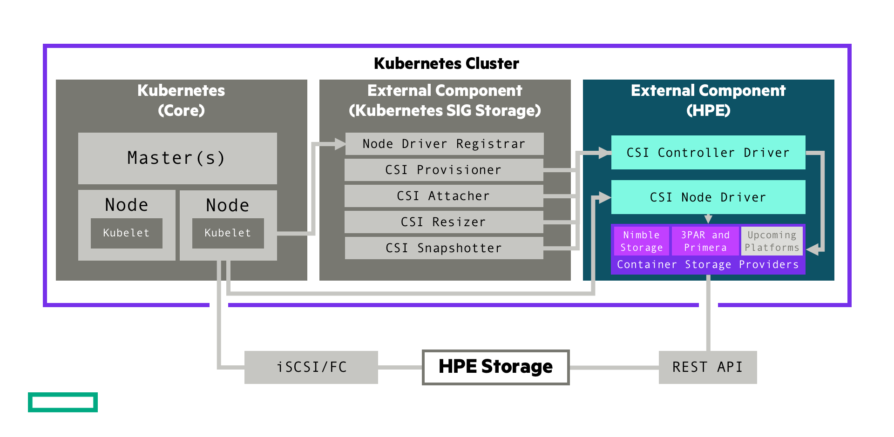

# Introduction

A Container Storage Interface ([CSI](https://github.com/container-storage-interface/spec)) Driver for Kubernetes. The HPE CSI Driver for Kubernetes allows you to use a [Container Storage Provider](../container_storage_provider/index.md) (CSP) to perform data management operations on storage resources. The architecture of the CSI driver allows block storage vendors to implement a CSP that follows the [spec](https://github.com/hpe-storage/container-storage-provider) (a [browser friendly version](https://developer.hpe.com/api/hpe-nimble-csp/)).

It allows a complete separation of concerns between upstream Kubernetes core, SIG Storage (CSI owners), CSI driver author (HPE) and the backend CSP developer.

!!! tip
    The HPE CSI Driver for Kubernetes is vendor agnostic. Any entity may leverage the driver and provide their on Container Storage Provider.

## Table of Contents 

[TOC]

## Features and capabilities

CSI gradually mature features and capabilities in the specification at the pace of the community. HPE keep a close watch on differentiating features the primary storage family of products may be suitable for implementing in CSI and Kubernetes. HPE experiment early and often. That's why it's sometimes possible to observe a certain feature being available in the CSI driver although it hasn't been announced or isn't documented.

Below is the official table for CSI features we track and deem readily available for use after we've officially tested and validated it in the [platform matrix](#compatibility_and_support).

| Feature                                | K8s maturity | Since K8s version | HPE CSI Driver |
|----------------------------------------|--------------|-------------------|----------------|
| Dynamic Provisioning                   | GA           | 1.13              | 1.0.0          |
| Raw Block Volume                       | GA           | 1.18              | Beta           |
| Volume Expansion                       | Beta         | 1.16              | 1.1.0          |
| PVC Data Source                        | GA           | 1.18              | 1.1.0          |
| Inline Ephemeral Volumes               | Beta         | 1.16              | Beta           |
| Volume Snapshots                       | Beta         | 1.17              | 1.1.0          |

Depending on the CSP, it may support a number of different snapshotting, cloning and restoring operations by taking advantage of `StorageClass` parameter overloading. Please see the respective [CSP](../container_storage_provider/index.md) for additional functionality.

Refer to the [official table](https://kubernetes.io/docs/reference/command-line-tools-reference/feature-gates/) of feature gates in the Kubernetes docs to find availability of beta and alpha features. HPE provide limited support on non-GA CSI features. Please file any issues, questions or feature requests [here](https://github.com/hpe-storage/csi-driver/issues). You may also join our Slack community to chat with HPE folks close to this project. We hang out in `#NimbleStorage`, `#3par-primera` and `#Kubernetes`, sign up at [slack.hpedev.io](https://slack.hpedev.io/) and login at [hpedev.slack.com](https://hpedev.slack.com).

!!! tip
    Familiarize yourself with the basic requirements below for running the CSI driver on your Kubernetes cluster. It's then highly recommended to continue installing the CSI driver with either a [Helm chart](deployment.md#helm) or an [Operator](deployment.md#operator).

## Compatibility and support

These are the combinations HPE has tested and can provide offical support services around for each of the CSI driver releases. Each Container Service Provider has it's own requirements in terms of storage platform OS and may have other constraints not listed here. 

#### HPE 3PAR and Primera Container Storage Provider 1.0

Release highlights: Initial GA release with support for Dynamic Provisioning, CSI snapshots, and volume resize.

<table>
  <tr>
    <th>Kubernetes</th>
    <td>1.16-1.17</td>
  </tr>
  <tr>
    <th>Worker OS</th>
    <td>CentOS 7.6, RHEL 7.6, RHCOS 4.2-4.3
  </tr>
  <tr>
    <th>Data protocol</th>
    <td>Fibre Channel, iSCSI </td>
  </tr>
</table>

**User Permissions:** The 3PAR and Primera CSP requires the user role to be **edit** or **super**.

!!! note
    For Kubernetes 1.12 and earlier please see [legacy FlexVolume drivers](../flexvolume_driver/index.md).

#### HPE CSI Driver for Kubernetes 1.1.0

Release highlights: Broader ecosystem support, official support for CSI snapshots and volume resize.

<table>
  <tr>
    <th>Kubernetes</th>
    <td>1.13-1.17</td>
  </tr>
  <tr>
    <th>Worker OS</th>
    <td>CentOS 7.6, RHEL 7.6, RHCOS 4.2-4.3, Ubuntu 16.04, Ubuntu 18.04
  </tr>
  <tr>
    <th>Data protocol</th>
    <td>Fibre Channel, iSCSI </td>
  </tr>
  <tr>
    <th>Release notes</th>
    <td><a href=https://github.com/hpe-storage/csi-driver/blob/master/release-notes/v1.1.0.md>v1.1.0</a> on GitHub</td>
  </tr>
  <tr>
   <th>Blogs</th>
   <td><a href=https://community.hpe.com/t5/HPE-Storage-Tech-Insiders/HPE-CSI-Driver-for-Kubernetes-1-1-0-Generally-Available/ba-p/7082995>HPE Storage Tech Insiders</a> (release), <a href=https://developer.hpe.com/blog/PklOy39w8NtX6M2RvAxW/hpe-csi-driver-for-kubernetes-snapshots-clones-and-volume-expansion>HPE DEV</a> (snapshots, clones, resize)
</table>

#### HPE CSI Driver for Kubernetes 1.0.0

Release highlights: Initial GA release with support for Dynamic Provisioning.

<table>
  <tr>
    <th>Kubernetes</th>
    <td>1.13-1.17</td>
  </tr>
  <tr>
    <th>Worker OS</th>
    <td>CentOS 7.6, RHEL 7.6, Ubuntu 16.04, Ubuntu 18.04
  </tr>
  <tr>
    <th>Data protocol</th>
    <td>Fibre Channel, iSCSI </td>
  </tr>
  <tr>
    <th>Release notes</th>
    <td><a href=https://github.com/hpe-storage/csi-driver/blob/master/release-notes/v1.0.0.md>v1.0.0</a> on GitHub</td>
  </tr>
  <tr>
   <th>Blogs</th>
   <td><a href=https://community.hpe.com/t5/HPE-Storage-Tech-Insiders/HPE-CSI-Driver-for-Kubernetes-1-0-Released/ba-p/7076820>HPE Storage Tech Insiders</a> (release), <a href=https://developer.hpe.com/blog/n0J8kpk1DJf4y7xD2D4X/introducing-a-multi-vendor-csi-driver-for-kubernetes>HPE DEV</a> (architecture and introduction)
</table>

## Kubernetes feature gates

Different features mature at different rates. Refer to the [official table](https://kubernetes.io/docs/reference/command-line-tools-reference/feature-gates/) of feature gates in the Kubernetes docs.

The following guidelines applies to what feature gates got introduced as alphas for the corresponding version of Kubernetes. For example, `ExpandCSIVolumes` got introduced in 1.14 but is still an alpha in 1.15, hence you need to enable that feature gate in 1.15 as well if you want to use it.

Kubernetes 1.13

 * `--allow-privileged` flag must be set to true for the API server

Kubernetes 1.14

 * `--allow-privileged` flag must be set to true for the API server
 * `--feature-gates=ExpandCSIVolumes=true,ExpandInUsePersistentVolumes=true` feature gate flags must be set to true for both the API server and kubelet for resize support

Kubernetes 1.15

 * `--allow-privileged` flag must be set to true for the API server
 * `--feature-gates=ExpandCSIVolumes=true,ExpandInUsePersistentVolumes=true` feature gate flags must be set to true for both the API server and kubelet for resize support
 * `--feature-gates=CSIInlineVolume=true` feature gate flag must be set to true for both the API server and kubelet for pod inline volumes (Ephemeral Local Volumes) support
 * `--feature-gates=VolumePVCDataSource=true` feature gate flag must be set to true for both the API server and kubelet for Volume cloning support

