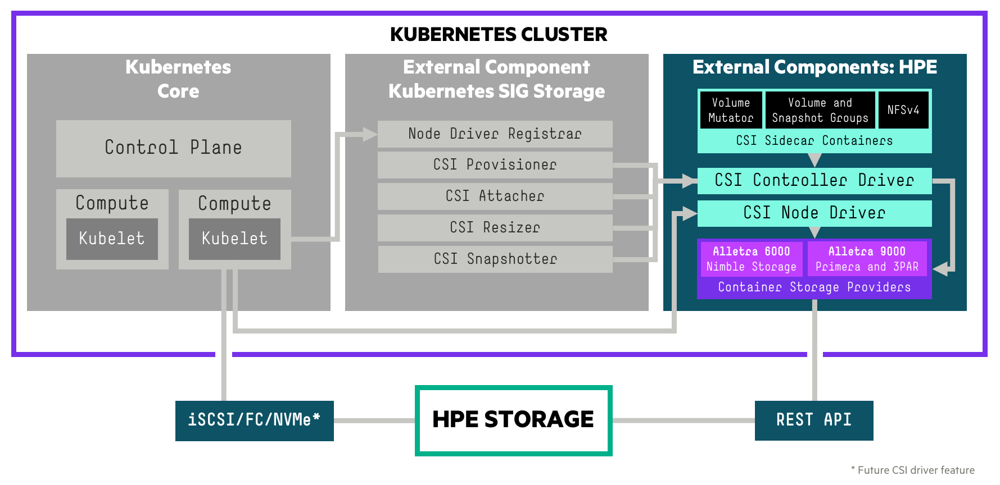

# Introduction

A Container Storage Interface ([CSI](https://github.com/container-storage-interface/spec)) Driver for Kubernetes. The HPE CSI Driver for Kubernetes allows you to use a [Container Storage Provider](../container_storage_provider/index.md) (CSP) to perform data management operations on storage resources. The architecture of the CSI driver allows block storage vendors to implement a CSP that follows the [specification](https://github.com/hpe-storage/container-storage-provider) (a [browser friendly version](https://developer.hpe.com/api/hpe-nimble-csp/)).

The CSI driver architecture allows a complete separation of concerns between upstream Kubernetes core, SIG Storage (CSI owners), CSI driver author (HPE) and the backend CSP developer.

!!! tip
    The HPE CSI Driver for Kubernetes is vendor agnostic. Any entity may leverage the driver and provide their own Container Storage Provider.

## Table of Contents 

[TOC]

## Features and Capabilities

CSI gradually mature features and capabilities in the specification at the pace of the community. HPE keep a close watch on differentiating features the primary storage family of products may be suitable for implementing in CSI and Kubernetes. HPE experiment early and often. That's why it's sometimes possible to observe a certain feature being available in the CSI driver although it hasn't been announced or isn't documented.

Below is the official table for CSI features we track and deem readily available for use after we've officially tested and validated it in the [platform matrix](#compatibility_and_support).

| Feature                                | K8s maturity      | Since K8s version | HPE CSI Driver |
|----------------------------------------|-------------------|-------------------|----------------|
| Dynamic Provisioning                   | GA                | 1.13              | 1.0.0          |
| Volume Expansion                       | Beta              | 1.16              | 1.1.0          |
| Volume Snapshots                       | GA                | 1.20              | 1.1.0          |
| PVC Data Source                        | GA                | 1.18              | 1.1.0          |
| Raw Block Volume                       | GA                | 1.18              | 1.2.0          |
| Inline Ephemeral Volumes               | Beta              | 1.16              | 1.2.0          |
| Volume Limits                          | GA                | 1.17              | 1.2.0          |
| Volume Mutator1             | N/A               | 1.15              | 1.3.0          |
| Generic Ephemeral Volumes              | Beta              | 1.21              | 1.3.0          |
| Volume Groups1              | N/A               | 1.17              | 1.4.0          |
| Snapshot Groups1            | N/A               | 1.17              | 1.4.0          |
| NFS Server Provisioner1     | N/A               | 1.17              | 1.4.0          |
| Volume Encryption1          | N/A               | 1.18              | 2.0.0          |
| Topology                               | GA                | 1.17              | Future         |
| Volume Health                          | Alpha             | 1.21              | Future         |

<small>
 1 = HPE CSI Driver for Kubernetes specific CSI sidecar. CSP support may vary. 
 2 = Alpha features are enabled by [Kubernetes feature gates](https://kubernetes.io/docs/reference/command-line-tools-reference/feature-gates/) and are not formally supported by HPE.
</small>

Depending on the CSP, it may support a number of different snapshotting, cloning and restoring operations by taking advantage of `StorageClass` parameter overloading. Please see the respective [CSP](../container_storage_provider/index.md) for additional functionality.

Refer to the [official table](https://kubernetes.io/docs/reference/command-line-tools-reference/feature-gates/) of feature gates in the Kubernetes docs to find availability of beta and alpha features. HPE provide limited support on non-GA CSI features. Please file any issues, questions or feature requests [here](https://github.com/hpe-storage/csi-driver/issues). You may also join our Slack community to chat with HPE folks close to this project. We hang out in `#NimbleStorage`, `#3par-primera` and `#Kubernetes`, sign up at [slack.hpedev.io](https://slack.hpedev.io/) and login at [hpedev.slack.com](https://hpedev.slack.com).

!!! tip
    Familiarize yourself with the basic requirements below for running the CSI driver on your Kubernetes cluster. It's then highly recommended to continue installing the CSI driver with either a [Helm chart](deployment.md#helm) or an [Operator](deployment.md#operator).

## Compatibility and Support

These are the combinations HPE has tested and can provide official support services around for each of the CSI driver releases. Each [Container Storage Provider](../container_storage_provider/index.md) has it's own requirements in terms of storage platform OS and may have other constraints not listed here. 

!!! note
    For Kubernetes 1.12 and earlier please see [legacy FlexVolume drivers](../flexvolume_driver/index.md), do note that the FlexVolume drivers are being deprecated.

#### HPE CSI Driver for Kubernetes 2.0.0

Release highlights:

* Support for HPE Alletra 6000 and 9000
* Host-based volume encryption
* Multitenancy for HPE Alletra 6000 and Nimble Storage 

<table>
  <tr>
    <th>Kubernetes</th>
    <td>1.18-1.211</td>
  </tr>
  <tr>
    <th>Worker&nbsp;OS</th>
    <td>CentOS and RHEL 7.x & 8.x, RHCOS 4.6, Ubuntu 18.04 & 20.04, SLES 15 SP2
  </tr>
  <tr>
    <th>Data&nbsp;protocol</th>
    <td>Fibre Channel, iSCSI</td>
  </tr>
  <tr>
    <th>Platforms</th>
    <td>
      Alletra OS 6000 6.0.0.x 
      Alletra OS 9000 9.3.0 
      Nimble OS 5.0.10.x,  5.1.4.200-x, 5.2.1.x, 5.3.0.x, 5.3.1.x, 6.0.0.x 
      Primera OS 4.0.x, 4.1.x, 4.2.x, 4.3.x 
      3PAR OS 3.3.1, 3.3.2
    </td>
  <tr>
    <th>Release&nbsp;notes</th>
    <td><a href=https://github.com/hpe-storage/csi-driver/blob/master/release-notes/v2.0.0.md>v2.0.0</a> on GitHub</td>
  </tr>
  <tr>
   <th>Blogs</th>
   <td>
    <a href="https://community.hpe.com/t5/Around-the-Storage-Block/HPE-CSI-Driver-for-Kubernetes-now-available-for-HPE-Alletra/ba-p/7136280">HPE CSI Driver for Kubernetes now available for HPE Alletra</a> (release blog) 
    <a href="https://developer.hpe.com/blog/multitenancy-for-kubernetes-clusters-using-hpe-alletra-6000-and-nimble-storage/">Multitenancy for Kubernetes clusters using HPE Alletra 6000 and Nimble</a> (tutorial) 
    <a href="https://developer.hpe.com/blog/host-based-volume-encryption-with-hpe-csi-driver-for-kubernetes/">Host-based Volume Encryption with HPE CSI Driver for Kubernetes</a> (tutorial)
   </td>
 </tr>
</table>
 
<small>
 1 = For HPE Ezmeral Container Platform, Rancher and Mirantis Kubernetes Engine; Kubernetes clusters must be deployed within the currently supported range of "Worker OS" platforms listed in the above table. See [partner ecosystems](../partners) for other variations.
</small>

#### HPE CSI Driver for Kubernetes 1.4.0

Release highlights:

* Kubernetes CSI Sidecars: Volume Group Provisioner and Volume Group Snapshotter
* NFS Server Provisioner GA
* HPE Primera Remote Copy Peer Persistence support
* Air-gap support for the Helm chart

<table>
  <tr>
    <th>Kubernetes</th>
    <td>1.17-1.201</td>
  </tr>
  <tr>
    <th>Worker&nbsp;OS</th>
    <td>CentOS and RHEL 7.7 & 8.1, RHCOS 4.4 & 4.6, Ubuntu 18.04 & 20.04, SLES 15 SP1
  </tr>
  <tr>
    <th>Data&nbsp;protocol</th>
    <td>Fibre Channel, iSCSI </td>
  </tr>
  <tr>
    <th>Platforms</th>
    <td>
      NimbleOS 5.0.10.0-x, 5.1.4.200-x, 5.2.1.0-x, 5.3.0.0-x, 5.3.1.0-x 
      3PAR OS 3.3.1+ 
      Primera OS 4.0+ 
    </td>
  <tr>
    <th>Release&nbsp;notes</th>
    <td><a href=https://github.com/hpe-storage/csi-driver/blob/master/release-notes/v1.4.0.md>v1.4.0</a> on GitHub</td>
  </tr>
  <tr>
   <th>Blogs</th>
   <td>
    <a href="https://community.hpe.com/t5/Around-the-Storage-Block/HPE-CSI-Driver-for-Kubernetes-v1-4-0-with-expanded-ecosystem-and/ba-p/7118180">HPE CSI Driver for Kubernetes v1.4.0 now available!</a> (release blog)  
    <a href="https://developer.hpe.com/blog/7mBn6Yj89Wcg6VN6lzMO/synchronized-volume-snapshots-for-distributed-workloads-on-kubernetes">Synchronized Volume Snapshots for Distributed Workloads on Kubernetes</a> (tutorial)
   </td>
 </tr>
</table>
 
<small>
 1 = For HPE Ezmeral Container Platform, Rancher and Mirantis Kubernetes Engine; Kubernetes clusters must be deployed within the currently supported range of "Worker OS" platforms listed in the above table. See [partner ecosystems](../partners) for other variations.
</small>

#### HPE CSI Driver for Kubernetes 1.3.0

Release highlights:

* Kubernetes CSI Sidecar: Volume Mutator
* Broader ecosystem support
* Native iSCSI CHAP configuration

<table>
  <tr>
    <th>Kubernetes</th>
    <td>1.15-1.181</td>
  </tr>
  <tr>
    <th>Worker OS</th>
    <td>CentOS 7.6, RHEL 7.6, RHCOS 4.3-4.4, Ubuntu 18.04, Ubuntu 20.04
  </tr>
  <tr>
    <th>Data protocol</th>
    <td>Fibre Channel, iSCSI </td>
  </tr>
  <tr>
    <th>Platforms</th>
    <td>
      NimbleOS 5.0.10.x, 5.1.4.200-x, 5.2.1.x, 5.3.0.x 
      3PAR OS 3.3.1 
      Primera OS 4.0.0, 4.1.0, 4.2.02 
    </td>
  <tr>
    <th>Release notes</th>
    <td><a href=https://github.com/hpe-storage/csi-driver/blob/master/release-notes/v1.3.0.md>v1.3.0</a> on GitHub</td>
  </tr>
  <tr>
   <th>Blogs</th>
   <td>
    <a href="https://community.hpe.com/t5/around-the-storage-block/hpe-csi-driver-for-kubernetes-1-3-0-now-available/ba-p/7099684">Around The Storage Block</a> (release) 
    <a href="https://developer.hpe.com/blog/ppPAlQ807Ah8QGMNl1YE/tutorial-enabling-remote-copy-using-the-hpe-csi-driver-for-kubernetes-on">HPE DEV</a> (Remote copy peer persistence tutorial) 
    <a href="https://developer.hpe.com/blog/8nlLVWP1RKFROlvZJDo9/introducing-kubernetes-csi-sidecar-containers-from-hpe">HPE DEV</a> (Introducing the volume mutator) 
   </td>
 </tr>
</table>

<small>
 1 = For HPE Ezmeral Container Platform and Rancher; Kubernetes clusters must be deployed within the currently supported range of "Worker OS" platforms listed in the above table. See [partner ecosystems](../partners) for other variations. 
 2 = Only FC is supported on Primera OS prior to 4.2.0.
</small>

#### Release Archive

HPE currently supports up to three minor releases of the HPE CSI Driver for Kubernetes.

* [Unsupported releases](archive.md)

## Known Limitations

* Always check with the Kubernetes vendor distribution which CSI features are available for use and supported by the vendor.
* When using Kubernetes in virtual machines on VMware vSphere, OpenStack or similiar, iSCSI is the only supported data protocol for the HPE CSI Driver when using block storage.
* Ephemeral, transient or non-persistent Kubernetes nodes are not supported unless the `/etc/hpe-storage` directory persists across node upgrades or reboots. The path is relocatable using a custom Helm chart or deployment manifest by altering the `mountPath` parameter for the directory.
* The CSI driver support a fixed number of volumes per node. Inspect the current limitation by running `kubectl get csinodes -o yaml` and inspect `.spec.drivers.allocatable` for "csi.hpe.com". The "count" element contains how many volumes the node can attach from the HPE CSI Driver (default is 100).
* The [NFS Server Provisioner](using.md#limitations_and_considerations_for_the_nfs_server_provisioner) and each of the [CSPs](../container_storage_provider/index.md) have known limitations listed separately.

## iSCSI CHAP Considerations

If iSCSI CHAP is being used in the environment, consider the following.

### CSI driver 1.3.0 and Above

CHAP is now an optional part of the initial deployment of the driver with parameters passed to Helm or the Operator. For object definitions, the `CHAP_USER` and `CHAP_PASSWORD` needs to be supplied to the `csi-node-driver`. The CHAP username and secret is picked up in the `hpenodeinfo` Custom Resource Definition (CRD). The CSP is under contract to create the user if it doesn't exist on the backend.

CHAP is a good measure to prevent unauthorized access to iSCSI targets, it does not encrypt data on the wire. CHAP secrets should be at least twelve charcters in length.

### CSI driver 1.2.1 and Below

In version 1.2.1 and below, the CSI driver did not support CHAP natively. CHAP must be enabled manually on the worker nodes before deploying the CSI driver on the cluster. This also needs to be applied to new worker nodes before they join the cluster.

## Kubernetes Feature Gates

Different features mature at different rates. Refer to the [official table](https://kubernetes.io/docs/reference/command-line-tools-reference/feature-gates/) of feature gates in the Kubernetes docs.

The following guidelines appliy to which feature gates got introduced as alphas for the corresponding version of Kubernetes. For example, `ExpandCSIVolumes` got introduced in 1.14 but is still an alpha in 1.15, hence you need to enable that feature gate in 1.15 as well if you want to use it.

### Kubernetes 1.13

 * `--allow-privileged` flag must be set to true for the API server

### Kubernetes 1.14

 * `--allow-privileged` flag must be set to true for the API server
 * `--feature-gates=ExpandCSIVolumes=true,ExpandInUsePersistentVolumes=true` feature gate flags must be set to true for both the API server and kubelet for resize support

### Kubernetes 1.15

 * `--allow-privileged` flag must be set to true for the API server
 * `--feature-gates=ExpandCSIVolumes=true,ExpandInUsePersistentVolumes=true` feature gate flags must be set to true for both the API server and kubelet for resize support
 * `--feature-gates=CSIInlineVolume=true` feature gate flag must be set to true for both the API server and kubelet for pod inline volumes (Ephemeral Local Volumes) support
 * `--feature-gates=VolumePVCDataSource=true` feature gate flag must be set to true for both the API server and kubelet for Volume cloning support

### Kubernetes 1.19

 * `--feature-gates=GenericEphemeralVolume=true` feature gate flags needs to be passed to api-server, scheduler, controller-manager and kubelet to enable Generic Ephemeral Volumes
