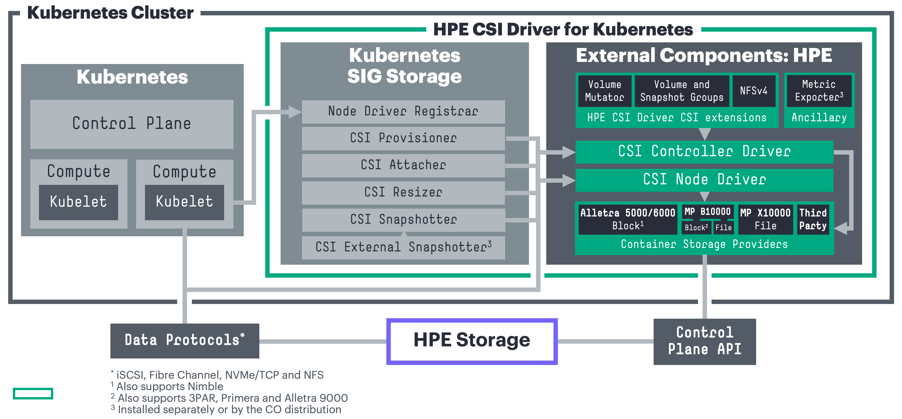

# Introduction

A Container Storage Interface ([CSI](https://github.com/container-storage-interface/spec)) Driver for Kubernetes. The HPE CSI Driver for Kubernetes allows you to use a [Container Storage Provider](container_storage_provider/index.md) (CSP) to perform data management operations on storage resources. The architecture of the CSI driver allows block (iSCSI/FC) and file (NFS) storage vendors to implement a CSP that follows the [specification](https://github.com/hpe-storage/container-storage-provider) (a [browser friendly version](https://developer.hpe.com/api/hpe-nimble-csp/)).

The CSI driver architecture allows a complete separation of concerns between upstream Kubernetes core, SIG Storage (CSI owners), CSI driver author (HPE) and the backend CSP developer.

!!! tip
    The HPE CSI Driver for Kubernetes is vendor agnostic. Any entity may leverage the driver and provide their own Container Storage Provider.

## Table of Contents

[TOC]

## Features and Capabilities

CSI gradually mature features and capabilities in the specification at the pace of the community. HPE keep a close watch on differentiating features the primary storage family of products may be suitable for implementing in CSI and Kubernetes. HPE experiment early and often. That's why it's sometimes possible to observe a certain feature being available in the CSI driver although it hasn't been announced or isn't documented.

Below is the official table for CSI features we track and deem readily available for use after we've officially tested and validated it in the [platform matrix](#compatibility_and_support).

| Feature                                | K8s maturity      | Since K8s version | HPE CSI Driver |
|----------------------------------------|-------------------|-------------------|----------------|
| Dynamic Provisioning                   | Stable            | 1.13              | 1.0.0          |
| Volume Expansion                       | Stable            | 1.24              | 1.1.0          |
| Volume Snapshots                       | Stable            | 1.20              | 1.1.0          |
| PVC Data Source                        | Stable            | 1.18              | 1.1.0          |
| Raw Block Volume                       | Stable            | 1.18              | 1.2.0          |
| Inline Ephemeral Volumes               | Stable            | 1.25              | 1.2.0          |
| Volume Limits                          | Stable            | 1.17              | 1.2.0          |
| Generic Ephemeral Volumes              | Stable            | 1.23              | 1.3.0          |
| Volume Mutator1             | N/A               | 1.15              | 1.3.0          |
| Volume Groups1              | N/A               | 1.17              | 1.4.0          |
| Snapshot Groups1            | N/A               | 1.17              | 1.4.0          |
| NFS Server Provisioner1     | N/A               | 1.17              | 1.4.0          |
| Volume Encryption1          | N/A               | 1.18              | 2.0.0          |
| Basic Topology3             | Stable            | 1.17              | 2.5.0          |
| Native NFS (via CSP)                   | Stable            | 1.13              | 3.0.0          |
| Volume Expansion From Source           | Stable            | 1.27              | 3.0.0          |
| Advanced Topology3          | Stable            | 1.17              | Future         |
| Storage Capacity Tracking              | Stable            | 1.24              | Future         |
| ReadWriteOncePod                       | Stable            | 1.29              | Future         |
| Volume Attribute Classes               | Stable            | 1.34              | Future         |
| Volume Populator                       | Stable            | 1.33              | Future         |
| Mutable CSI Node Allocatable Count     | Stable            | 1.36              | Future         |
| Volume Group Snapshot                  | Stable            | 1.36              | Future         |
| Volume Health Monitor                  | Alpha             | 1.21              | Future         |
| Cross Namespace Snapshots              | Alpha             | 1.26              | Future         |
| Change Block Tracking                  | Alpha             | 1.33              | Future         |

<small>
 1 = HPE CSI Driver for Kubernetes specific CSI sidecar. CSP support may vary. 
 2 = Alpha features are enabled by [Kubernetes feature gates](https://kubernetes.io/docs/reference/command-line-tools-reference/feature-gates/) and are not formally supported by HPE. 
 3 = Topology information can only be used to describe accessibility relationships between a set of nodes and a single backend using a `StorageClass`. See [Topology and volumeBindingMode](using.md#topology_and_volumebindingmode) for more information.
</small>

Depending on the CSP, it may support a number of different snapshotting, cloning and restoring operations by taking advantage of `StorageClass` parameter overloading. Please see the respective [CSP](container_storage_provider/index.md) for additional functionality.

Refer to the [official table](https://kubernetes.io/docs/reference/command-line-tools-reference/feature-gates/) of feature gates in the Kubernetes docs to find availability of beta and alpha features. HPE provide limited support on non-GA CSI features. Please file any issues, questions or feature requests [here](https://github.com/hpe-storage/csi-driver/issues). You may also join our Slack community to chat with HPE folks close to this project. We hang out in `#Alletra` and `#Kubernetes`, sign up at [slack.hpedev.io](https://slack.hpedev.io/) and login at [hpedev.slack.com](https://hpedev.slack.com).

!!! tip
    Familiarize yourself with the basic requirements below for running the CSI driver on your Kubernetes cluster. It's then highly recommended to continue installing the CSI driver with either a [Helm chart](deployment.md#helm) or an [Operator](deployment.md#operator).

## Compatibility and Support

These are the combinations HPE has tested and can provide official support services around for each of the CSI driver releases. Each [Container Storage Provider](container_storage_provider/index.md) has it's own requirements in terms of storage platform OS and may have other constraints not listed here.

!!! note
    For Kubernetes 1.12 and earlier please see [legacy FlexVolume drivers](../flexvolume_driver/index.md), do note that the FlexVolume drivers are being deprecated.

#### HPE CSI Driver for Kubernetes 3.3.0

Release highlights:

* Support for Alletra Storage MP B10000 10.6
* Improved `VolumeAttachment` scaling for Alletra Storage MP B10000
* Enhanced multitenancy with hashed CSI hostnames and Virtual Domains
* Added an "insecure" option to allow Alletra Storage MP B10000 File Service NFS clients to mount exports from random sources ports >1024
* Many improvements to security, reliability, availability and scalability

Upgrade considerations:

* Existing claims provisioned with the NFS Server Provisioner [may optionally be upgraded](operations.md#upgrade_to_v330).
* `VolumeGroupClasses` "domain" parameter has changed to "virtualDomain". Existing `VolumeGroups` will continue to operate but any `VolumeGroupClass` that has a "domain" parameter needs to be recreated.

<table>
  <tr>
    <th>Kubernetes</th>
    <td>1.34-1.371</td>
  </tr>
  <tr>
    <th>Helm Chart</th>
    <td><a href="https://artifacthub.io/packages/helm/hpe-storage/hpe-csi-driver/3.3.0">v3.3.0</a> on ArtifactHub</td>
  </tr>
  <tr>
    <th>Operators</th>
    <td>
     <a href="https://operatorhub.io/operator/hpe-csi-operator/stable/hpe-csi-operator.v3.3.0">v3.3.0</a> on OperatorHub 
     <a href="https://catalog.redhat.com/software/container-stacks/detail/5e9874643f398525a0ceb004">v3.3.0</a> via OpenShift console, see <a href="partners/redhat_openshift">Partner Ecosystems / Red Hat OpenShift</a>
    </td>
  </tr>
  <tr>
    <th>Worker&nbsp;OS</th>
    <td>
      Red Hat Enterprise Linux (including CoreOS)2 8.x, 9.x, 10.x 
      Ubuntu 20.04, 22.04, 24.04, 26.04 
      SUSE Linux Enterprise Server (including SL Micro4) 15 SP5, SP6, SP7, 16
  </tr>
  <tr>
    <th>CPU architecture</th>
    <td>AMD64, ARM64</td>
  </tr>
  <tr>
    <th>Platforms3</th>
    <td>
      Alletra Storage MP B10000 10.6.0 
      Alletra Storage MP X10000 2.0.0.0 
      Alletra OS 9000 9.6.20 
      Alletra OS 5000/6000 6.1.3.300 
      Nimble OS 6.1.3.300 
      Primera OS 4.6.20 
      3PAR OS 3.3.2 EMU1
    </td>
  </tr>
  <tr>
    <th>Data&nbsp;protocols</th>
    <td>Fibre Channel, iSCSI, NVMe/TCP and NFS</td>
  </tr>
  <tr>
    <th>Filesystems</th>
    <td>XFS, ext3/ext4, btrfs, NFSv4&ast;</td>
  </tr>
  <tr>
    <th>Release&nbsp;notes</th>
    <td><a href="https://github.com/hpe-storage/csi-driver/blob/master/release-notes/v3.3.0.md">v3.3.0</a> on GitHub</td>
  </tr>
  <tr>
   <th>Blogs</th>
   <td>
    <a href="https://community.hpe.com/t5/around-the-storage-block/improved-scalability-and-multitenancy-with-hpe-csi-driver-for/ba-p/7272513">Improved scalability and multitenancy with HPE CSI Driver for Kubernetes 3.3.0</a>
   </td>
 </tr>
</table>

#### HPE CSI Driver for Kubernetes 3.2.0

Release highlights:

* Introducing NFS support for Alletra Storage MP X10000
* Security updates
* Incremental ecosystem updates

Upgrade considerations:

* Existing claims provisioned with the NFS Server Provisioner [may optionally be upgraded](operations.md#upgrade_to_v320).

<table>
  <tr>
    <th>Kubernetes</th>
    <td>1.33-1.361</td>
  </tr>
  <tr>
    <th>Helm Chart</th>
    <td><a href="https://artifacthub.io/packages/helm/hpe-storage/hpe-csi-driver/3.2.0">v3.2.0</a> on ArtifactHub</td>
  </tr>
  <tr>
    <th>Operators</th>
    <td>
     <a href="https://operatorhub.io/operator/hpe-csi-operator/stable/hpe-csi-operator.v3.2.0">v3.2.0</a> on OperatorHub 
     <a href="https://catalog.redhat.com/software/container-stacks/detail/5e9874643f398525a0ceb004">v3.2.0</a> via OpenShift console
    </td>
  </tr>
  <tr>
    <th>Worker&nbsp;OS</th>
    <td>
      Red Hat Enterprise Linux (including CoreOS)2 8.x, 9.x, 10.x 
      Ubuntu 18.04, 20.04, 22.04, 24.04 
      SUSE Linux Enterprise Server (including SL Micro4) 15 SP5, SP6, SP7
  </tr>
  <tr>
    <th>CPU architecture</th>
    <td>AMD64, ARM64</td>
  </tr>
  <tr>
    <th>Platforms3</th>
    <td>
      Alletra Storage MP B10000 10.5.60 
      Alletra Storage MP X10000 2.0.0.0 
      Alletra OS 9000 9.6.20 
      Alletra OS 5000/6000 6.1.3.300 
      Nimble OS 6.1.3.300 
      Primera OS 4.6.20 
      3PAR OS 3.3.2 EMU1
    </td>
  </tr>
  <tr>
    <th>Data&nbsp;protocols</th>
    <td>Fibre Channel, iSCSI, NVMe/TCP and NFS</td>
  </tr>
  <tr>
    <th>Filesystems</th>
    <td>XFS, ext3/ext4, btrfs, NFSv4&ast;</td>
  </tr>
  <tr>
    <th>Release&nbsp;notes</th>
    <td><a href="https://github.com/hpe-storage/csi-driver/blob/master/release-notes/v3.2.0.md">v3.2.0</a> on GitHub</td>
  </tr>
  <tr>
   <th>Blogs</th>
   <td>
    <a href="https://community.hpe.com/t5/around-the-storage-block/unstructured-storage-for-kubernetes-unleashed-with-hpe-alletra/ba-p/7267994">Unstructured storage for Kubernetes unleashed with HPE Alletra Storage MP X10000</a>
   </td>
 </tr>
</table>

<small>
 &ast; = The HPE CSI Driver for Kubernetes is a block and file storage driver. For block only platforms it includes an [NFS Server Provisioner](using.md#using_the_nfs_server_provisioner) that allows "ReadWriteMany" `PersistentVolumeClaims` for `volumeMode: Filesystem`. 
 1 = For HPE Morpheus Enterprise Kubernetes Service (HKS), HPE Ezmeral Runtime Enterprise, SUSE Rancher, Mirantis Kubernetes Engine and others; Kubernetes clusters must be deployed within the currently supported range of "Worker OS" platforms listed in the above table. See [partner ecosystems](partners/index.md) for other variations. Lowest tested and known working version is Kubernetes 1.21<!-- and it has been field tested with Kubernetes 1.34 -->. 
 2 = The HPE CSI Driver will recognize AlmaLinux, Amazon Linux, CentOS, Oracle Linux and Rocky Linux as RHEL derives and they are supported by HPE. While RHEL 7 and its derives will work, the host OS have been EOL'd and support is limited. 
 3 = Learn about each data platform's team [support commitment](../legal/support/index.md#container_storage_providers). 
 4 = SL Micro nodes may need to be conformed manually, run `transactional-update -n pkg install multipath-tools open-iscsi nfs-client sg3_utils nvme-cli` and reboot if the CSI node driver doesn't start. 
</small>

#### HPE CSI Driver for Kubernetes 3.1.0

Release highlights:

* Introducing NVMe/TCP support for Alletra Storage MP B10000
* Support for IPv6 control and data plane for iSCSI on Alletra Storage MP B10000
* Periodic replication support for Alletra Storage MP B10000
* Security updates addressing several active CVEs
* Incremental ecosystem updates

Upgrade considerations:

* In order to use NVMe/TCP devices on existing clusters with any prior version of HPE CSI Driver installed, see the [upgrade section](https://artifacthub.io/packages/helm/hpe-storage/hpe-csi-driver#upgrading-the-chart) in the Helm chart.
* Existing claims provisioned with the NFS Server Provisioner [may optionally be upgraded](operations.md#upgrade_to_v310).

<table>
  <tr>
    <th>Kubernetes</th>
    <td>1.32-1.351</td>
  </tr>
  <tr>
    <th>Helm Chart</th>
    <td><a href="https://artifacthub.io/packages/helm/hpe-storage/hpe-csi-driver/3.1.0">v3.1.0</a> on ArtifactHub</td>
  </tr>
  <tr>
    <th>Operators</th>
    <td>
     <a href="https://operatorhub.io/operator/hpe-csi-operator/stable/hpe-csi-operator.v3.1.0">v3.1.0</a> on OperatorHub 
     <a href="https://catalog.redhat.com/software/container-stacks/detail/5e9874643f398525a0ceb004">v3.1.0</a> via OpenShift console
    </td>
  </tr>
  <tr>
    <th>Worker&nbsp;OS</th>
    <td>
      Red Hat Enterprise Linux (including CoreOS)2 8.x, 9.x, 10.x 
      Ubuntu 16.04, 18.04, 20.04, 22.04, 24.04 
      SUSE Linux Enterprise Server (including SL Micro4) 15 SP5, SP6, SP7
  </tr>
  <tr>
    <th>CPU architecture</th>
    <td>AMD64, ARM64</td>
  </tr>
  <tr>
    <th>Platforms3</th>
    <td>
      Alletra Storage MP B10000 10.2.x - 10.5.x 
      Alletra OS 9000 9.3.x - 9.6.x 
      Alletra OS 5000/6000 6.0.0.x - 6.1.3.x 
      Nimble OS 5.0.10.x, 5.2.1.x, 6.0.0.x, 6.1.3.x 
      Primera OS 4.3.x - 4.6.x 
      3PAR OS 3.3.x
    </td>
  </tr>
  <tr>
    <th>Data&nbsp;protocols</th>
    <td>Fibre Channel, iSCSI, NVMe/TCP and NFS</td>
  </tr>
  <tr>
    <th>Filesystems</th>
    <td>XFS, ext3/ext4, btrfs, NFSv4&ast;</td>
  </tr>
  <tr>
    <th>Release&nbsp;notes</th>
    <td><a href="https://github.com/hpe-storage/csi-driver/blob/master/release-notes/v3.1.0.md">v3.1.0</a> on GitHub</td>
  </tr>
  <tr>
   <th>Blogs</th>
   <td>
    <a href="https://community.hpe.com/t5/around-the-storage-block/introducing-nvme-tcp-for-hpe-alletra-storage-mp-b10000-with-hpe/ba-p/7262519">Introducing NVMe/TCP for HPE Alletra Storage MP B10000 with HPE CSI Driver for Kubernetes 3.1.0</a>
   </td>
 </tr>
</table>

<small>
 &ast; = The HPE CSI Driver for Kubernetes is a block and file storage driver. For block only platforms it includes an [NFS Server Provisioner](using.md#using_the_nfs_server_provisioner) that allows "ReadWriteMany" `PersistentVolumeClaims` for `volumeMode: Filesystem`. 
 1 = For HPE Morpheus Enterprise Kubernetes Service (HKS), HPE Ezmeral Runtime Enterprise, SUSE Rancher, Mirantis Kubernetes Engine and others; Kubernetes clusters must be deployed within the currently supported range of "Worker OS" platforms listed in the above table. See [partner ecosystems](partners/index.md) for other variations. Lowest tested and known working version is Kubernetes 1.21<!-- and it has been field tested with Kubernetes 1.34 -->. 
 2 = The HPE CSI Driver will recognize AlmaLinux, Amazon Linux, CentOS, Oracle Linux and Rocky Linux as RHEL derives and they are supported by HPE. While RHEL 7 and its derives will work, the host OS have been EOL'd and support is limited. 
 3 = Learn about each data platform's team [support commitment](../legal/support/index.md#container_storage_providers). 
 4 = SL Micro nodes may need to be conformed manually, run `transactional-update -n pkg install multipath-tools open-iscsi nfs-client sg3_utils nvme-cli` and reboot if the CSI node driver doesn't start. 
</small>

#### HPE CSI Driver for Kubernetes 3.0.1

Release highlights:

* Fixed an upgrade issue between 2.5.2 and 3.0.0. Go directly to 3.0.1 where applicable.
* Addressed issues related to Active Peer Persistence with Alletra Storage MP B10000.

!!! caution "Note"
    The latest version of the Helm chart and Operator that has been published is 3.0.2 and does not add any new functionality besides OpenShift4.20 certification and minor bug fixes. Kubernetes 1.34 has been field tested with 3.0.2 and is supported.

!!! tip "Good to know"
    This release only contains updates to the 3PAR CSP and only affects 3PAR derived platforms such as Primera, Alletra 9000 and Alletra Storage MP B10000. Customers on Nimble derived platforms do not need to update.

<table>
  <tr>
    <th>Kubernetes</th>
    <td>1.30-1.331</td>
  </tr>
  <tr>
    <th>Helm Chart</th>
    <td><a href="https://artifacthub.io/packages/helm/hpe-storage/hpe-csi-driver/3.0.1">v3.0.1</a> on ArtifactHub</td>
  </tr>
  <tr>
    <th>Operators</th>
    <td>
     <a href="https://operatorhub.io/operator/hpe-csi-operator/stable/hpe-csi-operator.v3.0.1">v3.0.1</a> on OperatorHub 
     <a href="https://catalog.redhat.com/software/container-stacks/detail/5e9874643f398525a0ceb004">v3.0.1</a> via OpenShift console
    </td>
  </tr>
  <tr>
    <th>Worker&nbsp;OS</th>
    <td>
      Red Hat Enterprise Linux (including CoreOS)2 8.x, 9.x, 10.x 
      Ubuntu 16.04, 18.04, 20.04, 22.04, 24.04 
      SUSE Linux Enterprise Server (including SLE Micro4) 15 SP4, SP5, SP6
  </tr>
  <tr>
    <th>CPU architecture</th>
    <td>AMD64, ARM64</td>
  </tr>
  <tr>
    <th>Platforms3</th>
    <td>
      Alletra Storage MP B10000 10.2.x - 10.5.x 
      Alletra OS 9000 9.3.x - 9.6.x 
      Alletra OS 5000/6000 6.0.0.x - 6.1.2.x 
      Nimble OS 5.0.10.x, 5.2.1.x, 6.0.0.x, 6.1.2.x 
      Primera OS 4.3.x - 4.6.x 
      3PAR OS 3.3.x
    </td>
  </tr>
  <tr>
    <th>Data&nbsp;protocols</th>
    <td>Fibre Channel, iSCSI, NFS</td>
  </tr>
  <tr>
    <th>Filesystems</th>
    <td>XFS, ext3/ext4, btrfs, NFSv4&ast;</td>
  </tr>
  <tr>
    <th>Release&nbsp;notes</th>
    <td><a href="https://github.com/hpe-storage/csi-driver/blob/master/release-notes/v3.0.1.md">v3.0.1</a> on GitHub</td>
  </tr>
</table>

<small>
 &ast; = The HPE CSI Driver for Kubernetes is a block and file storage driver. For block only platforms it includes an [NFS Server Provisioner](using.md#using_the_nfs_server_provisioner) that allows "ReadWriteMany" `PersistentVolumeClaims` for `volumeMode: Filesystem`. 
 1 = For Morpheus Kubernetes Service, HPE Ezmeral Runtime Enterprise, SUSE Rancher, Mirantis Kubernetes Engine and others; Kubernetes clusters must be deployed within the currently supported range of "Worker OS" platforms listed in the above table. See [partner ecosystems](partners/index.md) for other variations. Lowest tested and known working version is Kubernetes 1.21 and it has been field tested with Kubernetes 1.34. 
 2 = The HPE CSI Driver will recognize AlmaLinux, Amazon Linux, CentOS, Oracle Linux and Rocky Linux as RHEL derives and they are supported by HPE. While RHEL 7 and its derives will work, the host OS have been EOL'd and support is limited. 
 3 = Learn about each data platform's team [support commitment](../legal/support/index.md#container_storage_providers). 
 4 = SLE Micro nodes may need to be conformed manually, run `transactional-update -n pkg install multipath-tools open-iscsi nfs-client sg3_utils` and reboot if the CSI node driver doesn't start. The HPE CSI Driver is unable to conform nodes with SL Micro 6.0 and later at this time. 
</small>

#### HPE CSI Driver for Kubernetes 3.0.0

!!! caution
    An issue has been identified when upgrading 2.5.2 to 3.0.0 with Alletra Storage MP B10000, Alletra 9000, Primera and 3PAR. Only use 3.0.0 for those platform on clusters with no current workloads running. Contact support if this has already been done and see issues with unpublishing volumes. Upgrading from 2.5.2 directly to upcoming 3.0.1 is recommended.

Release highlights:

* Introducing support for Kubernetes 1.33 and OpenShift 4.19
* Introducing HPE Alletra Storage MP B10000 File Service CSP
* Active Peer Persistence support with automatic workload recovery
* Official support for HPE ProLiant RL300 Gen11 and DL384 Gen12 (ARM-based CPUs)
* Several enhancements to the NFS Server Provisioner
* Volume expansion on clone creation

Upgrade considerations:

* Existing claims provisioned with the NFS Server Provisioner [needs to be upgraded](operations.md#upgrade_to_v301).

<table>
  <tr>
    <th>Kubernetes</th>
    <td>1.30-1.331</td>
  </tr>
  <tr>
    <th>Helm Chart</th>
    <td><a href="https://artifacthub.io/packages/helm/hpe-storage/hpe-csi-driver/3.0.0">v3.0.0</a> on ArtifactHub</td>
  </tr>
  <tr>
    <th>Operators</th>
    <td>
     <a href="https://operatorhub.io/operator/hpe-csi-operator/stable/hpe-csi-operator.v3.0.0">v3.0.0</a> on OperatorHub 
     <a href="https://catalog.redhat.com/software/container-stacks/detail/5e9874643f398525a0ceb004">v3.0.0</a> via OpenShift console
    </td>
  </tr>
  <tr>
    <th>Worker&nbsp;OS</th>
    <td>
      Red Hat Enterprise Linux (including CoreOS)2 8.x, 9.x, 10.x 
      Ubuntu 16.04, 18.04, 20.04, 22.04, 24.04 
      SUSE Linux Enterprise Server (including SLE Micro4) 15 SP4, SP5, SP6
  </tr>
  <tr>
    <th>CPU architecture</th>
    <td>AMD64, ARM64</td>
  </tr>
  <tr>
    <th>Platforms3</th>
    <td>
      Alletra Storage MP B10000 10.2.x - 10.5.x 
      Alletra OS 9000 9.3.x - 9.6.x 
      Alletra OS 5000/6000 6.0.0.x - 6.1.2.x 
      Nimble OS 5.0.10.x, 5.2.1.x, 6.0.0.x, 6.1.2.x 
      Primera OS 4.3.x - 4.6.x 
      3PAR OS 3.3.x
    </td>
  </tr>
  <tr>
    <th>Data&nbsp;protocols</th>
    <td>Fibre Channel, iSCSI, NFS</td>
  </tr>
  <tr>
    <th>Filesystems</th>
    <td>XFS, ext3/ext4, btrfs, NFSv4&ast;</td>
  </tr>
  <tr>
    <th>Release&nbsp;notes</th>
    <td><a href="https://github.com/hpe-storage/csi-driver/blob/master/release-notes/v3.0.0.md">v3.0.0</a> on GitHub</td>
  </tr>
  <tr>
   <th>Blogs</th>
   <td>
    <a href="https://community.hpe.com/t5/around-the-storage-block/introducing-hpe-alletra-storage-mp-b10000-file-service-with-hpe/ba-p/7252531">Introducing HPE Alletra Storage MP B10000 File Service with HPE CSI Driver for Kubernetes 3.0.0</a>
   </td>
 </tr>
</table>

<small>
 &ast; = The HPE CSI Driver for Kubernetes is a block and file storage driver. For block only platforms it includes an [NFS Server Provisioner](using.md#using_the_nfs_server_provisioner) that allows "ReadWriteMany" `PersistentVolumeClaims` for `volumeMode: Filesystem`. 
 1 = For Morpheus Kubernetes Service, HPE Ezmeral Runtime Enterprise, SUSE Rancher, Mirantis Kubernetes Engine and others; Kubernetes clusters must be deployed within the currently supported range of "Worker OS" platforms listed in the above table. See [partner ecosystems](partners/index.md) for other variations. Lowest tested and known working version is Kubernetes 1.21. 
 2 = The HPE CSI Driver will recognize AlmaLinux, Amazon Linux, CentOS, Oracle Linux and Rocky Linux as RHEL derives and they are supported by HPE. While RHEL 7 and its derives will work, the host OS have been EOL'd and support is limited. 
 3 = Learn about each data platform's team [support commitment](../legal/support/index.md#container_storage_providers). 
 4 = SLE Micro nodes may need to be conformed manually, run `transactional-update -n pkg install multipath-tools open-iscsi nfs-client sg3_utils` and reboot if the CSI node driver doesn't start. The HPE CSI Driver is unable to conform nodes with SL Micro 6.0 and later at this time. 
</small>

#### Release Archive

HPE currently supports up to three minor releases of the HPE CSI Driver for Kubernetes.

* [Unsupported releases](archive.md)

## Known Limitations

* Always check with the Kubernetes vendor distribution which CSI features are available for use and supported by the vendor.
* When using Kubernetes in virtual machines on VMware vSphere, OpenStack or similar, iSCSI, NVMe/TCP and NFS are the only supported data protocol for the HPE CSI Driver. The CSI driver does **not** support NPIV which is required for FC.
* Ephemeral, transient or non-persistent Kubernetes nodes are not supported unless the `/etc/hpe-storage` directory persists across node upgrades or reboots. The path is relocatable using a custom Helm chart or deployment manifest by altering the `mountPath` parameter for the directory.
* The HPE CSI Driver uses host networking for the node driver. Some CNIs have flaky implementations which prevents the CSI driver components to communicate properly. Especially notorious is Flannel on K3s. Use Calico if possible for the widest compatibility.
* The [NFS Server Provisioner](using.md#limitations_and_considerations_for_the_nfs_server_provisioner) and each of the [CSPs](container_storage_provider/index.md) have known limitations listed separately.
* When attempting import of existing legacy volumes through the CSP specific "importVolumeName" and "importVolAsClone" features, it's important to understand that the CSI driver will attempt to use the largest existing partition on the device and attempt the mount. If the underlying host OS supports mounting the filesystem, the CSI driver will mount it with the following caveats. The "fsRepair" parameter will only work with ext3, ext4 and XFS. Any filesystem dependent kernel modules needed by the mount command needs to be installed by the system administrator of the worker nodes.
* Performing rolling upgrades of Kubernetes requires that the CSI controller and CSPs are scheduled on nodes that don't allow `PersistentVolumes` from the CSI driver. See [apply nodeSelectors and tolerations to perform rolling upgrades](operations.md#apply_nodeselectors_and_tolerations_to_perform_rolling_upgrades) for more details.
* The CSI driver does not support host-based encryption on `PVCs` using `volumeMode: Block`.

## VolumeAttachment Limitations

The CSI driver reports a fixed number of allocatable volumes per node to Kubernetes. Inspect the current limitation by running `kubectl get csinodes -o yaml` and inspect `.spec.drivers.allocatable` for "csi.hpe.com". The "count" element contains how many volumes the node can attach from the HPE CSI Driver (the default is 250). From v2.5.2 onwards this parameter is tunable in the [Helm chart](https://artifacthub.io/packages/helm/hpe-storage/hpe-csi-driver). See each respective [CSP](container_storage_provider/index.md) limitations for more guidance and be understood with the [Multipath Recommendations](#multipath_recommendations) and [VolumeAttachment Rates](#volumeattachment_rates).

### Multipath Recommendations

FC and iSCSI protocols uses multipath devices assembled by SCSI disks appearing on the node during discovery. These SCSI disks are sometimes distinguished as a "path" to the underlying storage to improve performance and resilience. It's recommended to not exceed 4000 paths in total for a node. In a scenario where it's desirable to scale up to 1000 multipath devices, no more than 4 paths per multipath may be presented at any give time. With the default `maxVolumesPerNode` set at 250, there can be up to 16 paths per multipath device.

### VolumeAttachment Rates

It takes around 5-10 seconds to attach a `PersistentVolume` to a node. This number scales linearly per node. Attaching the recommended 250 `maxVolumesPerNode` if 250 requests are submitted to the cluster at the exact same time will take (`(250 * 10) / 60`) 42 minutes and about 3 hours for 1000 `VolumeAttachments` if all attachments were to be processed for one node. Processing 1000 `VolumeAttachments` across 32 nodes takes around 5 minutes. Plan accordingly.

!!! danger "VolumeAttachment Recommendations"
    HPE recommends not exceeding 1000 `VolumeAttachments` and 4000 paths per node. It's advisable to leave headroom (N-2 to remain resilient during a node failure) for emergencies. Recovering a failed node may take hours to reschedule on a small cluster. Other limits may apply based on protocols, LUN limits of FC HBAs and outstanding data management operations such as online clones. It's advisable to test the upper bounds before assuming the resources are enough for both applications and infrastructure.

## iSCSI CHAP Considerations

If iSCSI CHAP is being used in the environment, consider the following.

### Existing PVs and iSCSI sessions

It's not recommended to retro fit CHAP into an existing environment where `PersistentVolumes` are already provisioned and attached. If necessary, all iSCSI sessions needs to be logged out from and the CSI driver Helm chart needs to be installed with [cluster-wide iSCSI CHAP credentials](using.md#cluster-wide_iscsi_chap_credentials) for iSCSI CHAP to be effective, otherwise existing non-authenticated sessions will be reused.

### CSI driver 2.5.0 and Above

In 2.5.0 and later the CHAP credentials must be supplied by a separate `Secret`. The `Secret` may be supplied when installing the Helm Chart (the `Secret` must exist prior) or referenced in the `StorageClass`.

### One CHAP configuration per backend

Inherently iSCSI CHAP operates per session against an iSCSI portal. The CSI driver only supports using a common set of sessions per iSCSI portal. It's imperative that only one iSCSI CHAP configuration exists (or don't exist) per cluster and storage backend pair.

#### Upgrade Considerations

When using CHAP with 2.4.2 or older the CHAP credentials were provided in clear text in the Helm Chart. To continue to use CHAP for those existing `PersistentVolumes`, a CHAP `Secret` needs to be created and referenced in the Helm Chart install.

New `StorageClasses` may reference the same `Secret`, it's recommended to use a different `Secret` to distinguish legacy and new `PersistentVolumes`.

#### Enable iSCSI CHAP

How to enable iSCSI CHAP in the current version of the HPE CSI Driver is available in the [user documentation](using.md#enabling_iscsi_chap).

### CSI driver 1.3.0 to 2.4.2

CHAP is an optional part of the initial deployment of the driver with parameters passed to Helm or the Operator. For object definitions, the `CHAP_USER` and `CHAP_PASSWORD` needs to be supplied to the `csi-node-driver`. The CHAP username and secret is picked up in the `hpenodeinfo` Custom Resource Definition (CRD). The CSP is under contract to create the user if it doesn't exist on the backend.

CHAP is a good measure to prevent unauthorized access to iSCSI targets, it does not encrypt data on the wire. CHAP secrets should be at least twelve characters in length.

### CSI driver 1.2.1 and Below

In version 1.2.1 and below, the CSI driver did not support CHAP natively. CHAP must be enabled manually on the worker nodes before deploying the CSI driver on the cluster. This also needs to be applied to new worker nodes before they join the cluster.

## Kubernetes Feature Gates

Different features mature at different rates. Refer to the [official table](https://kubernetes.io/docs/reference/command-line-tools-reference/feature-gates/) of feature gates in the Kubernetes docs.

!!! note "Good to know"
    There are no features in the currently shipping and supported version of the HPE CSI Driver that require separate feature gates.
