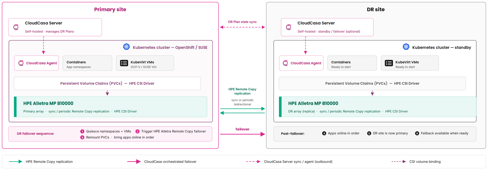

# Overview

This page describes how to protect Kubernetes workloads running on HPE storage with CloudCasa, using the HPE CSI Driver for Kubernetes and HPE Alletra Storage MP B10000 and Alletra 9000 arrays. CloudCasa offers two complementary forms of protection for these workloads:

- Backups and restores based on CSI volume snapshots taken through the HPE CSI Driver ― the standard CloudCasa Kubernetes data-protection workflow.
- Array-based disaster recovery (DR) using HPE Remote Copy replication between a source and a destination array, with CloudCasa DR orchestrating failover and failback.

!!! note "Scope"
    This page covers the CloudCasa side of protecting workloads using the HPE CSI Driver. The step-by-step backup and restore procedures are documented in the CloudCasa documentation linked under [Backups and Restores](#backups_and_restores). For array-based DR, the array-side Remote Copy configuration such as replication targets, common provisioning groups (CPGs), and remote copy groups (RCGs) is assumed to be set up in advance by your storage administrator and is described here only conceptually. For the HPE array and HPE CSI Driver configuration, follow the HPE documentation linked in [Related Documentation](#related_documentation).

[TOC]

## Protection Methods

CloudCasa protects Kubernetes workloads using the HPE CSI Driver in two ways, which you can use independently or together:

- Backups and restores ― CloudCasa backs up volumes provisioned by the HPE CSI Driver based on CSI snapshots taken through the HPE CSI Driver and restores them to the same or a different cluster. Use this for routine data protection and operational recovery (see [Backups and Restores](#backups_and_restores)).
- Array-based disaster recovery ― CloudCasa DR orchestrates HPE Remote Copy replication between two arrays and drives failover and failback at the RCG level. Use this for site-level DR, where a second array already holds a replicated copy of the data (see [Disaster Recovery](#disaster_recovery)).

Both modes share a common set of [Prerequisites](#prerequisites).

### CloudCasa Control Plane Deployment Models

CloudCasa's control plane is available in two deployment models. The HPE protection workflow described here is the same in both; only where the control plane runs differs.

- SaaS: the CloudCasa-hosted service at [home.cloudcasa.io](https://home.cloudcasa.io). Nothing extra to install for the control plane; you onboard clusters and drive everything from the hosted UI. See the [CloudCasa overview](https://docs.cloudcasa.io/help/overview-cloudcasa.html).
- Self-hosted: you run the CloudCasa control plane yourself. Array-based DR works the same way as in SaaS from a single control plane. Optionally, self-hosted deployments can also register DR CloudCasa Servers ― a separate CloudCasa server at the primary and DR sites, syncing DR resources between them and running recovery from the remote CloudCasa server. This option is only available in self-hosted; it is not supported in SaaS. See [DR CloudCasa Servers](https://docs.cloudcasa.io/help/dr-ccservers.html).

## Prerequisites

The prerequisites below cover all CloudCasa protection of workloads using the HPE CSI Driver. The shared group applies to both protection modes; the remaining groups add what is needed specifically for backups and restores or for array-based DR.

### Shared Prerequisites

- HPE CSI Driver installed and configured against the corresponding HPE storage array, including a working backend `Secret` and `StorageClass`. See the HPE CSI Driver documentation on SCOD in [Related Documentation](#related_documentation).
- CloudCasa agent installed and the cluster Active. Add each cluster in CloudCasa, apply the returned agent manifest, and wait for the cluster to reach the Active state (see [Appendix: Cluster Onboarding Recap](#appendix_cluster_onboarding_recap)). The agent components install into the "cloudcasa-io" `Namespace`.
- The HPE CSI Driver backend `Secret` that authenticates to the array (see [HPE CSI Driver Backend Secret](#hpe_csi_driver_backend_secret) below).

#### HPE CSI Driver Backend Secret

CloudCasa uses the same `Secret` referred to by the HPE CSI Driver `StorageClasses` and `VolumeSnapshotClasses`. Refer to [Add an HPE Storage Backend](../../deployment.md#add_an_hpe_storage_backend) for how to create a `Secret` for the HPE Alletra Storage MP B10000 or Alletra 9000.

!!! note
    The `Secret` must exist before configuring CloudCasa with HPE storage.

### Additional Prerequisites for Backups and Restores

Backups use the CSI snapshot path, which array-based DR does not.

- CSI snapshots enabled on the cluster. See [Enabling CSI Snapshots](../../using.md#enabling_csi_snapshots).
- A `VolumeSnapshotClass` for the `csi.hpe.com` driver that CloudCasa can discover (see [VolumeSnapshotClass for CloudCasa](#volumesnapshotclass_for_cloudcasa) below).

#### VolumeSnapshotClass for CloudCasa

CloudCasa discovers any `VolumeSnapshotClass` labeled `cloudcasa.io/csi-volumesnapshot-class: "true"`. Label an existing class, such as the `hpe-snapshot` class created in [Using CSI Snapshots](../../using.md#using_csi_snapshots):

```text
kubectl label volumesnapshotclass hpe-snapshot cloudcasa.io/csi-volumesnapshot-class="true"
```

Alternatively, create a dedicated class with the label in place. A `deletionPolicy` of `Retain` is recommended so that snapshots survive deletion of the `VolumeSnapshot` object.

```yaml
apiVersion: snapshot.storage.k8s.io/v1
kind: VolumeSnapshotClass
metadata:
  name: hpe-snapshot-cloudcasa
  labels:
    cloudcasa.io/csi-volumesnapshot-class: "true"
driver: csi.hpe.com
deletionPolicy: Retain
parameters:
  description: "Snapshot created by the HPE CSI Driver for CloudCasa"
  csi.storage.k8s.io/snapshotter-secret-name: hpe-backend
  csi.storage.k8s.io/snapshotter-secret-namespace: hpe-storage
  csi.storage.k8s.io/snapshotter-list-secret-name: hpe-backend
  csi.storage.k8s.io/snapshotter-list-secret-namespace: hpe-storage
```

!!! note
    If no class is labeled, you can also select a `VolumeSnapshotClass` in the CloudCasa UI. See the CloudCasa [VolumeSnapshotClass reference](https://docs.cloudcasa.io/help/reference-vol-snapshot.html).

### Additional Prerequisites for Disaster Recovery

In addition to the [Shared Prerequisites](#shared_prerequisites) above, array-based DR also requires the following.

#### In CloudCasa

- The DR feature enabled for the cluster.
- An inventory PVC exists. Create the inventory PVC in the "cloudcasa-io" `Namespace` and ensure it is replicated to the destination site (i.e. it is a member of an RCG). CloudCasa uses this PVC to store the Kubernetes manifests (YAMLs) of the protected workloads so they can be restored on the destination cluster. You will reference it by name when creating the DR plan.

#### On the HPE Storage Arrays

Your storage administrator must configure the following on the storage arrays:

- Remote Copy is pre-configured between the source and destination arrays: replication targets are defined and Active, CPGs exist on both sides, and the volumes you intend to protect are members of RCGs. CloudCasa discovers this configuration ― it does not create it.
- Array management credentials (endpoint, username, password) for both arrays, with WSAPI access enabled.

## Backups and Restores

Once the [Prerequisites](#prerequisites) are met, workloads using the HPE CSI Driver are protected with standard CloudCasa backups and restores ― the same workflow CloudCasa uses for any CSI-backed Kubernetes storage. CloudCasa takes backups based on CSI volume snapshots and restores them to the same or a different cluster.

This is separate from array-based DR: backups are based on CSI snapshots, while DR uses HPE Remote Copy replication. Use backups for routine data protection and operational recovery. Use DR for site-level failover.

The step-by-step procedures are available in the CloudCasa documentation:

- [Backing up Kubernetes clusters](https://docs.cloudcasa.io/help/guide-kubernetes-backup.html)
- [Restoring Kubernetes clusters](https://docs.cloudcasa.io/help/guide-kubernetes-restore.html)

## Disaster Recovery

Array-based DR protects against the loss of an entire site. CloudCasa DR orchestrates HPE Remote Copy replication between a source and a destination array, inventories the replicated volumes and their Kubernetes workloads, and drives failover and failback at the RCG level. There is no data movement at failover time ― the data is already present on the destination array through Remote Copy. Before a failover, CloudCasa synchronizes the protected volumes, then issues an HPE Remote Copy failover on the destination array and attaches the replicated volumes to the workloads it restores on the destination cluster. For failback, CloudCasa issues HPE Remote Copy recover and restore commands to return the RCGs to their original roles.

In an array-based DR topology you run two Kubernetes clusters, each backed by an HPE Alletra Storage MP B10000 or Alletra 9000 array, with HPE Remote Copy replicating volumes from the source array to the destination array:



!!! note "Optional: DR CloudCasa Servers (self-hosted only)"
    The workflow below runs from a single CloudCasa control plane in both the SaaS and self-hosted models. In self-hosted deployments you can *optionally* register DR CloudCasa Servers instead ― a CloudCasa server at both the primary and DR sites, with DR resources synced between them and recovery run from the remote CloudCasa server. This option is only available in self-hosted; it is not supported in SaaS. See [DR CloudCasa Servers](https://docs.cloudcasa.io/help/dr-ccservers.html).

### CloudCasa Orchestration

- Discovers the HPE storage systems and their Remote Copy replication targets through the array management API.
- Inventories the replicated volumes, the RCGs they belong to, and the Kubernetes workloads (Deployments, StatefulSets, KubeVirt VMs) that consume them.
- Fails over a DR plan by synchronizing the volumes and issuing an HPE Remote Copy failover on the destination array, then re-creating the workloads on the destination cluster bound to static PVs/PVCs that point at the now-primary replicated volumes.
- Fails back by issuing HPE Remote Copy recover (which re-synchronizes the data) and restore commands to return the RCGs to their original roles.

The data path at failover is HPE Remote Copy, not CSI snapshots. CloudCasa never copies volume data during a failover.

### Supported Arrays and Replication Types

#### Arrays

- HPE Alletra Storage MP B10000
- HPE Alletra 9000 family

#### Replication Modes

CloudCasa recognizes and surfaces the following HPE Remote Copy modes on each RCG target:

- Synchronous
- Asynchronous (periodic)

!!! warning "Peer Persistence is not supported"
    CloudCasa does not support HPE Peer Persistence. Configure the protected RCG in a standard synchronous or periodic replication mode.

#### Management Access

CloudCasa communicates with HPE Alletra arrays through the HPE WSAPI over HTTPS.

### Register the HPE Storage System in CloudCasa

Register both arrays (source and destination) as storage systems in CloudCasa. The steps below describe the source array; repeat them for the destination array.

1. In the CloudCasa UI, go to Configuration → Storage Systems and add a new storage system.
2. Choose provider HPE Alletra
3. Enter the array's management details:
    - Endpoint ― the array management URL or IP, e.g. `https://my-array-1.example.com`.
    - Username / Password ― the array management credentials.
    - Skip TLS verification ― optional; enable only for arrays using self-signed certificates.
4. Validate the storage system. Validation runs through an active cluster's agent, so select a cluster that is Active. CloudCasa connects to the array over WSAPI and, on success, sets the validation status to Validated and discovers:
    - the array name, model, and software version.
    - the configured Remote Copy replication targets and their status (Active / Inactive / Unknown).
5. Repeat for the destination array.
6. Confirm that the source array reports an Active replication target that matches the destination array. This pairing is required later by the DR plan.

The validation status progresses Pending → Validating → Validated (or Failed). A storage system must reach Validated before it can be linked to a cluster.

### Link the Storage System to Each Cluster

Each array must be linked to its cluster (a *cluster storage system*) so CloudCasa can reach the array through that cluster's agent and discover its volumes.

1. In the CloudCasa UI, link the source storage system to the source cluster.
2. Fill in the Secret name and Secret namespace fields with the name and namespace of the HPE CSI Driver backend Secret from [HPE CSI Driver Backend Secret](#hpe_csi_driver_backend_secret). Both fields are required for HPE Alletra links; CloudCasa uses the referenced Secret to attach replicated volumes during DR restore on the destination cluster.
3. Verify the link. The connection status progresses Pending → Connected (or Disconnected on failure). Wait for Connected.
4. Repeat for the destination storage system and the destination cluster.

!!! note "Requirements for linking"
    - The storage system must already be Validated.
    - The cluster must be Active with the DR feature enabled.
    - For HPE Alletra, both Secret name and Secret namespace are required.
    - Only one link may exist per cluster + storage-system combination.

### Create a DR Plan

A DR plan ties together the source and destination clusters, their storage-system links, the inventory PVC, the inventory schedule, and the protected workloads.

In the CloudCasa UI, create a DR plan with:

- Source cluster and destination cluster ― both must be Active.
- Source and destination cluster storage systems ― both must be Connected, backed by validated storage systems.
- Inventory PVC ― the name of the inventory PVC. It must already exist in the "cloudcasa-io" `Namespace` and be replicated to the destination site (a member of an RCG); CloudCasa uses it to store the Kubernetes manifests (YAMLs) of the protected workloads.
- Inventory interval ― how often the storage inventory runs. Default `6h`.
- Workloads ― the workloads protected by this plan, selected through dedicated tabs. Specify at least one of:
    - Namespaces ― protect one or more entire namespaces; or
    - VMs, Deployments, StatefulSets ― select specific KubeVirt VMs, Deployments, or StatefulSets by name from their respective tabs.

!!! note "Failover granularity is the RCG"
    Although you select workloads at the namespace/resource level, failover operates at the RCG level. When you failover, CloudCasa fails over each RCG that contains the selected volumes ― so all volumes in an affected RCG move together. Plan your RCG membership accordingly.

!!! note
    The source storage system must have an Active replication target that matches the destination storage system, or DR plan operations will fail their checks.

### Run a Storage Inventory

The inventory discovers the replicated volumes, their RCGs, and the workloads that use them. It runs automatically on the configured interval and can be triggered on demand.

1. From the DR plan in the CloudCasa UI, run the storage inventory.
2. Watch the inventory status progress Pending → In Progress → Completed (or Failed). Wait for Completed.
3. Review what was discovered:
    - Storage consistency groups ― CloudCasa's term for RCGs. Each shows its replication target mode (Synchronous or Asynchronous), state (e.g. Started, Stopped, Failsafe), and role (Primary, Secondary, or, after a failover, Primary-Reverse / Secondary-Reverse).
    - Storage volumes ― each shows whether it is replicated, its RCG, remote-volume targets, and the per-target replication status.

### Execute a Failover

A DR recovery defines and runs a failover to the destination cluster.

#### Create the DR Recovery

In the CloudCasa UI, open DR recovery details and step through the wizard:

- DR plan ― the DR plan to recover.
- Selection ― enable Recover all workloads to recover everything in the plan, or turn the toggle off to recover a subset of the plan's workloads.
- Transforms ― optional adjustments applied during restore:
    - Enable resource modifiers ― apply resource-modifier YAML, as in standard CloudCasa restores.
    - VM options (KubeVirt) ― Clear MAC address(es), Generate new firmware UUID, and Run strategy (e.g. Halted).
- Summary ― review the selections and run the recovery.

#### Run the Failover

Run the DR recovery. Before it starts, CloudCasa runs pre-flight checks and refuses to proceed (returns an error) unless all of the following hold:

- The DR recovery and its DR plan are not already completed.
- The destination cluster storage system is Connected and backed by a supported, validated storage system.
- The destination cluster is Active.

During failover, CloudCasa:

1. Synchronizes the volumes and then issues an HPE Remote Copy failover on each affected RCG so the destination array's copy becomes primary.
2. On the destination cluster, creates static `PersistentVolume` objects (HPE CSI Driver `csi.hpe.com`, reclaim policy `Retain`) bound to the now-primary replicated volumes, with the CSI secret references pointing at the Secret named in the cluster-storage-system link's Secret name / Secret namespace fields, plus the matching PVCs.
3. Restores the workloads (Deployments, StatefulSets, KubeVirt VMs) on the destination cluster, attached to those PVCs, along with the other Kubernetes resources they depend on (for example Secrets, ConfigMaps or Services).

No volume data is copied during failover ― the data is already on the destination array via Remote Copy.

### Failback / Role Restoration

Failback returns service to the original source site once it is healthy. CloudCasa performs it with HPE Remote Copy recover and restore commands:

- Recover re-synchronizes the data from the current primary (the destination site) back to the original source array.
- Restore then switches the roles back so the original source site becomes primary again and the destination site returns to secondary.

The role change is visible in the RCG role: after a failover a group shows either the reversed roles Primary-Reverse / Secondary-Reverse, or a straight swap where the former Primary becomes Secondary and the former Secondary becomes Primary. A completed failback returns the roles to their original Primary / Secondary assignment.

!!! warning "Recover or restore depends on the auto-synchronize policy"
    When an RCG's `auto_synchronize` policy is disabled, CloudCasa runs the Recover command to re-synchronize the group. When it is enabled, CloudCasa runs the Restore command.

The detailed array-side behavior of Remote Copy recover, synchronize, and restore is governed by HPE. Defer to the HPE Remote Copy documentation in [Related Documentation](#related_documentation) for array-specific semantics.

### Verification and Monitoring

Use these signals to confirm DR health before and after a failover:

- RCG roles and states ― confirm the expected role (Primary / Secondary, or Primary-Reverse / Secondary-Reverse after failover) and a healthy state (e.g. Started).
- Volume replication status ― per-target status should be Synced. Syncing is transient; Out of Sync or Stopped indicates replication needs attention before relying on DR.
- DR job logs ― review the failover/failback job activity in CloudCasa.

#### Post-Failover Checklist

1. The DR recovery job completed successfully.
2. Affected RCGs show their roles changed ― either the reversed roles Primary-Reverse / Secondary-Reverse, or a straight swap where the former Primary is now Secondary and the former Secondary is now Primary.
3. Workloads are running on the destination cluster and their PVCs are bound to the static PVs CloudCasa created.
4. Applications are serving from the destination site as expected.

## Appendix: Cluster Onboarding Recap

For reference, onboarding a cluster to CloudCasa:

1. Add the cluster in the CloudCasa UI. CloudCasa returns an agent manifest URL and the cluster starts in state Pending.
2. Apply the agent manifest:
   ```
   kubectl apply -f <agentURL>
   ```
   The agent components install into the "cloudcasa-io" `Namespace`.
3. The cluster advances through the state lifecycle: Registered → Discovered → Inventory → Active.
4. DR requires the cluster to be Active with the DR feature enabled.

## Related Documentation

### Catalogic CloudCasa

- [CloudCasa overview (deployment models)](https://docs.cloudcasa.io/help/overview-cloudcasa.html)
- [DR CloudCasa Servers (self-hosted)](https://docs.cloudcasa.io/help/dr-ccservers.html)
- [CloudCasa Kubernetes backup documentation](https://docs.cloudcasa.io/help/guide-kubernetes-backup.html)
- [CloudCasa Kubernetes restore documentation](https://docs.cloudcasa.io/help/guide-kubernetes-restore.html)
- [CloudCasa DR failover and failback documentation](https://docs.cloudcasa.io/help/guide-dr-failover.html)
- [CloudCasa product site](https://cloudcasa.io)

### HPE Storage and HPE CSI Driver

- [HPE CSI Driver for Kubernetes](../../index.md) ― installation and configuration.
- [Add an HPE Storage Backend](../../deployment.md#add_an_hpe_storage_backend) ― creating the backend `Secret`.
- [HPE Alletra Storage MP B10000, Alletra 9000, Primera and 3PAR Container Storage Provider (CSP)](../../container_storage_provider/hpe_alletra_storage_mp_b10000/index.md)
- HPE Remote Copy configuration documentation for your array.
