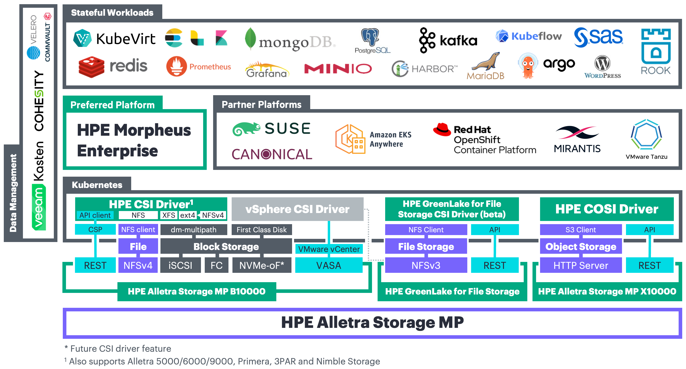

<!--
!!! error "KubeCon + CloudNativeCon North America 2020 Virtual"
    The HPE primary storage team is participating at KubeCon November 17-20th 2020

    - Visit the primary storage [KubeCon mini site](https://www.hpe.com/us/en/events/kubecon-kubernetes.html) for exclusive content!
    - Attend the KubeCon tutorial: "[Introduction to Using the Container Storage Interface (CSI) Primitives](https://kccncna20.sched.com/event/ekFc)" presented by HPE.
    - Find us in the #HPE channel on the [official Slack community of CNCF](https://cloud-native.slack.com).

-->
## HPE Storage Container Orchestrator Documentation 

This is an umbrella documentation project for the HPE CSI Driver for Kubernetes and neighboring ecosystems for HPE primary storage including HPE Alletra 6000, Alletra 9000, Nimble Storage, Primera and 3PAR storage systems. The documentation is tailored for IT Ops, developers and partners.

Use the navigation on the left-hand side to explore the different topics. Feel free to contribute to this project but please read the [contributing guidelines](legal/contributing/index.md).

Use the navigation to the left. Not sure what you're looking for? → [Get started](welcome)!

<!-- div align="right"></div-->

!!! note "Did you know?"
    SCOD is "docs" in reverse?

