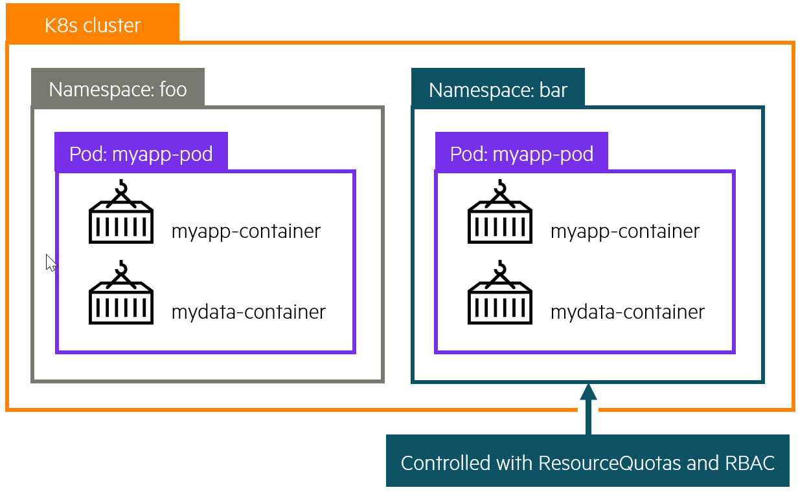
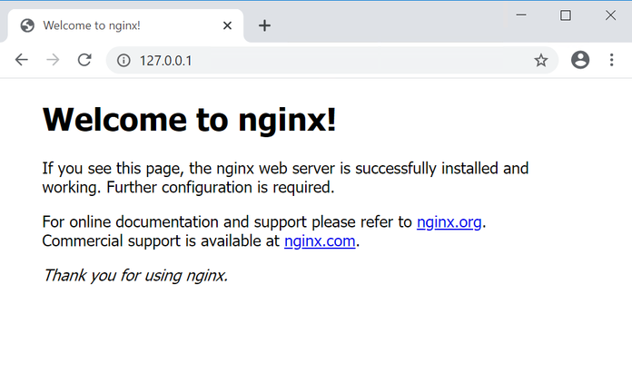
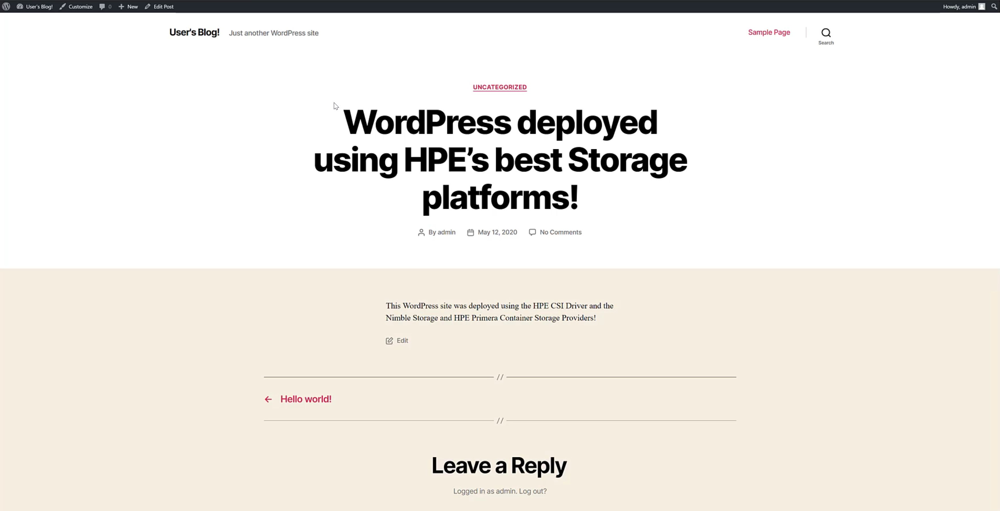

# Overview

This is a free learning resource from HPE which walks you through various exercises to get you familiar with Kubernetes and provisioning Persistent storage using HPE Nimble Storage and HPE Primera storage systems. This guide is by no means a comprehensive overview of the capabilities of Kubernetes but rather a getting started guide for individuals who wants to learn how to use Kubernetes with persistent storage.

[TOC]

 <br /> <br />

## Kubernetes cluster

In Kubernetes, nodes within a cluster pool together their resources (memory and CPU) to distribute workloads. A cluster is comprised of control plane and worker nodes that allow you to run your containerized workloads.

##### Control plane

The Kubernetes control plane is responsible for maintaining the desired state of your cluster. When you interact with Kubernetes, such as by using the `kubectl` command-line interface, you’re communicating with your cluster’s Kubernetes API services running on the control plane. Control plane refers to a collection of processes managing the cluster state. 

##### Nodes

Kubernetes runs your workload by placing containers into `Pods` to run on **Nodes**. A node may be a virtual or physical machine, depending on the cluster. Each node is managed by the control plane and contains the services necessary to run `Pods`.

## Kubernetes Objects 

Programs running on Kubernetes are packaged as containers which can run on Linux or Windows. A container image is a lightweight, standalone, executable package of software that includes everything needed to run an application: code, runtime, system tools, system libraries and settings.

##### Pods

A `Pod` is the basic execution unit of a Kubernetes application–the smallest and simplest unit in the Kubernetes object model that you create or deploy. A `Pod` encapsulates an application’s container (or, in some cases, multiple containers), storage resources, a unique network IP, and options that govern how the container(s) should run.

##### Persistent Volumes

Because programs running on your cluster aren’t guaranteed to run on a specific node, data can’t be saved to any arbitrary place in the file system. If a program tries to save data to a file for later, but is then relocated onto a new node, the file will no longer be where the program expects it to be.

To store data permanently, Kubernetes uses a `PersistentVolume`. Local, external storage via SAN arrays, or cloud drives can be attached to the cluster as a `PersistentVolume`.

##### Namespaces
 <br /> <br />
Kubernetes supports multiple virtual clusters backed by the same physical cluster. These virtual clusters are called `Namespaces`. `Namespaces` are intended for use in environments with many users spread across multiple teams, or projects. `Namespaces` are a way to divide cluster resources between multiple users.

##### Deployments
A `Deployment` provides declarative updates for `Pods`. You declare a desired state for your `Pods` in your `Deployment` and Kubernetes will manage it for you automatically.

##### Services
A Kubernetes `Service` object defines a policy for external clients to access an application within a cluster. By default, the container runtime uses host-private networking, so containers can talk to other containers only if they are on the same machine. In order for containers to communicate across nodes, there must be allocated ports on the machine’s own IP address, which are then forwarded or proxied to the containers. Coordinating port allocations is very difficult to do at scale, and exposes users to cluster-level issues outside of their control. Kubernetes assumes that `Pods` can communicate with other `Pods`, regardless of which host they land on. Kubernetes gives every `Pod` its own cluster-private IP address, through a Kubernetes Service object, so you do not need to explicitly create links between `Pods` or map container ports to host ports. This means that containers within a `Pod` can all reach each other’s ports on localhost, and all `Pods` in a cluster can see each other without NAT.

---

## Lab 1: Tour your cluster

All of this information presented here is taken from the official documentation found on [kubernetes.io/docs](https://kubernetes.io/docs/).

### Overview of kubectl

The Kubernetes command-line tool, `kubectl`, allows you to run commands against Kubernetes clusters. You can use `kubectl` to deploy applications, inspect and manage cluster resources, and view logs. For a complete list of `kubectl` operations, see [Overview of kubectl](https://kubernetes.io/docs/reference/kubectl/overview/) on kubernetes.io.

For more information on how to install and setup `kubectl` on Linux, Windows or MacOS, see [Install and Set Up kubectl](https://kubernetes.io/docs/tasks/tools/install-kubectl/) on kubernetes.io.

### Syntax
Use the following syntax to run `kubectl` commands from your terminal window:

`kubectl [command] [TYPE] [NAME] [flags]`

where `command`, `TYPE`, `NAME`, and `flags` are:

* `command`: Specifies the operation that you want to perform on one or more resources, for example create, get, describe, delete.

* `TYPE`: Specifies the resource type. Resource types are case-insensitive and you can specify the singular, plural, or abbreviated forms. For example, the following commands produce the same output:

* `NAME`: Specifies the name of the resource. Names are case-sensitive. If the name is omitted, details for all resources are displayed, for example `kubectl get pods`.

Get object example command: 
```markdown
kubectl get nodes
kubectl get node <node_name>
```

Describe object example command:
```markdown
kubectl describe node <node_name>
```

Create object example command
```markdown
kubectl create -f <file_name or URL>
```

The below YAML declarations are meant to be created with `kubectl create`. Either copy the content to a file on the host where `kubectl` is being executed, or copy & paste into the terminal, like this:

```markdown
kubectl create -f- (press Enter)
< paste the YAML >
(CTRL-D for Linux) or (^D for Mac users)
```

!!! note "Kubernetes Cheat Sheet"
    Find more available commands at [Kubernetes Cheat Sheet](https://kubernetes.io/docs/reference/kubectl/cheatsheet/) on kubernetes.io.

### Getting to know your cluster:

Let's run through some simple `kubectl` commands to get familiar with your cluster.

First we need to open a terminal window, the following commands can be run from a Windows, Linux or Mac. In this guide, we will be using the Window Subsystem for Linux (WSL) which allows us to have a Linux terminal within Windows.

To start a WSL terminal session, click the CentOS icon in the Windows taskbar.


It will open a terminal window. We will be working within this terminal through out this lab.


In order to communicate with the Kubernetes cluster, `kubectl` looks for a file named config in the `$HOME/.kube` directory. You can specify other `kubeconfig` files by setting the `KUBECONFIG` environment variable or by setting the `--kubeconfig` flag.

You will need to request the `kubeconfig` file from your cluster administrator and copy the file to your local `$HOME/.kube/` directory. You may need to create this directory.

Once you have the `kubeconfig` file, you can view the config file:

```markdown
kubectl config view
```

Check that `kubectl` and the config file are properly configured by getting the cluster state.

```markdown
kubectl cluster-info
```

If you see a URL response, `kubectl` is correctly configured to access your cluster.

The output is **similar** to this:

```markdown
$ kubectl cluster-info
Kubernetes control plane is running at https://192.168.1.50:6443
KubeDNS is running at https://192.168.1.50:6443/api/v1/namespaces/kube-system/services/kube-dns:dns/proxy

To further debug and diagnose cluster problems, use 'kubectl cluster-info dump'.
```

Now let's look at the nodes within our cluster.

```markdown
kubectl get nodes
```
You should see output similar to below. As you can see, each node has a role **control-plane** or as **worker** nodes (&lt;none&gt;).

```markdown
$ kubectl get nodes
NAME          STATUS   ROLES                  AGE     VERSION
kube-group1   Ready    control-plane,master   2d18h   v1.21.5
...
```

You can list pods.

```markdown
kubectl get pods
```

!!! note "Quiz"
    Did you see any `Pods` listed when you ran `kubectl get pods`?  **Why?** <br /> <br /> If you don't see any `Pods` listed, it is because there are no `Pods` deployed within the "default" `Namespace`. Now run, `kubectl get pods --all-namespaces`. **Does it look any different?** <br /> <br /> Pay attention to the first column, `NAMESPACES`. In our case, we are working in the "default" `Namespace`. Depending on the type of application and your user access level, applications can be deployed within one or more `Namespaces`. <br /> <br />If you don't see the object (deployment, pod, services, etc) you are looking for, double-check the `Namespace` it was deployed under and use the `-n <namespace>` flag to view objects in other `Namespaces`.


Once complete, type "Clear" to clear your terminal window.

---

## Lab 2: Deploy your first Pod (Stateless)

A `Pod` is a collection of containers sharing a network and mount namespace and is the basic unit of deployment in Kubernetes. All containers in a `Pod` are scheduled on the same node. In our first demo we will deploy a stateless application that has no persistent storage attached. Without persistent storage, any modifications done to the application will be lost if that application is stopped or deleted.

Here is a sample NGINX webserver deployment.

```markdown
apiVersion: apps/v1
kind: Deployment
metadata:
  labels:
    run: nginx
  name: first-nginx-pod
spec:
  replicas: 1
  selector:
    matchLabels:
      run: nginx-first-pod
  template:
    metadata:
      labels:
        run: nginx-first-pod
    spec:
      containers:
      - image: nginx
        name: nginx
```        

Open a WSL terminal session, if you don't have one open already.


At the prompt, we will start by deploying the NGINX example above, by running:

```markdown
kubectl create -f https://scod.hpedev.io/learn/persistent_storage/yaml/nginx-stateless-deployment.yaml
```

We can see the `Deployment` was successfully created and the NGINX `Pod` is running.

!!! note
    The `Pod` names will be unique to your deployment.

```markdown
$ kubectl get deployments.apps
NAME              READY   UP-TO-DATE   AVAILABLE   AGE
first-nginx-pod   1/1     1            1           38s

$ kubectl get pods
NAME                             READY   STATUS    RESTARTS   AGE
first-nginx-pod-8d7bb985-rrdv8   1/1     Running   0          10s
```

!!! Important
    In a `Deployment`, a `Pod` name is generated using the `Deployment` name and then a randomized hash (i.e. `first-nginx-pod-8d7bb985-kql7t`) to ensure that each `Pod` has a unique name. During this lab exercise, make sure to reference the correct object names that are generated in each exercise.

We can inspect the `Pod` further using the **kubectl describe** command. 

!!! note
    You can use tab completion to help with Kubernetes commands and objects. Start typing the first few letters of the command or Kubernetes object (i.e `Pod`) name and hit **TAB** and it should autofill the name.

```markdown
kubectl describe pod <pod_name> 
```

The output should be similar to this. Note, the `Pod` name will be unique to your deployment.
```markdown
Name:         first-nginx-pod-8d7bb985-rrdv8
Namespace:    default
Priority:     0
Node:         kube-group1/10.90.200.11
Start Time:   Mon, 01 Nov 2021 13:37:59 -0500
Labels:       pod-template-hash=8d7bb985
              run=nginx-first-pod
Annotations:  cni.projectcalico.org/podIP: 192.168.162.9/32
              cni.projectcalico.org/podIPs: 192.168.162.9/32
Status:       Running
IP:           192.168.162.9
IPs:
  IP:           192.168.162.9
Controlled By:  ReplicaSet/first-nginx-pod-8d7bb985
Containers:
  nginx:
    Container ID:   docker://3610d71c054e6b8fdfffbf436511fda048731a456b9460ae768ae7db6e831398
    Image:          nginx
    Image ID:       docker-pullable://nginx@sha256:644a70516a26004c97d0d85c7fe1d0c3a67ea8ab7ddf4aff193d9f301670cf36
    Port:           <none>
    Host Port:      <none>
    State:          Running
      Started:      Mon, 01 Nov 2021 13:38:06 -0500
    Ready:          True
    Restart Count:  0
    Environment:    <none>
    Mounts:
      /var/run/secrets/kubernetes.io/serviceaccount from kube-api-access-w7sbw (ro)
Conditions:
  Type              Status
  Initialized       True
  Ready             True
  ContainersReady   True
  PodScheduled      True
Volumes:
  kube-api-access-w7sbw:
    Type:                    Projected (a volume that contains injected data from multiple sources)
    TokenExpirationSeconds:  3607
    ConfigMapName:           kube-root-ca.crt
    ConfigMapOptional:       <nil>
    DownwardAPI:             true
QoS Class:                   BestEffort
Node-Selectors:              <none>
Tolerations:                 node.kubernetes.io/not-ready:NoExecute op=Exists for 300s
                             node.kubernetes.io/unreachable:NoExecute op=Exists for 300s
Events:
  Type    Reason     Age    From               Message
  ----    ------     ----   ----               -------
  Normal  Scheduled  5m14s  default-scheduler  Successfully assigned default/first-nginx-pod-8d7bb985-rrdv8 to kube-group1
  Normal  Pulling    5m13s  kubelet            Pulling image "nginx"
  Normal  Pulled     5m7s   kubelet            Successfully pulled image "nginx" in 5.95086952s
  Normal  Created    5m7s   kubelet            Created container nginx
  Normal  Started    5m7s   kubelet            Started container nginx
```

Looking under the "Events" section is a great place to start when checking for issues or errors during `Pod` creation.

At this stage, the NGINX application is only accessible from within the cluster. Use `kubectl port-forward` to expose the `Pod` temporarily outside of the cluster to your workstation.

```markdown
kubectl port-forward <pod_name> 80:80
```

The output should be similar to this:
```markdown
kubectl port-forward first-nginx-pod-8d7bb985-rrdv8 80:80
Forwarding from 127.0.0.1:80 -> 8080
Forwarding from [::1]:80 -> 8080
```

!!! note
    If you have something already running locally on port 80, modify the `port-forward` to an unused port (i.e. 5000:80). `Port-forward` is meant for temporarily exposing an application outside of a Kubernetes cluster. For a more permanent solution, look into Ingress Controllers.

Finally, open a browser and go to **http://127.0.0.1** and you should see the following.



You have successfully deployed your first Kubernetes pod. 

With the `Pod` running, you can log in and explore the `Pod`. 

To do this, open a **second** terminal, by clicking on the WSL terminal icon again. The first terminal should have `kubectl port-forward` still running.


Run:

```markdown
kubectl exec -it <pod_name> -- /bin/bash
```

You can explore the `Pod` and run various commands. Some commands might not be available within the `Pod`. Why would that be?

```markdown
root@first-nginx-pod-8d7bb985-rrdv8:/# df -h
Filesystem               Size  Used Avail Use% Mounted on
overlay                   46G  8.0G   38G  18% /
tmpfs                     64M     0   64M   0% /dev
tmpfs                    1.9G     0  1.9G   0% /sys/fs/cgroup
/dev/mapper/centos-root   46G  8.0G   38G  18% /etc/hosts
shm                       64M     0   64M   0% /dev/shm
tmpfs                    1.9G   12K  1.9G   1% /run/secrets/kubernetes.io/serviceaccount
tmpfs                    1.9G     0  1.9G   0% /proc/acpi
tmpfs                    1.9G     0  1.9G   0% /proc/scsi
tmpfs                    1.9G     0  1.9G   0% /sys/firmware

```

While inside the container, you can also modify the webpage.

```markdown
echo "<h1>Hello from the HPE Storage Hands on Labs</h1>" > /usr/share/nginx/html/index.html
```

Now switch back over to the browser and refresh the page (http://127.0.0.1), you should see the updated changes to the webpage.

Once ready, switch back over to your second terminal, type **exit** to logout of the NGINX container and close that terminal. Back in your original terminal, use **Ctrl+C** to exit the port-forwarding.

Since this is a stateless application, we will now demonstrate what happens if the NGINX `Pod` is lost. 

To do this, simply delete the `Pod`.

```markdown
kubectl delete pod <pod_name>
```

Now run `kubectl get pods` to see that a new NGINX `Pod` has been created.

Lets use `kubectl port-forward` again to look at the NGINX application.

```markdown
kubectl port-forward <new_pod_name> 80:80
```

Back in your browser, refresh the page (http://127.0.0.1) and you should the webpage has reverted back to its default state.


Back in the terminal, use **Ctrl+C** to exit the port-forwarding and once ready, type **clear** to refresh your terminal.

The NGINX application has reverted back to default because we didn't store the modifications we made to a location that would persist beyond the life of the container. There are many applications where persistence isn't critical (i.e. Google uses stateless containers for your browser web searches) as they perform computations that are either stored into an external database or passed to subsequent processes. 

As mission-critical workloads move into Kubernetes, the need for stateful containers is increasingly important. The following exercises will go through how to provision persistent storage to applications using the HPE CSI Driver for Kubernetes backed by HPE Primera or Nimble Storage.

---

## Lab 3: Install the HPE CSI Driver for Kubernetes

To get started with the deployment of the HPE CSI Driver for Kbuernetes, the CSI driver is deployed using industry standard means, either a Helm chart or an Operator. For this tutorial, we will be using Helm to the deploy the HPE CSI driver for Kubernetes.

The official Helm chart for the HPE CSI Driver for Kubernetes is hosted on [Artifact Hub](https://artifacthub.io/packages/helm/hpe-storage/hpe-csi-driver). There, you will find the configuration and installation instructions for the chart.

!!! note
    [Helm](https://helm.sh) is the package manager for Kubernetes. Software is delivered in a format called a "chart". Helm is a [standalone CLI](https://helm.sh/docs/intro/install/) that interacts with the Kubernetes API server using your `KUBECONFIG` file.

### Installing the Helm chart

Open a WSL terminal session, if you don't have one open already.


To install the chart with the name `my-hpe-csi-driver`, add the HPE CSI Driver for Kubernetes Helm repo.

```markdown
helm repo add hpe-storage https://hpe-storage.github.io/co-deployments
helm repo update
```

Install the latest chart.
```markdown
kubectl create ns hpe-storage
helm install my-hpe-csi-driver hpe-storage/hpe-csi-driver -n hpe-storage
```

!!! note
    It is safe to ignore the warnings: <br /> `W1104 14:25:11.178003   18461 warnings.go:70] apiextensions.k8s.io/v1beta1 CustomResourceDefinition is deprecated in v1.16+, unavailable in v1.22+; use apiextensions.k8s.io/v1 CustomResourceDefinition`.
 
Wait a few minutes as the deployment finishes.

Verify that everything is up and running correctly by listing out the `Pods`.

```markdown
kubectl get pods -n hpe-storage
```

The output is **similar** to this:

!!! note
    The `Pod` names will be unique to your deployment.

```markdown
$ kubectl get pods -n hpe-storage
NAME                                      READY   STATUS    RESTARTS   AGE
pod/hpe-csi-controller-6f9b8c6f7b-n7zcr   9/9     Running   0          7m41s
pod/hpe-csi-node-npp59                    2/2     Running   0          7m41s
pod/nimble-csp-5f6cc8c744-rxgfk           1/1     Running   0          7m41s
pod/primera3par-csp-7f78f498d5-4vq9r      1/1     Running   0          7m41s
```

If all of the components show in **Running** state, then the HPE CSI Driver for Kubernetes and the corresponding Container Storage Providers (CSP) for HPE Alletra, Primera and Nimble Storage have been successfully deployed.

!!! Important
    With the HPE CSI Driver deployed, the rest of this guide is designed to demonstrate the usage of the CSI driver with HPE Primera or Nimble Storage. You will need to choose which storage system (HPE Primera or Nimble Storage) to use for the rest of the exercises. While the HPE CSI Driver supports connectivity to multiple backends, configurating multiple backends is outside of the scope of this lab guide.

### Creating a Secret

Once the HPE CSI Driver has been deployed, a `Secret` needs to be created in order for the CSI driver to communicate to the HPE Primera or Nimble Storage. This `Secret`, which contains the storage system IP and credentials, is used by the CSI driver sidecars within the `StorageClass` to authenticate to a specific backend for various CSI operations. For more information, see [adding an HPE storage backend](https://scod.hpedev.io/csi_driver/deployment.html#add_an_hpe_storage_backend) 

Here is an example `Secret`.

```markdown
apiVersion: v1
kind: Secret
metadata:
  name: custom-secret
  namespace: hpe-storage 
stringData:
  serviceName: primera3par-csp-svc 
  servicePort: "8080"
  backend: 10.10.0.2
  username: <user>
  password: <password>
```

Download and modify, using the text editor of your choice, the `Secret` file with the **backend** IP per your environment.

```markdown fct_label="Nimble Storage"
wget https://raw.githubusercontent.com/hpe-storage/scod/master/docs/learn/persistent_storage/yaml/nimble-secret.yaml
```

```markdown fct_label="HPE Primera"
wget https://raw.githubusercontent.com/hpe-storage/scod/master/docs/learn/persistent_storage/yaml/primera-secret.yaml
```

Save the file and create the `Secret` within the cluster.

```markdown fct_label="Nimble Storage"
kubectl create -f nimble-secret.yaml
```

```markdown fct_label="HPE Primera"
kubectl create -f primera-secret.yaml
```

The `Secret` should now be available in the "hpe-storage" `Namespace`:

```markdown 
kubectl -n hpe-storage get secret/custom-secret
NAME                     TYPE          DATA      AGE
custom-secret            Opaque        5         1m
```

If you made a mistake when creating the `Secret`, simply delete the object (`kubectl -n hpe-storage delete secret/custom-secret`) and repeat the steps above.

### Creating a StorageClass

Now we will create a `StorageClass` that will be used in the following exercises. A `StorageClass` (SC) specifies which storage provisioner to use (in our case the HPE CSI Driver) and the volume parameters (such as Protection Templates, Performance Policies, CPG, etc.) for the volumes that we want to create which can be used to differentiate between storage levels and usages. 

This concept is sometimes called “profiles” in other storage systems. A cluster can have multiple `StorageClasses` allowing users to create storage claims tailored for their specific application requirements.

We will start by creating a `StorageClass` called **hpe-standard**. We will use the **custom-secret** created in the previous step and specify the **hpe-storage** `namespace` where the CSI driver was deployed.

Here is an example `StorageClasses` for HPE Primera and Nimble Storage systems and some of the available volume parameters that can be defined. See the respective [CSP](../../container_storage_provider/index.md) for more elaborate examples.

```markdown fct_label="HPE Nimble Storage"
apiVersion: storage.k8s.io/v1
kind: StorageClass
metadata:
  name: hpe-standard
  annotations:
    storageclass.kubernetes.io/is-default-class: "true"
provisioner: csi.hpe.com
parameters:
  csi.storage.k8s.io/fstype: xfs
  csi.storage.k8s.io/provisioner-secret-name: custom-secret
  csi.storage.k8s.io/provisioner-secret-namespace: hpe-storage
  csi.storage.k8s.io/controller-publish-secret-name: custom-secret
  csi.storage.k8s.io/controller-publish-secret-namespace: hpe-storage
  csi.storage.k8s.io/node-stage-secret-name: custom-secret
  csi.storage.k8s.io/node-stage-secret-namespace: hpe-storage
  csi.storage.k8s.io/node-publish-secret-name: custom-secret
  csi.storage.k8s.io/node-publish-secret-namespace: hpe-storage
  csi.storage.k8s.io/controller-expand-secret-name: custom-secret
  csi.storage.k8s.io/controller-expand-secret-namespace: hpe-storage
  performancePolicy: "SQL Server"
  description: "Volume from HPE CSI Driver"
  accessProtocol: iscsi
  limitIops: "76800"
  allowOverrides: description,limitIops,performancePolicy
allowVolumeExpansion: true
```

```markdown fct_label="HPE Primera"
apiVersion: storage.k8s.io/v1
kind: StorageClass
metadata:
  name: hpe-standard
  annotations:
    storageclass.kubernetes.io/is-default-class: "true"
provisioner: csi.hpe.com
parameters:
  csi.storage.k8s.io/fstype: xfs
  csi.storage.k8s.io/provisioner-secret-name: custom-secret
  csi.storage.k8s.io/provisioner-secret-namespace: hpe-storage
  csi.storage.k8s.io/controller-publish-secret-name: custom-secret
  csi.storage.k8s.io/controller-publish-secret-namespace: hpe-storage
  csi.storage.k8s.io/node-stage-secret-name: custom-secret
  csi.storage.k8s.io/node-stage-secret-namespace: hpe-storage
  csi.storage.k8s.io/node-publish-secret-name: custom-secret
  csi.storage.k8s.io/node-publish-secret-namespace: hpe-storage
  csi.storage.k8s.io/controller-expand-secret-name: custom-secret
  csi.storage.k8s.io/controller-expand-secret-namespace: hpe-storage
  cpg: SSD_r6
  provisioningType: tpvv
  accessProtocol: iscsi
  allowOverrides: cpg,provisioningType
allowVolumeExpansion: true
```

Create the `StorageClass` within the cluster
```markdown fct_label="Nimble Storage"
kubectl create -f http://scod.hpedev.io/learn/persistent_storage/yaml/nimble-storageclass.yaml
```

```markdown fct_label="Primera"
kubectl create -f http://scod.hpedev.io/learn/persistent_storage/yaml/primera-storageclass.yaml
```

We can verify the `StorageClass` is now available.

```markdown
kubectl get sc
NAME                     PROVISIONER   AGE
hpe-standard (default)   csi.hpe.com   2m
```

!!! note 
    You can create multiple `StorageClasses` to match the storage requirements of your applications. We set **hpe-standard** `StorageClass` as default using the annotation `storageclass.kubernetes.io/is-default-class: "true"`. There can only be one **default** `StorageClass` per cluster, for any additional `StorageClasses` set this to **false**. To learn more about configuring a default `StorageClass`, see [Default StorageClass](https://kubernetes.io/docs/tasks/administer-cluster/change-default-storage-class/) on kubernetes.io. 

---

## Lab 4: Creating a Persistent Volume using HPE Storage 

With the HPE CSI Driver for Kubernetes deployed and a `StorageClass` available, we can now provision persistent volumes.

- A `PersistentVolumeClaim` (PVC) is a request for storage by a user. Claims can request storage of a specific size and access modes (e.g., they can be mounted ReadWriteOnce, ReadOnlyMany or ReadWriteMany). The `accessMode` will be dependent on the type of storage system and the application requirements. Block storage like HPE Primera and Nimble Storage, provision volumes using `ReadWriteOnce` access mode where the volume can only be mounted to a single node within the cluster at a time. Any applications running on that node can access that volume. Applications deployed across multiple nodes within a cluster that require shared access (`ReadWriteMany`) to the same `PersistentVolume` will need to use NFS or a distribute storage system such as MapR, Gluster or Ceph.

- A `PersistentVolume` (PV) is a piece of storage in the cluster that has been provisioned by an administrator or dynamically provisioned using `Storage Classes`.

### Creating a PersistentVolumeClaim

With a `StorageClass` available, we can request an amount of storage for our application using a `PersistentVolumeClaim`. Here is a sample `PVC`.

```markdown
apiVersion: v1
kind: PersistentVolumeClaim
metadata:
  name: my-pvc
spec:
  accessModes:
  - ReadWriteOnce
  resources:
    requests:
      storage: 50Gi
```

!!! note
    We don't have a `StorageClass` (SC) explicitly defined within this `PVC` therefore it will use the default `StorageClass`. You can use `spec.storageClassName` to override the default `SC` with another one available to the cluster.

Create the `PersistentVolumeClaim`.
```markdown
kubectl create -f http://scod.hpedev.io/learn/persistent_storage/yaml/my-pvc.yaml
```

We can see the **my-pvc** `PersistentVolumeClaim` was created.
```markdown
kubectl get pvc
NAME                          STATUS   VOLUME                                     CAPACITY   ACCESS MODES   STORAGECLASS   AGE
my-pvc                        Bound    pvc-70d5caf8-7558-40e6-a8b7-77dfcf8ddcd8   50Gi       RWO            hpe-standard   72m
```

!!! note
    The `Persistent Volume` name is a randomly generated name by Kubernetes. For consistent naming for your stateful applications, check out [StatefulSet](https://kubernetes.io/docs/concepts/workloads/controllers/statefulset/) deployment model. These names can be used to track the volume back to the storage system. It is important to note that HPE Primera has a 30 character limit on volume names therefore the name will be truncated. For example: `pvc-70d5caf8-7558-40e6-a8b7-77dfcf8ddcd8` will be truncated to `pvc-70d5caf8-7558-40e6-a8b7-77d` on an HPE Primera system.

We can inspect the `PVC` further for additional information including event logs for troubleshooting.

```markdown
kubectl describe pvc my-pvc
```

Check the **Events** section to see if there were any issues during creation.

The output is similar to this:
```markdown
$ kubectl describe pvc my-pvc
Name:          my-pvc
Namespace:     default
StorageClass:  hpe-standard
Status:        Bound
Volume:        pvc-70d5caf8-7558-40e6-a8b7-77dfcf8ddcd8
Labels:        <none>
Annotations:   pv.kubernetes.io/bind-completed: yes
               pv.kubernetes.io/bound-by-controller: yes
               volume.beta.kubernetes.io/storage-provisioner: csi.hpe.com
Finalizers:    [kubernetes.io/pvc-protection]
Capacity:      50Gi
Access Modes:  RWO
VolumeMode:    Filesystem
Mounted By:    <none>
Events:        <none>
```

We can also inspect the `PersistentVolume` (PV) in a similar manner. Note, the volume name will be unique to your deployment.

```markdown
kubectl describe pv <volume_name>
```

The output is similar to this:
```markdown
$ kubectl describe pv pvc-70d5caf8-7558-40e6-a8b7-77dfcf8ddcd8
Name:            pvc-70d5caf8-7558-40e6-a8b7-77dfcf8ddcd8
Labels:          <none>
Annotations:     pv.kubernetes.io/provisioned-by: csi.hpe.com
Finalizers:      [kubernetes.io/pv-protection]
StorageClass:    hpe-standard
Status:          Bound
Claim:           default/my-pvc
Reclaim Policy:  Delete
Access Modes:    RWO
VolumeMode:      Filesystem
Capacity:        50Gi
Node Affinity:   <none>
Message:
Source:
    Type:              CSI (a Container Storage Interface (CSI) volume source)
    Driver:            csi.hpe.com
    VolumeHandle:      063aba3d50ec99d866000000000000000000000001
    ReadOnly:          false
    VolumeAttributes:      accessProtocol=iscsi
                           allowOverrides=description,limitIops,performancePolicy
                           description=Volume from HPE CSI Driver
                           fsType=xfs
                           limitIops=76800
                           performancePolicy=SQL Server
                           storage.kubernetes.io/csiProvisionerIdentity=1583271972595-8081-csi.hpe.com
                           volumeAccessMode=mount
Events:                <none>
```

With the `describe` command, you can see the volume parameters used to create this volume. In this case, Nimble Storage parameters `performancePolicy`, `limitIops`, etc.

!!! Important
    If the PVC is stuck in **Pending** state, double check the `Secret` and `Namespace` are correct within the `StorageClass`(sc) and that the volume parameters are valid. If necessary delete the object (sc or pvc) (`kubectl delete <object_type> <object_name>`) and repeat the steps above.

Let's recap what we have learned.

1. We created a default `StorageClass` for our volumes.
2. We created a `PVC` that created a volume from the storageClass.
3. We can use **kubectl get** to list the `StorageClass`, `PVC` and `PV`.
4. We can use **kubectl describe** to get details on the `StorageClass`, `PVC` or `PV`

At this point, we have validated the deployment of the HPE CSI Driver and are ready to deploy an application with persistent storage.

---

## Lab 5: Deploying a Stateful Application using HPE Storage (WordPress)

To begin, we will create two `PersistentVolumes` for the WordPress application using the default **hpe-standard** `StorageClass` we created previously. If you don't have the **hpe-standard** `StorageClass` available, please refer to the [StorageClass](#creating_a_storageclass) section for instructions on creating a `StorageClass`.

Create a `PersistentVolumeClaim` for the MariaDB database that will used by WordPress.

```markdown
kubectl create -f http://scod.hpedev.io/learn/persistent_storage/yaml/wordpress-mariadb-pvc.yaml
```

Next let's make another volume for the WordPress application.

```markdown
kubectl create -f http://scod.hpedev.io/learn/persistent_storage/yaml/my-wordpress-pvc.yaml
```

Now verify the `PersistentVolumes` were created successfully. The output should be similar to the following. Note, the volume names will be unique to your deployment.

```markdown
kubectl get pvc
NAME                          STATUS    VOLUME                                     CAPACITY   ACCESS MODES   STORAGECLASS   AGE
data-my-wordpress-mariadb-0   Bound     pvc-1abdb7d7-374e-45b3-8fa1-534131ec7ec6   50Gi       RWO            hpe-standard   1m
my-wordpress                  Bound     pvc-ff6dc8fd-2b14-4726-b608-be8b27485603   20Gi       RWO            hpe-standard   1m
```

The above output means that the HPE CSI Driver has successfully provisioned two volumes based upon the default **hpe-standard** `StorageClass`. At this stage, the volumes are not attached (exported) to any nodes yet. They will only be attached (exported) to a node once a scheduled workload requests the `PersistentVolumeClaims`. 

We will use Helm again to deploy WordPress using the `PersistentVolumeClaims` we just created. When WordPress is deployed, the volumes will be attached, formatted and mounted.

The first step is to add the WordPress chart to Helm. The output should be similar to below.

```markdown
helm repo add bitnami https://charts.bitnami.com/bitnami
helm repo update
helm search repo bitnami/wordpress
NAME                    CHART VERSION   APP VERSION     DESCRIPTION
bitnami/wordpress       11.0.13         5.7.2           Web publishing platform for building blogs and ...
```

Next, deploy WordPress by setting the deployment parameter `persistence.existingClaim=<existing_PVC>` to the `PVC` **my-wordpress** created in the previous step.

```markdown
helm install my-wordpress bitnami/wordpress --version 9.2.1 --set service.type=ClusterIP,wordpressUsername=admin,wordpressPassword=adminpassword,mariadb.mariadbRootPassword=secretpassword,persistence.existingClaim=my-wordpress,allowEmptyPassword=false 
```

Check to verify that WordPress and MariaDB were deployed and are in the **Running** state. This may take a few minutes. 

!!! note
    The `Pod` names will be unique to your deployment.

```markdown
kubectl get pods
NAME                            READY     STATUS    RESTARTS   AGE
my-wordpress-69b7976c85-9mfjv   1/1       Running   0          2m
my-wordpress-mariadb-0          1/1       Running   0          2m
```

Finally take a look at the WordPress site. Again, we can use `kubectl port-forward` to access the WordPress application and verify everything is working correctly.

```markdown
kubectl port-forward svc/my-wordpress 80:80
```

!!! note
    If you have something already running locally on port 80, modify the port-forward to an unused port (i.e. 5000:80).

Open a browser on your workstation to **http://127.0.0.1** and you should see, **"Hello World!"**.

Access the admin console at: **http://127.0.0.1/admin** using the **"admin/adminpassword"** we specified when deploying the Helm Chart. 



Create a new blog post so you have data stored in the WordPress application.

**Happy Blogging!**

Once ready, hit "**Ctrl+C**" in your terminal to stop the `port-forward`.

Verify the Wordpress application is using the **my-wordpress** and **data-my-wordpress-mariadb-0** `PersistentVolumeClaims`.

```markdown
kubectl get pods -o=jsonpath='{.items[*].spec.volumes[*].persistentVolumeClaim.claimName}'
```

With the WordPress application using persistent storage for the database and the application data, in the event of a crash of the WordPress application, the `PVC` will be remounted to the new `Pod`.

Delete the WordPress `Pod`.

```markdown
kubectl delete pod <my-wordpress_pod_name>
```

For example.

```markdown
$ kubectl delete pod my-wordpress-69b7976c85-9mfjv
pod "my-wordpress-69b7976c85-9mfjv" deleted
```

Now if run `kubectl get pods` and you should see the WordPress `Pod` recreating itself with a new name. This may take a few minutes.

Output should be similar to the following as the WordPress container is recreating.

```markdown
$ kubectl get pods
NAME                             READY   STATUS              RESTARTS   AGE
my-wordpress-mariadb-0           1/1     Running             1          10m
my-wordpress-7856df6756-m2nw8    0/1     ContainerCreating   0          33s
```

Once the WordPress `Pod` is in `Ready` state, we can verify that the Wordpress application is still using the **my-wordpress** and **data-my-wordpress-mariadb-0** `PersistentVolumeClaims`.

```markdown
kubectl get pods -o=jsonpath='{.items[*].spec.volumes[*].persistentVolumeClaim.claimName}'
```

And finally, run `kubectl port-forward` again to see the changes made to the WordPress application survived deleting the application `Pod`.

```markdown
kubectl port-forward svc/my-wordpress 80:80
```
Open a browser on your workstation to **http://127.0.0.1** and you should see your WordPress site running.

This completes the tutorial of using the HPE CSI Driver with HPE storage to create Persistent Volumes within Kubernetes. This is just the beginning of the capabilities of the HPE Storage integrations within Kubernetes. We recommend exploring [SCOD](https://scod.hpedev.io) further and the specific HPE Storage CSP ([Nimble](http://scod.hpedev.io/container_storage_provider/hpe_nimble_storage/index.html), [Primera, and 3PAR](http://scod.hpedev.io/container_storage_provider/hpe_3par_primera/index.html)) to learn more.

## Optional Lab: Advanced Configuration

### Configuring additional storage backends

It's not uncommon to have multiple HPE primary storage systems within the same environment, either the same family or different ones. This section walks through the scenario of managing multiple `StorageClass` and `Secret` API objects to represent an environment with multiple systems.

To view the current `Secrets` in the **hpe-storage** `Namespace` (assuming default names):

```markdown
kubectl -n hpe-storage get secret
NAME                     TYPE          DATA      AGE
custom-secret            Opaque        5         10m
```

This `Secret` is used by the CSI sidecars in the `StorageClass` to authenticate to a specific backend for CSI operations. In order to add a new `Secret` or manage access to multiple backends, additional `Secrets` will need to be created per backend. 

In the previous steps, if you connected to Nimble Storage, create a new `Secret` for the Primera array or if you connected to Primera array above then create a `Secret` for the Nimble Storage.

!!! note "Secret Requirements"
    * Each `Secret` name must be unique.
    * **servicePort** should be set to **8080**.

Using your text editor of choice, create a new `Secret`, specify the name, `Namespace`, backend username, backend password and the backend IP address to be used by the CSP and save it as `gold-secret.yaml`.

```markdown fct_label="HPE Nimble Storage"
apiVersion: v1
kind: Secret
metadata:
  name: gold-secret
  namespace: hpe-storage
stringData:
  serviceName: nimble-csp-svc
  servicePort: "8080"
  backend: 192.168.1.2
  username: admin
  password: admin
```

```markdown fct_label="HPE Primera"
apiVersion: v1
kind: Secret
metadata:
  name: gold-secret
  namespace: hpe-storage
stringData:
  serviceName: primera3par-csp-svc
  servicePort: "8080"
  backend: 10.10.0.2
  username: 3paradm
  password: 3pardata
```

Create the `Secret` using `kubectl`:

```markdown
kubectl create -f gold-secret.yaml
```

You should now see the `Secret` in the "hpe-storage" `Namespace`:

```markdown
kubectl -n hpe-storage get secret
NAME                     TYPE          DATA      AGE
gold-secret              Opaque        5         1m
custom-secret            Opaque        5         15m
```

### Create a StorageClass with the new Secret

To use the new `gold-secret`, create a new `StorageClass` using the `Secret` and the necessary `StorageClass` parameters. Please see the requirements section of the respective [CSP](../container_storage_provider/index.md).

We will start by creating a `StorageClass` called **hpe-gold**. We will use the `gold-secret` created in the previous step and specify the **hpe-storage** `Namespace` where the CSI driver was deployed.

!!! note
    Please note that at most one `StorageClass` can be marked as default. If two or more of them are marked as default, a `PersistentVolumeClaim` without `storageClassName` explicitly specified cannot be created.

```markdown fct_label="HPE Nimble Storage"
apiVersion: storage.k8s.io/v1
kind: StorageClass
metadata:
  name: hpe-gold
provisioner: csi.hpe.com
parameters:
  csi.storage.k8s.io/fstype: xfs
  csi.storage.k8s.io/provisioner-secret-name: gold-secret
  csi.storage.k8s.io/provisioner-secret-namespace: hpe-storage
  csi.storage.k8s.io/controller-publish-secret-name: gold-secret
  csi.storage.k8s.io/controller-publish-secret-namespace: hpe-storage
  csi.storage.k8s.io/node-stage-secret-name: gold-secret
  csi.storage.k8s.io/node-stage-secret-namespace: hpe-storage
  csi.storage.k8s.io/node-publish-secret-name: gold-secret
  csi.storage.k8s.io/node-publish-secret-namespace: hpe-storage
  csi.storage.k8s.io/controller-expand-secret-name: gold-secret
  csi.storage.k8s.io/controller-expand-secret-namespace: hpe-storage
  performancePolicy: "SQL Server"
  description: "Volume from HPE CSI Driver"
  accessProtocol: iscsi
  limitIops: "76800"
  allowOverrides: description,limitIops,performancePolicy
allowVolumeExpansion: true
```

```markdown fct_label="HPE Primera"
apiVersion: storage.k8s.io/v1
kind: StorageClass
metadata:
  name: hpe-gold
provisioner: csi.hpe.com
parameters:
  csi.storage.k8s.io/fstype: xfs
  csi.storage.k8s.io/provisioner-secret-name: gold-secret
  csi.storage.k8s.io/provisioner-secret-namespace: hpe-storage
  csi.storage.k8s.io/controller-publish-secret-name: gold-secret
  csi.storage.k8s.io/controller-publish-secret-namespace: hpe-storage
  csi.storage.k8s.io/node-stage-secret-name: gold-secret
  csi.storage.k8s.io/node-stage-secret-namespace: hpe-storage
  csi.storage.k8s.io/node-publish-secret-name: gold-secret
  csi.storage.k8s.io/node-publish-secret-namespace: hpe-storage
  csi.storage.k8s.io/controller-expand-secret-name: gold-secret
  csi.storage.k8s.io/controller-expand-secret-namespace: hpe-storage
  cpg: SSD_r6
  provisioningType: tpvv
  accessProtocol: iscsi
  allowOverrides: cpg,provisioningType
allowVolumeExpansion: true
```

We can verify the StorageClass is now available.

```markdown
kubectl get sc
NAME                     PROVISIONER   AGE
hpe-standard (default)   csi.hpe.com   15m
hpe-gold                 csi.hpe.com   1m
```

!!! note
    Don't forget to call out the `StorageClass` explicitly when creating `PVCs` from non-default `StorageClasses`.

### Creating a PersistentVolumeClaim

With a `StorageClass` available, we can request an amount of storage for our application using a `PersistentVolumeClaim`. Using your text editor of choice, create a new `PVC` and save it as `gold-pvc.yaml`.

```markdown
apiVersion: v1
kind: PersistentVolumeClaim
metadata:
  name: gold-pvc
spec:
  accessModes:
  - ReadWriteOnce
  resources:
    requests:
      storage: 50Gi
  storageClassName: hpe-gold
```

Create the `PersistentVolumeClaim`.
```markdown
kubectl create -f gold-pvc.yaml
```

We can see the **my-pvc** `PersistentVolumeClaim` was created.
```markdown
kubectl get pvc
NAME                          STATUS   VOLUME                                     CAPACITY   ACCESS MODES   STORAGECLASS   AGE
my-pvc                        Bound    pvc-70d5caf8-7558-40e6-a8b7-77dfcf8ddcd8   50Gi       RWO            hpe-standard   72m
gold-pvc                      Bound    pvc-7a74d656-0b14-42a2-9437-e374a5d3bd68   50Gi       RWO            hpe-gold       1m
```

You can see that the new `PVC` is using the new `StorageClass` which is backed by the additional storage backend allowing you to add additional flexibility to your containerized workloads and match the persistent storage requirements to the application.

## Cleanup (Optional)

As others will be using this lab at a later time, we can clean up the objects that were deployed during this lab exercise. 

!!! note
    These steps may take a few minutes to complete. Please be patient and don't cancel out the process.

Remove WordPress & NGINX deployments.

```markdown
helm uninstall my-wordpress && kubectl delete all --all
```

Delete the `PersistentVolumeClaims` and related objects.

```markdown
kubectl delete pvc --all && kubectl delete sc --all
```

Remove the HPE CSI Driver for Kubernetes. 

```markdown
helm uninstall my-hpe-csi-driver -n hpe-storage
```

It takes a couple minutes to cleanup the objects from the CSI driver. You can check the status:

```markdown
watch kubectl get all -n hpe-storage
```

Once everything is removed, **Ctrl+C** to exit and finally you can remove the `Namespace`.

```markdown
kubectl delete ns hpe-storage
```