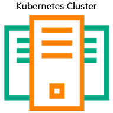

# Overview

This is a free learning resource from HPE which walks you through various exercises to get you familiar with Kubernetes and provisioning Persistent storage using HPE Nimble Storage, HPE Primera or HPE 3PAR storage systems. This guide is by no means a comprehensive overview of the capabilities of Kubernetes but rather a getting started guide for individuals who wants to learn how to use Kubernetes with persistent storage.

[TOC]

## Kubernetes 101

### The basics

The first thing we need to do is to understand the various components of Kubernetes.

##### <u>Nodes</u>

 <br /> <br />
The nodes in a Kubernetes cluster are the machines (VMs, physical servers, etc) that run your applications and cloud workflows. The Kubernetes master controls each node; you’ll rarely interact with nodes directly.

##### <u>Master</u>

 <br /> <br />
The Kubernetes master is responsible for maintaining the desired state of your cluster. When you interact with Kubernetes, such as by using the `kubectl` command-line interface, you’re communicating with your cluster’s Kubernetes master nodes.

!!! Note
    "Master” refers to a collection of processes managing the cluster state. Typically all these processes run on a single node within the cluster, and this node is also referred to as the master. The master can be replicated for availability and redundancy.

##### <u>Kubernetes Cluster</u>
 <br /> <br />
In Kubernetes, nodes pool together their resources (memory and CPU) to distribute workloads. A cluster is comprised of a control plane, master and worker nodes, and physical machines that allow you to run your container workloads on.

##### <u>Persistent Volumes</u>
 <br /> <br />
<p>Because programs running on your cluster aren’t guaranteed to run on a specific node, data can’t be saved to any arbitrary place in the file system. If a program tries to save data to a file for later, but is then relocated onto a new node, the file will no longer be where the program expects it to be. </p>
To store data permanently, Kubernetes uses Persistent Volumes. Local, external storage via SAN arrays, or cloud drives can be attached to the cluster as a Persistent Volume.

<h3> Kubernetes Objects </h3>

##### <u>Containers</u>
  <br /> <br />
Programs running on Kubernetes are packaged as containers which can run on Linux or Windows. A container image is a lightweight, standalone, executable package of software that includes everything needed to run an application: code, runtime, system tools, system libraries and settings.

##### <u>Pods</u>
 <br /> <br />
A Pod is the basic execution unit of a Kubernetes application–the smallest and simplest unit in the Kubernetes object model that you create or deploy. A Pod encapsulates an application’s container (or, in some cases, multiple containers), storage resources, a unique network IP, and options that govern how the container(s) should run.

##### <u>Namespaces</u>
 <br /> <br />
Kubernetes supports multiple virtual clusters backed by the same physical cluster. These virtual clusters are called namespaces. Namespaces are intended for use in environments with many users spread across multiple teams, or projects. Namespaces are a way to divide cluster resources between multiple users.

##### <u>Deployments</u>
A Deployment provides declarative updates for Pods. You declare a desired state for your pods in your Deployment and Kubernetes will manage it for you automatically.

##### <u>Services</u>
A Kubernetes Service object defines a policy for external clients to access an application within a cluster. By default, Docker uses host-private networking, so containers can talk to other containers only if they are on the same machine. In order for Docker containers to communicate across nodes, there must be allocated ports on the machine’s own IP address, which are then forwarded or proxied to the containers. Coordinating port allocations is very difficult to do at scale, and exposes users to cluster-level issues outside of their control. Kubernetes assumes that pods can communicate with other pods, regardless of which host they land on. Kubernetes gives every pod its own cluster-private IP address, through a Kubernetes Service object, so you do not need to explicitly create links between pods or map container ports to host ports. This means that containers within a Pod can all reach each other’s ports on localhost, and all pods in a cluster can see each other without NAT.

---

## Lab 1: Tour your cluster

All of this information presented here is taken from the official documentation found on [kubernetes.io/docs](https://kubernetes.io/docs/).

### Overview of kubectl

The Kubernetes command-line tool, `kubectl`, allows you to run commands against Kubernetes clusters. You can use `kubectl` to deploy applications, inspect and manage cluster resources, and view logs. For a complete list of `kubectl` operations, see [Overview of kubectl](https://kubernetes.io/docs/reference/kubectl/overview/) on kubernetes.io.

For more information on how to install and setup `kubectl` on Linux, Windows or MacOS, see [Install and Set Up kubectl](https://kubernetes.io/docs/tasks/tools/install-kubectl/) on kubernetes.io.

### Syntax
Use the following syntax to run `kubectl` commands from your terminal window:

`kubectl [command] [TYPE] [NAME] [flags]`

where `command`, `TYPE`, `NAME`, and `flags` are:

* `command`: Specifies the operation that you want to perform on one or more resources, for example create, get, describe, delete.

* `TYPE`: Specifies the resource type. Resource types are case-insensitive and you can specify the singular, plural, or abbreviated forms. For example, the following commands produce the same output:

```markdown
kubectl get pod pod1
kubectl get pods pod1
kubectl get po pod1
```

* `NAME`: Specifies the name of the resource. Names are case-sensitive. If the name is omitted, details for all resources are displayed, for example `kubectl get pods`.

!!! note "Kubernetes Cheat Sheet"
    Find more available commands at [Kubernetes Cheat Sheet](https://kubernetes.io/docs/reference/kubectl/cheatsheet/) on kubernetes.io.


### Getting to know your cluster:

Let's run through some simple `kubectl` commands to get familiar with your cluster.

In order to communicate with the Kubernetes cluster, `kubectl` looks for a file named config in the `$HOME/.kube` directory. You can specify other `kubeconfig` files by setting the `KUBECONFIG` environment variable or by setting the `--kubeconfig` flag.

You will need to request the `kubeconfig` file from your cluster administrator and copy the file to your local `$HOME/.kube/` directory. You may need to create this directory.

Once you have the `kubeconfig` file, you can view the config file:

```markdown
kubectl config view
```

Check that `kubectl` and the config file are properly configured by getting the cluster state.

```markdown
kubectl cluster-info
```

If you see a URL response, `kubectl` is correctly configured to access your cluster.

The output is similar to this:

```markdown
$ kubectl cluster-info
Kubernetes control plane is running at https://192.168.1.50:6443
KubeDNS is running at https://192.168.1.50:6443/api/v1/namespaces/kube-system/services/kube-dns:dns/proxy

To further debug and diagnose cluster problems, use 'kubectl cluster-info dump'.
```

Now let's look at the nodes within our cluster.

```markdown
kubectl get nodes
```
You should see output similar to below. As you can see, each node has a role **master** or as **worker** nodes (&lt;none&gt;).

```markdown
$ kubectl get nodes
NAME          STATUS   ROLES                  AGE     VERSION
kube-group1   Ready    control-plane,master   2d18h   v1.20.1
...
```

You can list pods.

```markdown
kubectl get pods
```

!!! note "Quiz"
    Did you see any pods listed when you ran `kubectl get pods`?  **Why?** <br /> <br /> If you don't see any pods listed, it is because there are no pods deployed within the `default` namespace. Now run, `kubectl get pods --all-namespaces`. **Does it look any different?** <br /> <br /> Pay attention to the first column, **NAMESPACES**. In our case, we are working in the `default` namespace. Depending on the type of application and your user access level, applications can be deployed within one or more namespaces. <br /> <br />If you don't see the object (deployment, pod, services, etc) you are looking for, double-check the `namespace` it was deployed under and use the `-n <namespace>` flag to view objects in other namespaces.


---

## Lab 2: Deploy your first pod (Stateless)

A pod is a collection of containers sharing a network and mount namespace and is the basic unit of deployment in Kubernetes. All containers in a pod are scheduled on the same node.

The below YAML declarations are meant to be created with `kubectl create`. Either copy the content to a file on the host where `kubectl` is being executed, or copy & paste into the terminal, like this:

```markdown
kubectl create -f-
< paste the YAML >
^D (CTRL + D)
```

Let's create a simple **nginx** webserver.

```markdown
apiVersion: apps/v1
kind: Deployment
metadata:
  labels:
    run: nginx
  name: first-nginx-pod
spec:
  replicas: 1
  selector:
    matchLabels:
      run: nginx-first-pod
  template:
    metadata:
      labels:
        run: nginx-first-pod
    spec:
      containers:
      - image: nginx
        name: nginx
```        

We can now see the pod running.

```markdown
kubectl get pods
NAME                             READY   STATUS    RESTARTS   AGE
first-nginx-pod-8d7bb985-kql7t   1/1     Running   0          10s
```

We can inspect the pod further using the **kubectl describe** command:
```markdown
$ kubectl describe pod first-nginx-pod-8d7bb985-kql7t 
Name:         first-nginx-pod-8d7bb985-kql7t
Namespace:    default
Priority:     0
Node:         kube-group1/192.168.1.50
Start Time:   Wed, 13 Jan 2021 14:31:07 -0700
Labels:       pod-template-hash=8d7bb985
              run=nginx-first-pod
Annotations:  cni.projectcalico.org/podIP: 192.168.55.68/32
              cni.projectcalico.org/podIPs: 192.168.55.68/32
Status:       Running
IP:           192.168.55.68
IPs:
  IP:           192.168.55.68
Controlled By:  ReplicaSet/first-nginx-pod-8d7bb985
Containers:
  nginx:
    Container ID:   containerd://aece6579cc1b3ddcad9ce9e8ba6994699807602c3124df20e9129868787ec893
    Image:          nginx
    Image ID:       docker.io/library/nginx@sha256:10b8cc432d56da8b61b070f4c7d2543a9ed17c2b23010b43af434fd40e2ca4aa
    Port:           <none>
    Host Port:      <none>
    State:          Running
      Started:      Wed, 13 Jan 2021 14:31:15 -0700
    Ready:          True
    Restart Count:  0
    Environment:    <none>
    Mounts:
      /var/run/secrets/kubernetes.io/serviceaccount from default-token-xzgwz (ro)
Conditions:
  Type              Status
  Initialized       True 
  Ready             True 
  ContainersReady   True 
  PodScheduled      True 
Volumes:
  default-token-xzgwz:
    Type:        Secret (a volume populated by a Secret)
    SecretName:  default-token-xzgwz
    Optional:    false
QoS Class:       BestEffort
Node-Selectors:  <none>
Tolerations:     node.kubernetes.io/not-ready:NoExecute op=Exists for 300s
                 node.kubernetes.io/unreachable:NoExecute op=Exists for 300s
Events:
  Type    Reason     Age   From               Message
  ----    ------     ----  ----               -------
  Normal  Scheduled  80s   default-scheduler  Successfully assigned default/first-nginx-pod-8d7bb985-kql7t to kube-group1
  Normal  Pulling    79s   kubelet            Pulling image "nginx"
  Normal  Pulled     74s   kubelet            Successfully pulled image "nginx" in 5.378619409s
  Normal  Created    72s   kubelet            Created container nginx
  Normal  Started    72s   kubelet            Started container nginx
```

Let's find the IP address of the pod.

```markdown
kubectl get pod <pod_name> -o=jsonpath='{.status.podIP}'
```

The output should be similar to the following.
```markdown
$ kubectl get pod first-nginx-pod-8d7bb985-kql7t -o=jsonpath='{.status.podIP}'
192.168.55.68

```

This IP address (192.168.55.68) is only accessible from within the cluster, so let's use `port-forward` to expose the `pod` port temporarily outside the cluster.

```markdown
kubectl port-forward first-nginx-pod-8d7bb985-kql7t 80:80
Forwarding from 127.0.0.1:80 -> 8080
Forwarding from [::1]:80 -> 8080
```

!!! NOTE
    If you have something already running locally on port 80, modify the port-forward to an unused port (i.e. 5000:80). `port-forward` is meant for temporarily exposing an application outside of a Kubernetes cluster. For a more permanent solution, look into Ingress Controllers.

Finally, we can open a browser and go to **http://127.0.0.1** and should see the following.


You have successfully deployed your first Kubernetes pod. 

With the pod running, we can log in and explore the pod. If you don't have another terminal open already, open another terminalgi and run:

```markdown
kubectl exec -it <pod_name> /bin/bash
```

You can explore the pod and run various commands. Some commands might not be available within the pod. Why would that be?

```markdown
root@first-nginx-pod-8d7bb985-kql7t:/# df -h
Filesystem               Size  Used Avail Use% Mounted on
overlay                   46G  8.0G   38G  18% /
tmpfs                     64M     0   64M   0% /dev
tmpfs                    1.9G     0  1.9G   0% /sys/fs/cgroup
/dev/mapper/centos-root   46G  8.0G   38G  18% /etc/hosts
shm                       64M     0   64M   0% /dev/shm
tmpfs                    1.9G   12K  1.9G   1% /run/secrets/kubernetes.io/serviceaccount
tmpfs                    1.9G     0  1.9G   0% /proc/acpi
tmpfs                    1.9G     0  1.9G   0% /proc/scsi
tmpfs                    1.9G     0  1.9G   0% /sys/firmware

```

Or modify the webpage:

```markdown
echo Hello from Kubernetes Storage > /usr/share/nginx/html/index.html
```

If we switch back over to the browser and refresh the page (http://127.0.0.1), you should see your changes.

Once done, press **Ctrl-D** to exit the pod. Use **Ctrl+C** to exit the port-forwarding.

---

## Lab 3: Install the HPE CSI Driver for Kubernetes

To get started with the deployment, the HPE CSI Driver is deployed using industry standard means, either a Helm chart or an Operator. For this tutorial, we will be using Helm to the deploy the HPE CSI driver for Kubernetes.

The official Helm chart for the HPE CSI Driver for Kubernetes is hosted on [Artifact Hub](https://artifacthub.io/packages/helm/hpe-storage/hpe-csi-driver). There, you will find the configuration and installation instructions for the chart.


### Installing the Helm chart

To install the chart with the name `hpe-csi`, add the HPE CSI Driver for Kubernetes helm repo.

```markdown
helm repo add hpe-storage https://hpe-storage.github.io/co-deployments
helm repo update
```

Install the latest chart:
```markdown
kubectl create ns hpe-storage
helm install my-hpe-csi-driver hpe/hpe-csi-driver -n hpe-storage
```

Wait a few minutes as the deployment finishes.

Verify that everything is up and running correctly with the listing out the pods.

```markdown
kubectl get pods --all-namespaces -l 'app in (nimble-csp, primera3par-csp, hpe-csi-node, hpe-csi-controller)'
```

The output is similar to this:
```markdown
$ kubectl get pods --all-namespaces -l 'app in (nimble-csp, primera3par-csp, hpe-csi-node, hpe-csi-controller)'
NAME                                  READY   STATUS    RESTARTS   AGE
hpe-csi-controller-66fc6544f8-mnllq   9/9     Running   0          77s
hpe-csi-node-gqjnq                    2/2     Running   0          77s
nimble-csp-5d4c9fc5b6-sxqmm           1/1     Running   0          77s
primera3par-csp-94b9c4978-4xv86       1/1     Running   0          77s
```

If all of the components show in Running state, then the HPE CSI driver for Kubernetes and the corresponding Container Storage Providers (CSP) for Nimble, Primera or 3PAR have been successfully deployed.

### Creating a Secret

Once the HPE CSI Driver has been deployed, a `Secret` needs to be created in order for the CSI Driver to communicate to the HPE Nimble, Primera or 3PAR systems. This `Secret`, which contains the storage system IP and credentials, is used by the CSI sidecars within the `StorageClass` to authenticate to a specific backend for various CSI operations. For more information, see [adding an HPE storage backend](https://scod.hpedev.io/csi_driver/deployment.html#add_a_hpe_storage_backend) 

!!! Note "Secret Requirements"
    * Each `Secret` name must be unique.
    * **servicePort** should be set to **8080**.


The below YAML declarations are meant to be created with `kubectl create`. Either copy the content to a file on the host where `kubectl` is being executed, or copy & paste into the terminal, like this:

```markdown
kubectl create -f-
< paste the YAML >
^D (CTRL + D)
```

Create a new `Secret`, specify the name of the `Secret`, the `Namespace` where the CSI driver was deployed, the system IP, username, password to be used by the CSP.

```markdown fct_label="HPE Nimble Storage"
apiVersion: v1
kind: Secret
metadata:
  name: custom-secret
  namespace: hpe-storage 
stringData:
  serviceName: nimble-csp-svc
  servicePort: "8080"
  backend: 192.168.1.2
  username: admin
data:
  # echo -n "admin" | base64
  password: YWRtaW4=
```

```markdown fct_label="HPE Primera"
apiVersion: v1
kind: Secret
metadata:
  name: custom-secret
  namespace: hpe-storage 
stringData:
  serviceName: primera3par-csp-svc 
  servicePort: "8080"
  backend: 10.10.0.2
  username: 3paradm
data:
  # echo -n "3pardata" | base64
  password: M3BhcmRhdGE=
```

You should now see the `Secret` in the "hpe-storage" `Namespace`:

```markdown 
kubectl -n hpe-storage get secret/custom-secret
NAME                     TYPE          DATA      AGE
custom-secret            Opaque        5         1m
```

### Creating a StorageClass

Now we will create a `StorageClass` that will be used in the following exercises. A `StorageClass` specifies which storage provisioner to use (in our case the HPE CSI Driver) and the volume parameters (such as Protection Templates, Performance Policies, CPG, etc.) for the volumes that we want to create which can be used to differentiate between storage levels and usages. 

This concept is sometimes called “profiles” in other storage systems. A cluster can have multiple `StorageClasses` allowing users to create storage claims tailored for their specific application requirements.

We will start by creating a `StorageClass` called **hpe-standard**. We will use the **custom-secret** we created in the previous step as well as specify the `namespace` where the CSI driver was deployed, if you used a different name make sure to modify the `StorageClass` accordingly.

```markdown fct_label="HPE Nimble Storage"
apiVersion: storage.k8s.io/v1
kind: StorageClass
metadata:
  name: hpe-standard
  annotations:
    storageclass.kubernetes.io/is-default-class: "true"
provisioner: csi.hpe.com
parameters:
  csi.storage.k8s.io/fstype: xfs
  csi.storage.k8s.io/provisioner-secret-name: custom-secret
  csi.storage.k8s.io/provisioner-secret-namespace: hpe-storage
  csi.storage.k8s.io/controller-publish-secret-name: custom-secret
  csi.storage.k8s.io/controller-publish-secret-namespace: hpe-storage
  csi.storage.k8s.io/node-stage-secret-name: custom-secret
  csi.storage.k8s.io/node-stage-secret-namespace: hpe-storage
  csi.storage.k8s.io/node-publish-secret-name: custom-secret
  csi.storage.k8s.io/node-publish-secret-namespace: hpe-storage
  csi.storage.k8s.io/controller-expand-secret-name: custom-secret
  csi.storage.k8s.io/controller-expand-secret-namespace: hpe-storage
  performancePolicy: "SQL Server"
  description: "Volume from HPE CSI Driver"
  accessProtocol: iscsi
  limitIops: "76800"
  allowOverrides: description,limitIops,performancePolicy
allowVolumeExpansion: true
```

```markdown fct_label="HPE 3PAR and Primera"
apiVersion: storage.k8s.io/v1
kind: StorageClass
metadata:
  name: hpe-standard
  annotations:
    storageclass.kubernetes.io/is-default-class: "true"
provisioner: csi.hpe.com
parameters:
  csi.storage.k8s.io/fstype: xfs
  csi.storage.k8s.io/provisioner-secret-name: custom-secret
  csi.storage.k8s.io/provisioner-secret-namespace: hpe-storage
  csi.storage.k8s.io/controller-publish-secret-name: custom-secret
  csi.storage.k8s.io/controller-publish-secret-namespace: hpe-storage
  csi.storage.k8s.io/node-stage-secret-name: custom-secret
  csi.storage.k8s.io/node-stage-secret-namespace: hpe-storage
  csi.storage.k8s.io/node-publish-secret-name: custom-secret
  csi.storage.k8s.io/node-publish-secret-namespace: hpe-storage
  csi.storage.k8s.io/controller-expand-secret-name: custom-secret
  csi.storage.k8s.io/controller-expand-secret-namespace: hpe-storage
  cpg: SSD_r6
  provisioningType: tpvv
  accessProtocol: iscsi
  allowOverrides: cpg,provisioningType
allowVolumeExpansion: true
```

Now let's look at the available StorageClasses.

```markdown
kubectl get sc
NAME                     PROVISIONER   AGE
hpe-standard (default)   csi.hpe.com   2m
```

!!! Note 
    We set **hpe-standard** `StorageClass` as default using the annotation `storageclass.kubernetes.io/is-default-class: "true"`. To learn more about configuring a default `StorageClass`, see [Default StorageClass](https://kubernetes.io/docs/tasks/administer-cluster/change-default-storage-class/) on kubernetes.io.


## Lab 4: Creating a Persistent Volume using HPE Storage 

With the HPE CSI Driver for Kubernetes deployed and a `StorageClass` available we can now provision a persistent volume.

### Creating a PersistentVolumeClaim

With a `StorageClass` available, we can request an amount of storage for our application using a `PersistentVolumeClaim`(PVC).

```markdown
apiVersion: v1
kind: PersistentVolumeClaim
metadata:
  name: my-pvc
spec:
  accessModes:
  - ReadWriteOnce
  resources:
    requests:
      storage: 50Gi
```

!!! Note
    We can use `storageClassName` to override the default `StorageClass` with another available `StorageClass`.

We can see the **my-pvc** `PersistentVolumeClaim` created.

```markdown
kubectl get pvc
NAME                          STATUS   VOLUME                                     CAPACITY   ACCESS MODES   STORAGECLASS   AGE
my-pvc                        Bound    pvc-70d5caf8-7558-40e6-a8b7-77dfcf8ddcd8   50Gi       RWO            hpe-standard   72m
```

We can inspect the `PVC` further for additional information.

```markdown
kubectl describe pvc my-pvc
```

The output is similar to this:
```markdown
$ kubectl describe pvc my-pvc
Name:          my-pvc
Namespace:     default
StorageClass:  hpe-standard
Status:        Bound
Volume:        pvc-70d5caf8-7558-40e6-a8b7-77dfcf8ddcd8
Labels:        <none>
Annotations:   pv.kubernetes.io/bind-completed: yes
               pv.kubernetes.io/bound-by-controller: yes
               volume.beta.kubernetes.io/storage-provisioner: csi.hpe.com
Finalizers:    [kubernetes.io/pvc-protection]
Capacity:      50Gi
Access Modes:  RWO
VolumeMode:    Filesystem
Mounted By:    <none>
Events:        <none>
```

We can also inspect the volume in a similar manner.

```markdown
kubectl describe pv <volume_name>
```

The output is similar to this:
```markdown
$ kubectl describe pv pvc-70d5caf8-7558-40e6-a8b7-77dfcf8ddcd8
Name:            pvc-70d5caf8-7558-40e6-a8b7-77dfcf8ddcd8
Labels:          <none>
Annotations:     pv.kubernetes.io/provisioned-by: csi.hpe.com
Finalizers:      [kubernetes.io/pv-protection]
StorageClass:    hpe-standard
Status:          Bound
Claim:           default/my-pvc
Reclaim Policy:  Delete
Access Modes:    RWO
VolumeMode:      Filesystem
Capacity:        50Gi
Node Affinity:   <none>
Message:
Source:
    Type:              CSI (a Container Storage Interface (CSI) volume source)
    Driver:            csi.hpe.com
    VolumeHandle:      063aba3d50ec99d866000000000000000000000001
    ReadOnly:          false
    VolumeAttributes:      accessProtocol=iscsi
                           allowOverrides=description,limitIops,performancePolicy
                           description=Volume from HPE CSI Driver
                           fsType=xfs
                           limitIops=76800
                           performancePolicy=SQL Server
                           storage.kubernetes.io/csiProvisionerIdentity=1583271972595-8081-csi.hpe.com
                           volumeAccessMode=mount
Events:                <none>
```

With the `describe` command, you can see the volume parameters applied to the volume, in this case Nimble specific parameters.

Let's recap what we have learned.

1. We created a default `StorageClass` for our volumes.
2. We created a `PVC` that created a volume from the storageClass.
3. We can use **kubectl get** to list the `StorageClass`, `PVC` and `PV`.
4. We can use **kubectl describe** to get details on the `StorageClass`, `PVC` or `PV`

At this point, we have validated the deployment of the HPE CSI Driver and are ready to deploy an application with persistent storage.

---

## Lab 5: Deploying a Stateful Application using HPE Storage (Wordpress)

To begin, we will be using the **hpe-standard** `StorageClass` we created previously. If you don't have **hpe-standard** available, please refer to [StorageClass](#creating_a_storageclass) for instructions on creating a `StorageClass`.

Create a `PersistentVolumeClaim` for MariaDB for use by Wordpress. This object creates a `PersistentVolume` as defined, make sure to reference the correct `.spec.storageClassName`.

```markdown
kind: PersistentVolumeClaim
apiVersion: v1
metadata:
  name: data-my-wordpress-mariadb-0
spec:
  accessModes:
    - ReadWriteOnce
  resources:
    requests:
      storage: 50Gi
  storageClassName: hpe-standard
```

Next let's make another for the Wordpress application.

```markdown
apiVersion: v1
kind: PersistentVolumeClaim
metadata:
  name: my-wordpress
spec:
  accessModes:
    - ReadWriteOnce
  resources:
    requests:
      storage: 20Gi
  storageClassName: hpe-standard
```

Let's again verify the `PersistentVolume` were created successfully.

```markdown
kubectl get pv
NAME                          STATUS    VOLUME                                     CAPACITY   ACCESS MODES   STORAGECLASS   AGE
data-my-wordpress-mariadb-0   Bound     pvc-1abdb7d7-374e-45b3-8fa1-534131ec7ec6   50Gi       RWO            hpe-standard   1m
my-wordpress                  Bound     pvc-ff6dc8fd-2b14-4726-b608-be8b27485603   20Gi       RWO            hpe-standard   1m
```

The above output means that the HPE CSI Driver successfully provisioned a new volume based upon the **hpe-standard** `StorageClass`. The volume is not attached to any node yet. It will only be attached to a node once a scheduled workload requests the `PersistentVolumeClaim`. 

Now, let's use Helm to deploy Wordpress using the `PVC` created previously. When Wordpress is deployed, the volumes will be attached, formatted and mounted.

The first step is to add the Wordpress chart.

```markdown
helm repo add bitnami https://charts.bitnami.com/bitnami
helm repo update
helm search repo bitnami/wordpress
NAME                    CHART VERSION   APP VERSION     DESCRIPTION
bitnami/wordpress       9.2.1           5.4.0           Web publishing platform for building blogs and ...
```

Deploy Wordpress by setting `persistence.existingClaim=<existing_PVC>` to the `PVC` **my-wordpress** created in the previous step.

```markdown
helm install my-wordpress bitnami/wordpress --version 9.2.1 --set service.type=ClusterIP,wordpressUsername=admin,wordpressPassword=adminpassword,mariadb.mariadbRootPassword=secretpassword,persistence.existingClaim=my-wordpress,allowEmptyPassword=false 
```

Check to verify that Wordpress and MariaDB were deployed and are in the **Running** state. This may take a few minutes.

```markdown
kubectl get pods
NAME                            READY     STATUS    RESTARTS   AGE
my-wordpress-69b7976c85-9mfjv   1/1       Running   0          2m
my-wordpress-mariadb-0          1/1       Running   0          2m
```

Finally let's take a look at the Wordpress site. You can use `kubectl port-forward` to access the Wordpress application from within the Kubernetes cluster to verify everything is working correctly.

```markdown
kubectl port-forward svc/my-wordpress 80:80
Forwarding from 127.0.0.1:80 -> 8080
Forwarding from [::1]:80 -> 8080
```

!!! NOTE
    If you have something already running locally on port 80, modify the port-forward to an unused port (i.e. 5000:80).

Open a browser on your workstation to **http://127.0.0.1** and you should see, **"Hello World!"**.

Access the admin console at: **http://127.0.0.1/admin** using the **"admin/adminpassword"** used to deploy the Helm Chart. 


**Happy Blogging!**

This completes the tutorial of using the HPE CSI Driver with HPE storage to create Persistent Volumes within Kubernetes. This is just the beginning of the capabilities of the HPE Storage integrations within Kubernetes. We recommend exploring [SCOD](https://scod.hpedev.io) further and the specific HPE Storage CSP ([Nimble](http://scod.hpedev.io/container_storage_provider/hpe_nimble_storage/index.html), [Primera, and 3PAR](http://scod.hpedev.io/container_storage_provider/hpe_3par_primera/index.html)) to learn more.
