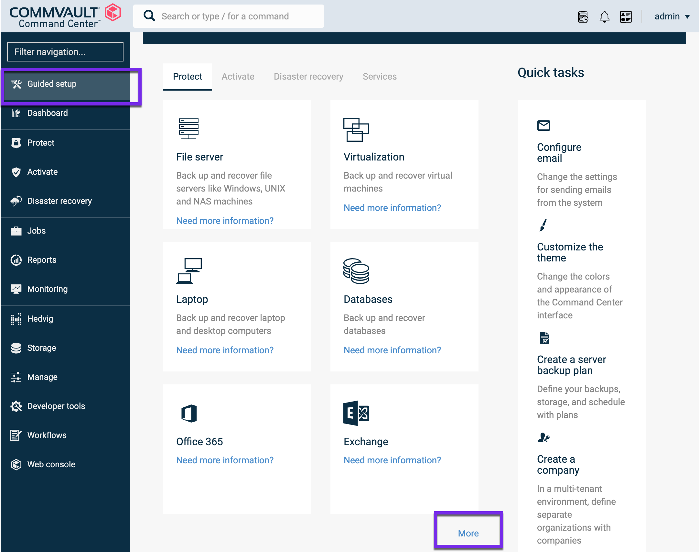
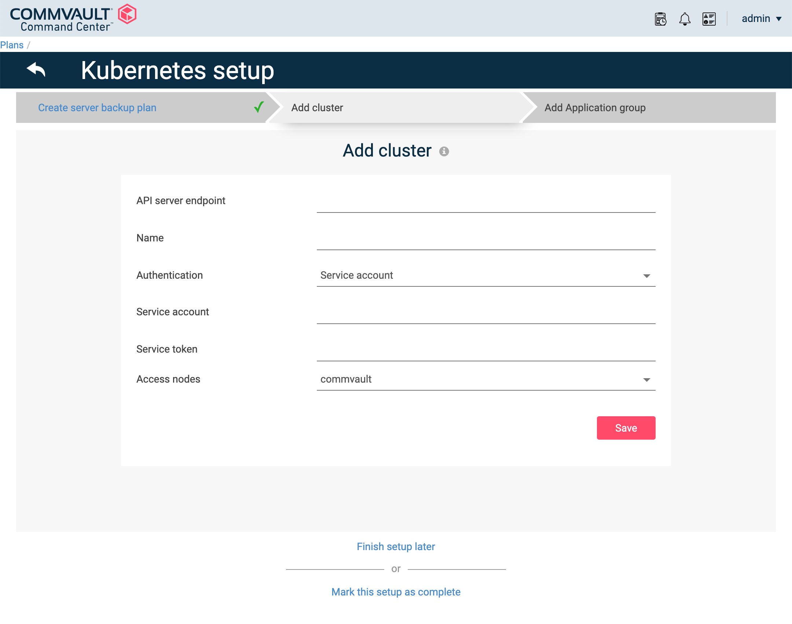
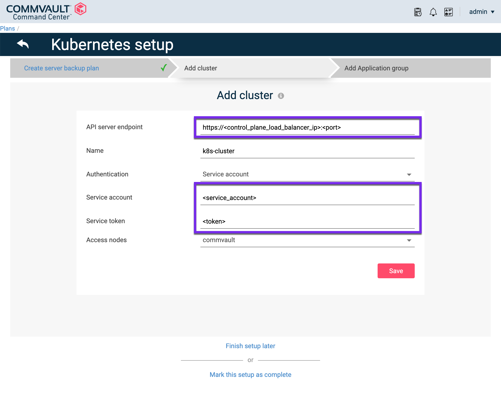
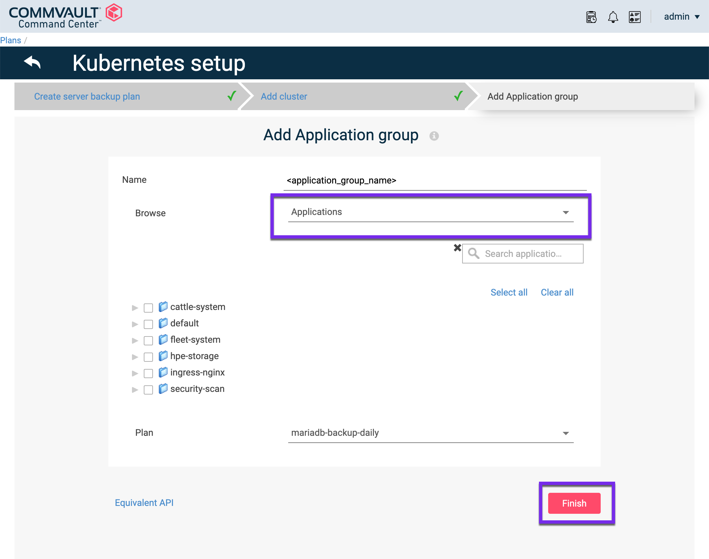

# Overview

The Commvault intelligent data management platform provides Kubernetes-native protection, application mobility, and disaster recovery for containerized applications. Combined with Commvault Command Center™, Commvault provides enterprise IT operations and DevOps teams an easy-to-use, self-service dashboard for managing the protection of Kubernetes.

HPE and Commvault have been delivering end-to-end solutions for many years. Learn more about HPE and Commvaults partnership here: [https://www.commvault.com/supported-technologies/hpe](https://www.commvault.com/supported-technologies/hpe).

[TOC]

## Pre-requisites

The HPE CSI Driver has been validated on Commvault Complete Backup and Recovery version 11.21 and later. 

##### Permissions

This guide assumes you have administrative access to Commvault Command Center and access to a Kubernetes cluster with `kubectl` and a `KUBECONFIG` file configured with a cluster administrator account. This will be used to create a Kubernetes service account for Commvault Complete Backup and Recovery, with the `default-sa-crb` cluster role binding. Please refer to the [Creating a Service Account for Kubernetes Authentication](https://documentation.commvault.com/11.22/essential/129223_creating_service_account_for_kubernetes_authentication.html).

##### Cluster requirements

The cluster needs to be running Kubernetes 1.17 or later and have the CSI snapshot `CustomResourceDefinitions` (CRDs) and the CSI external snapshotter deployed. Follow the guides available on SCOD to:

- [Enable CSI snapshots](../../csi_driver/using.md#enabling_csi_snapshots)
- [Using CSI snapshots](../../csi_driver/using.md#using_csi_snapshots)

!!! note
    The rest of this guide assumes the default `VolumeSnapshotClass` and `VolumeSnapshots` are functional within the cluster with a compatible Kubernetes snapshot API level between the CSI driver and Commvault.

## Getting Started

This guide will walk through the steps to configure Commvault to perform data protection operations within a Kubernetes cluster. To learn more, refer to the [official Commvault documentation](https://documentation.commvault.com/11.22/essential/123634_kubernetes.html).

- Complete the [Core Setup Wizard](https://documentation.commvault.com/11.22/essential/86638_step_3_complete_core_setup_wizard.html)
- Review [Supported Configurations for Kubernetes](https://documentation.commvault.com/11.22/essential/123637_supported_configurations_for_kubernetes.html)

#### Configuring Commvault with Kubernetes

If the setup page is not displayed, from the navigation pane, click **Guided setup**.



After you complete the core setup, on the **Protect** tab, click the **Kubernetes** tile.


On the **Create server backup plan** page, enter in a **Plan name**, then choose **Storage**, **Retention period**, and **RPO schedule**. For more information, see [Creating a Server Plan](https://documentation.commvault.com/11.22/essential/86648_creating_server_plan.html).

!!! Note
    If you configured a server backup plan as part of the **Core Setup**, the wizard skips this page.


Click **Save**.

The **Add cluster** page appears.



In the **API server endpoint** box, enter the API server endpoint URL. This can be found using `kubectl config view` under `server: https://<control_plane_load_balancer_ip>:<port>`.



Select **Authentication** method (**Service account**, **Kubeconfig file**, or **Username and Password**).

##### Create a Service Account

In this example, we will cover how to create a Kubernetes service account within the cluster to be used by Commvault for backup and restore operations. 

The official guide is available here: [Creating a Service Account for Kubernetes Authentication](https://documentation.commvault.com/11.22/essential/129223_creating_service_account_for_kubernetes_authentication.html)

- Create a Kubernetes service account (for example, cvbackup).

```markdown
kubectl create serviceaccount cvbackup
``` 

- To ensure that the service account has sufficient privileges to perform data protection operations, add the service account to the `default-sa-crb` cluster role binding.

```markdown
kubectl create clusterrolebinding default-sa-crb --clusterrole=cluster-admin --serviceaccount=default:cvbackup
```

- Extract the service account token required to configure your Kubernetes cluster for data protection.

```markdown
kubectl get secrets -o jsonpath="{.items[?(@.metadata.annotations['kubernetes\.io/service-account\.name']=='cvbackup')].data.token}"|base64 --decode
```

- Use the Kubernetes service account **cvbackup**, and the token for authentication to your Kubernetes cluster by pasting them into the appropriate fields.

Click **Save**.

Next choose the [Application group](https://documentation.commvault.com/11.22/essential/123896_creating_application_group_of_content_to_back_up_for_kubernetes.html), [Labels](https://documentation.commvault.com/11.22/essential/122510_using_labels_to_automatically_discover_applications_or_other_objects_for_kubernetes.html) or **Volumes** you want to backup.



Click **Finish**. 

#### Backup and Restores

To perform snapshot and restore operations through Commvault using the HPE CSI Driver for Kubernetes, please refer to the Commvault documentation.

- [Backup](https://documentation.commvault.com/11.22/essential/123639_kubernetes_backup.html)
- [Restores](https://documentation.commvault.com/11.22/essential/123640_kubernetes_restores.html)

!!! note
    Above links are external to [documentation.commvault.com](https://documentation.commvault.com/).