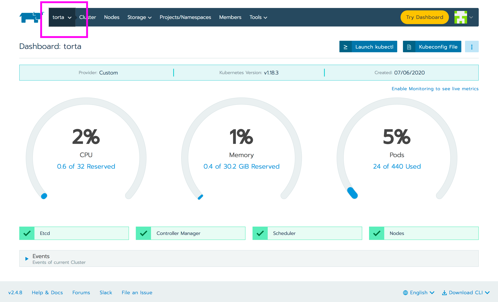
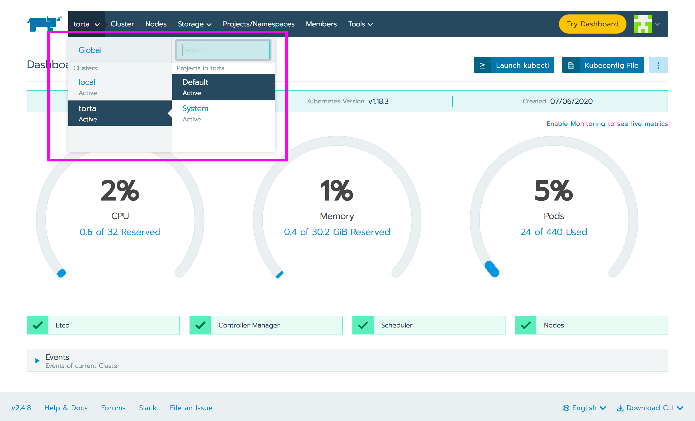
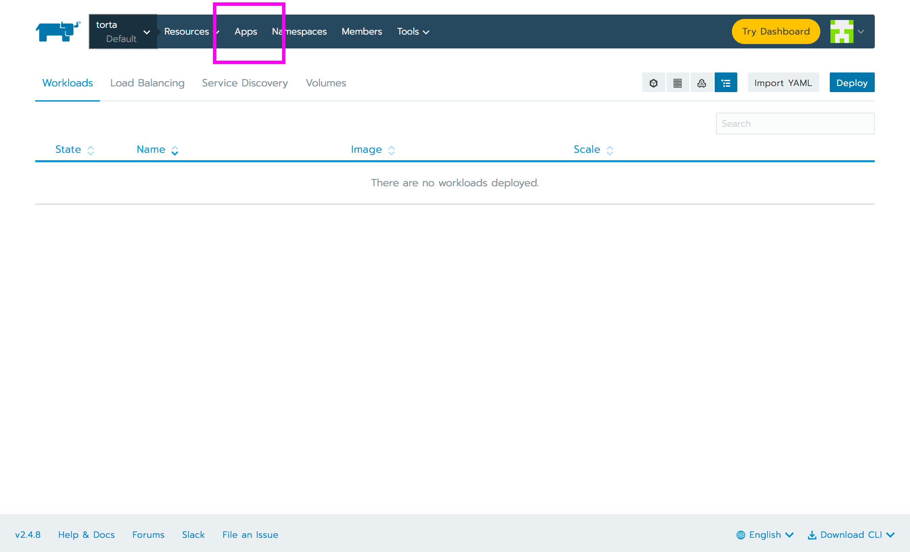
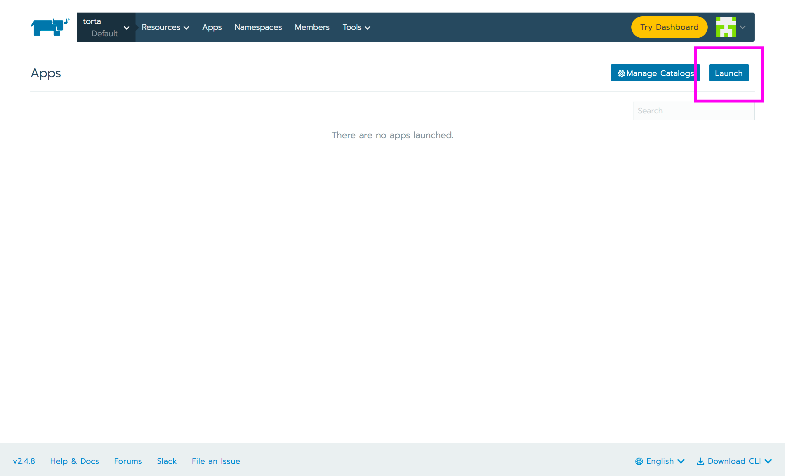
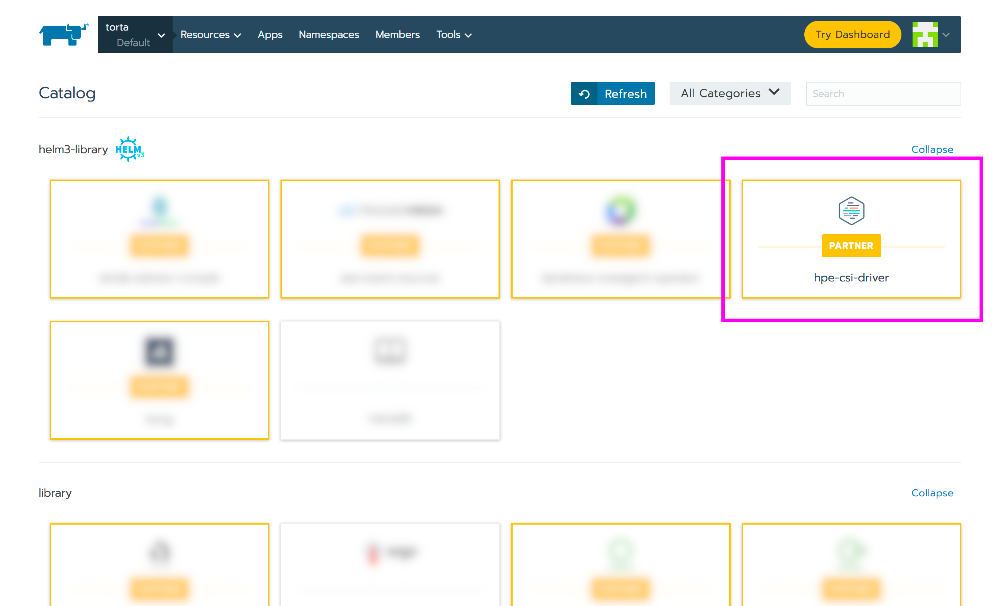
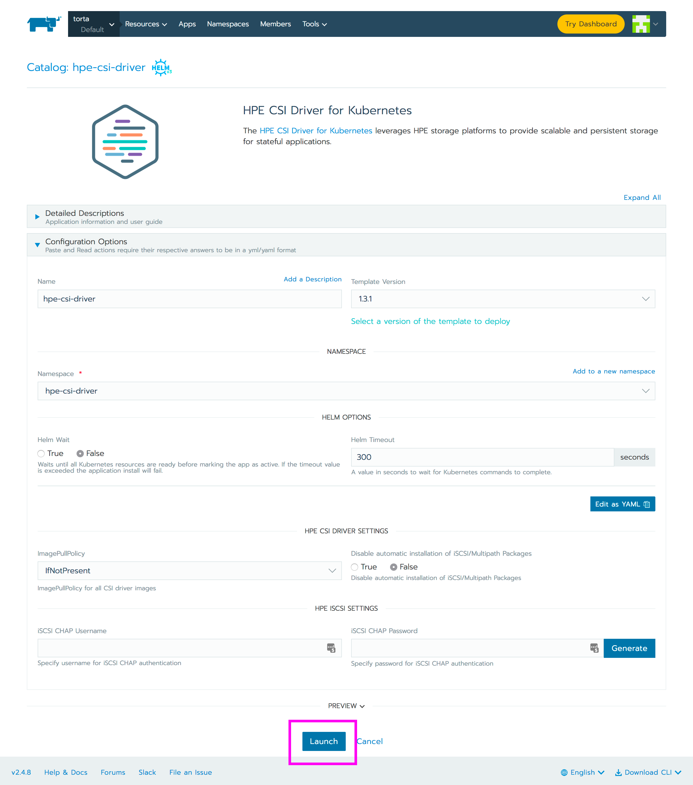
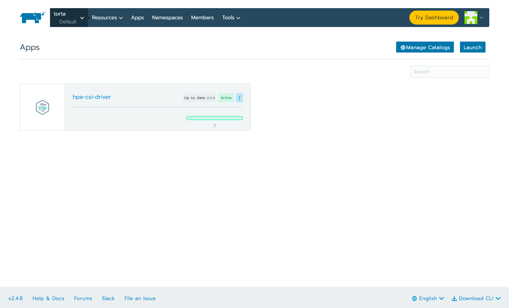

# Overview

Rancher Labs provides a platform to deploy Kubernetes-as-a-service everywhere. HPE partners with Rancher Labs to provide effortless management of the CSI and FlexVolume driver on managed Kubernetes clusters. This allows our joint customers and channel partners to enable hybrid cloud stateful workloads on Kubernetes.

[TOC]

## Deployment considerations

Rancher is capable of managing Kubernetes across a broad spectrum of managed and BYO clusters. It's important to understand that the HPE CSI Driver for Kubernetes does not support the same amount of combinations Rancher does. Consult the support matrix on [the CSI driver overview page](../../csi_driver/index.md#compatibility_and_support) for the supported combinations of the HPE CSI Driver, Kubernetes and supported node Operating Systems.

## Rancher 2.4

Rancher uses Helm to deploy and manage partner software. The concept of a Helm repository in Rancher is organized as a "catalog". The HPE CSI Driver for Kubernetes and the HPE Volume Driver for Kubernetes FlexVolume plugin are both partner solutions present in the official Rancher Catalog.

!!! tip
    Learn more about Catalogs, Helm Charts and Apps in the [Rancher documentation](https://rancher.com/docs/rancher/v2.x/en/catalog/).

### HPE CSI Driver for Kubernetes

The HPE CSI Driver is part of the official Helm v3 library in Rancher. The CSI driver is deployed on managed Kubernetes clusters like any ordinary "App" in Rancher. You may use either the [Rancher CLI](https://rancher.com/docs/rancher/v2.x/en/cli/) or the web UI to deploy the CSI driver.

#### Rancher CLI install

Switch to the project you want to install the CSI driver. For this example, the default project on a managed cluster is being used.

```markdown
$ rancher context current
Cluster:torta Project:Default
```

Steps to install the CSI driver.

```markdown
$ rancher app install hpe-csi-driver hpe-csi-driver --no-prompt
run "app show-notes hpe-csi-driver" to view app notes once app is ready
$ rancher app
ID                       NAME             STATE     CATALOG         TEMPLATE         VERSION
p-k28xd:hpe-csi-driver   hpe-csi-driver   active    helm3-library   hpe-csi-driver   1.3.1
```

!!! note
    This is installs the driver with the default parameters which is the most common deployment option. Please see the official Helm chart [documentation](https://artifacthub.io/packages/helm/hpe-storage/hpe-csi-driver) for supported parameters.

#### Web UI install

The web UI install is straight forward. Illustrated here for completeness.


*Login to RKE and click the cluster tab*


*Select which managed cluster and project the driver should be installed to*


*Select "Apps"*


*Select "Launch"*


*Pick "hpe-csi-driver"*


*Scroll past the manifest unless any parameters needs changing, hit "Launch"*


*After a few moments the driver should be installed. The number of workloads depends on the cluster node count.*

!!! note
    This is installs the driver with the default parameters which is the most common deployment option. Please see the official Helm chart [documentation](https://artifacthub.io/packages/helm/hpe-storage/hpe-csi-driver) for supported parameters.

#### Post install steps

For Rancher Apps to make use of persistent storage from HPE, a supported backend needs to be configured. This procedure is generic regardless of Kubernetes distribution being used.

- Go ahead and [add a HPE storage backend](../../csi_driver/deployment.md#add_a_hpe_storage_backend)

### HPE Volume Driver for Kubernetes FlexVolume plugin

Only use the FlexVolume driver for Kubernetes 1.12 and below or with HPE Cloud Volumes up to Kubernetes 1.17. The FlexVolume driver is provided as a Helm v2 chart in the official Rancher Catalog. Parameters are very specific to the environment to where the driver is being installed to. Please follow the steps in the FlexVolume Helm chart [documentation](https://artifacthub.io/packages/helm/hpe-storage/hpe-flexvolume-driver) for further guidance. Also understand that the FlexVolume driver only supports HPE Nimble Storage and HPE Cloud Volumes.

!!! caution
    The FlexVolume driver is being deprecated. Reach out to your HPE representative if you think deploying the FlexVolume driver on your Rancher managed Kubernetes cluster is the correct course of action.
