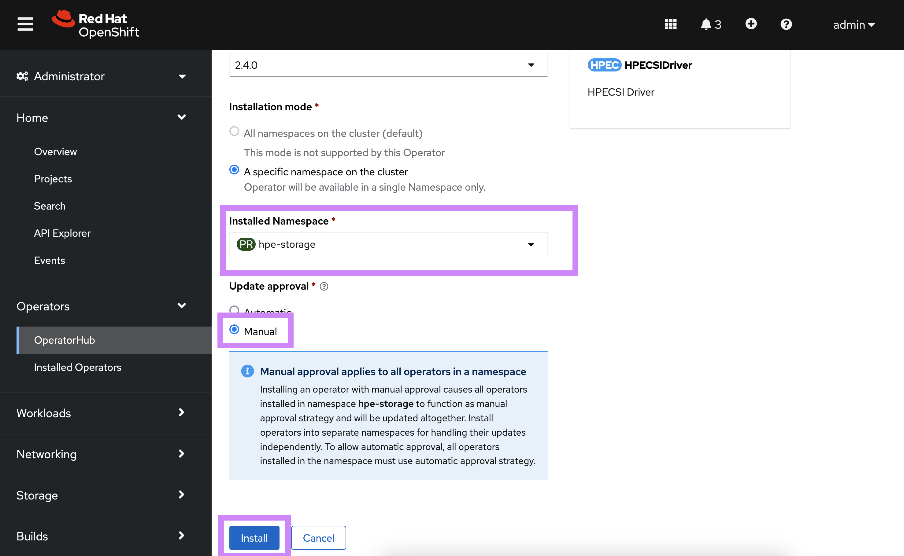

# Overview
HPE and Red Hat have a long standing partnership to provide jointly supported software, platform and services with the absolute best customer experience in the industry.

Red Hat OpenShift uses open source Kubernetes and various other components to deliver a PaaS experience that benefits both developers and operations. This packaged experience differs slightly on how you would deploy and use the HPE volume drivers and this page serves as the authoritative source for all things HPE primary storage and Red Hat OpenShift.

[TOC]

## OpenShift 4

Software deployed on OpenShift 4 follows the [Operator pattern](https://kubernetes.io/docs/concepts/extend-kubernetes/operator/). CSI drivers are no exception.

### Certified combinations

Software delivered through the HPE and Red Hat partnership follows a rigorous certification process and only qualify what's listed in the following table.

| Status                  | Red Hat OpenShift                 | HPE CSI Operator | Container Storage Providers          |
| ----------------------- | --------------------------------- | ---------------- | ------------------------------------ |
| Certified               | 4.3<sup>1</sup>, 4.4              | 1.3.0            | Nimble, Primera and 3PAR             |
| Certified               | 4.4                               | 1.4.0            | Nimble, Primera and 3PAR             |
| Uncertified<sup>2</sup> | 4.5 (Upgrade path only)           | -                | -                                    |
| Certified               | 4.6                               | 1.4.0, 2.0.0     | Alletra, Nimble, Primera and 3PAR    |
| Uncertified<sup>2</sup> | 4.7 (Upgrade path only)           | -                | -                                    |
| In progress             | 4.8                               | TBD              | Alletra, Nimble, Primera and 3PAR    |

<small><sup>1</sup> = End of life support per [Red Hat OpenShift Life Cycle Policy](https://access.redhat.com/support/policy/updates/openshift).</small><br />
<small><sup>2</sup> = HPE will only be certifying the HPE CSI Operator for Kubernetes on **EVEN** versions of Red Hat OpenShift (i.e. 4.4, 4.6, etc). The Operator will not go through the Red Hat certification process for **MIDDLE** releases (i.e. 4.5, 4.7, etc.) and will only be supported as upgrade path to the next **EVEN** release of Red Hat OpenShift.</small>

Check this table periodically for future releases.

!!! seealso "Pointers"
    Other combinations may work but will not be supported.  
    Both Red Hat Enterprise Linux and Red Hat CoreOS worker nodes are supported.

### Security model

By default, OpenShift prevents containers from running as root. Containers are run using an arbitrarily assigned user ID. Due to these security restrictions, containers that run on Docker and Kubernetes might not run successfully on Red Hat OpenShift without modification. 

Users deploying applications that require persistent storage (i.e. through the HPE CSI Driver) will need the appropriate permissions and Security Context Constraints (SCC) to be able to request and manage storage through OpenShift. Modifying container security to work with OpenShift is outside the scope of this document.

For more information on OpenShift security, see [Managing security context constraints](https://docs.openshift.com/container-platform/4.6/authentication/managing-security-context-constraints.html).

!!! note
    If you run into issues writing to persistent volumes provisioned by the HPE CSI Driver under a restricted SCC, add the `fsmode: 0770` parameter to the `StorageClass`.

### Deployment

The HPE CSI Operator for Kubernetes needs to be installed through the interfaces provided by Red Hat. Do not follow the instructions found on OperatorHub.io. 

!!! tip
    There's a tutorial available on YouTube accessible through the [Video Gallery](../../learn/video_gallery/index.md#install_the_hpe_csi_operator_for_kubernetes_on_red_hat_openshift) on how to install and use the HPE CSI Operator on Red Hat OpenShift. 

#### Prerequisites

The HPE CSI Driver needs to run in privileged mode and needs access to host ports, host network and should be able to mount hostPath volumes. Hence, before deploying HPE CSI Operator on OpenShift, please create the following `SecurityContextConstraints` (SCC) to allow the CSI driver to be running with these privileges.

Download the SCC to where you have access to `oc` and the OpenShift cluster:

```markdown
curl -sL https://raw.githubusercontent.com/hpe-storage/co-deployments/master/operators/hpe-csi-operator/deploy/scc.yaml > hpe-csi-scc.yaml
```

Change `my-hpe-csi-operator` to the name of the project (e.g. `hpe-csi-driver` below) where the CSI Operator is being deployed.

```markdown
oc new-project hpe-csi-driver --display-name="HPE CSI Driver for Kubernetes"
sed -i'' -e 's/my-hpe-csi-driver-operator/hpe-csi-driver/g' hpe-csi-scc.yaml
```

Deploy the SCC:

```markdown
oc create -f hpe-csi-scc.yaml
securitycontextconstraints.security.openshift.io/hpe-csi-scc created
```

!!! important
    Make note of the project name as it's needed for the Operator deployment in the next steps.

#### OpenShift web console

Once the SCC has been applied to the project, login to the OpenShift web console as `kube:admin` and navigate to **Operators -> OperatorHub**.


*Search for 'HPE' in the search field.*


*Select the HPE CSI Operator and click 'Install'.*


*In the next pane, click 'Subscribe'.*


*The HPE CSI Operator is now installed.*


*Click the HPE CSI Operator, in the next pane, click 'Create Instance'.*

* In the next 'Create HPECSIDriver' pane, click 'Create'

By navigating to the Developer view, it should now be possible to inspect the CSI driver and Operator topology.


The CSI driver is now ready for use. Next, an [HPE storage backend needs to be added](../../csi_driver/deployment.md#add_an_hpe_storage_backend) along with a [`StorageClass`](../../csi_driver/using.md#base_storageclass_parameter).

See [Caveats](#caveats) below for information on creating `StorageClasses` in Red Hat OpenShift.

#### OpenShift CLI

This provides an example Operator deployment using `oc`. If you want to use the web console, proceed to the [previous section](#openshift_web_console).

It's assumed the SCC has been applied to the project and have `kube:admin` privileges. As an example, we'll deploy to the `hpe-csi-driver` project as described in previous steps.

First, an `OperatorGroup` needs to be created.

```markdown
apiVersion: operators.coreos.com/v1
kind: OperatorGroup
metadata:
  name: hpe-csi-driver-for-kubernetes
  namespace: hpe-csi-driver
spec:
  targetNamespaces:
  - hpe-csi-driver
```

Next, create a `Subscription` to the Operator.

```markdown
apiVersion: operators.coreos.com/v1alpha1
kind: Subscription
metadata:
  name: hpe-csi-operator
  namespace: hpe-csi-driver
spec:
  channel: stable
  name: hpe-csi-operator
  source: certified-operators
  sourceNamespace: openshift-marketplace
```

The Operator will now be installed on the OpenShift cluster. Before instantiating a CSI driver, watch the roll-out of the Operator.

```markdown
oc rollout status deploy/hpe-csi-driver-operator -n hpe-csi-driver
Waiting for deployment "hpe-csi-driver-operator" rollout to finish: 0 of 1 updated replicas are available...
deployment "hpe-csi-driver-operator" successfully rolled out
```

The next step is to create a `HPECSIDriver` object. It's unique per backend CSP.

```markdown
apiVersion: storage.hpe.com/v1
kind: HPECSIDriver
metadata:
  name: csi-driver
  namespace: hpe-csi-driver
spec:
  disableNodeConformance: false
  imagePullPolicy: IfNotPresent
  iscsi:
    chapPassword: ""
    chapUser: ""
  logLevel: info
  registry: "quay.io"
```

The CSI driver is now ready for use. Next, an [HPE storage backend needs to be added](../../csi_driver/deployment.md#add_an_hpe_storage_backend) along with a [`StorageClass`](../../csi_driver/using.md#base_storageclass_parameter).

#### Additional information

At this point the CSI driver is managed like any other Operator on Kubernetes and the life-cycle management capabilities may be explored further in the [official Red Hat OpenShift documentation](https://docs.openshift.com/container-platform/4.3/operators/olm-what-operators-are.html).
