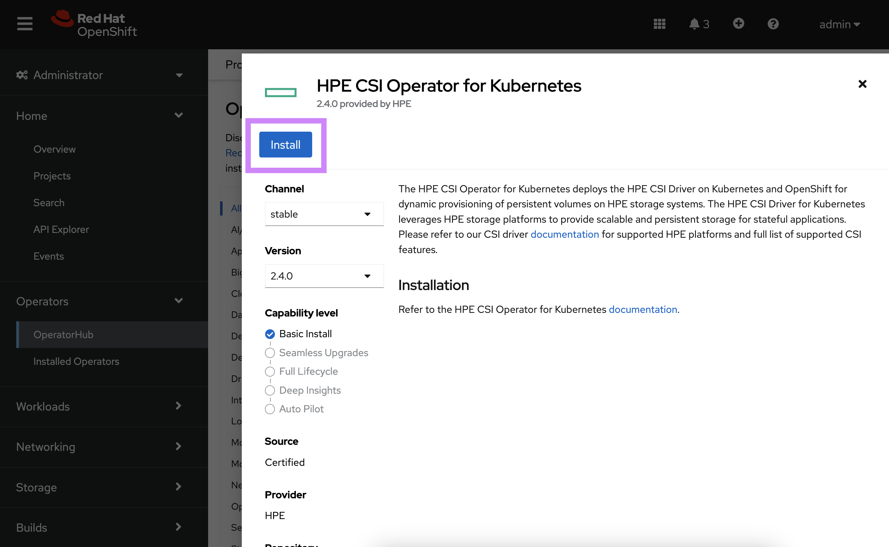
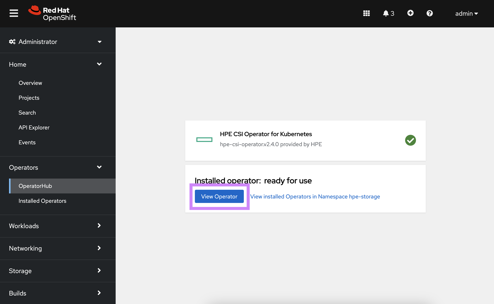

# Overview

HPE and Red Hat have a long standing partnership to provide jointly supported software, platform and services with the absolute best customer experience in the industry.

Red Hat OpenShift uses open source Kubernetes and various other components to deliver a PaaS experience that benefits both developers and operations. This packaged experience differs slightly on how you would deploy and use the HPE volume drivers and this page serves as the authoritative source for all things HPE primary storage and Red Hat OpenShift.

[TOC]

## OpenShift 4

Software deployed on OpenShift 4 follows the [Operator pattern](https://kubernetes.io/docs/concepts/extend-kubernetes/operator/). CSI drivers are no exception.

### Certified combinations

Software delivered through the HPE and Red Hat partnership follows a [rigorous certification process](https://redhat-connect.gitbook.io/openshift-badges/badges/container-storage-interface-csi-1) and only qualify what's listed as "Certified" in the below table.

| Status                  | Red Hat OpenShift                 | HPE CSI Operator           | Container Storage Providers                      |
| ----------------------- | --------------------------------- | -------------------------- | ------------------------------------------------ |
| Certified               | 4.15                              | 2.4.1                      | [All](../../container_storage_provider/index.md) |
| Certified               | 4.14 EUS<sup>2</sup>              | 2.4.0, 2.4.1               | [All](../../container_storage_provider/index.md) |
| Certified               | 4.13                              | 2.4.0, 2.4.1               | [All](../../container_storage_provider/index.md) |
| Certified               | 4.12 EUS<sup>2</sup>              | 2.3.0, 2.4.0, 2.4.1        | [All](../../container_storage_provider/index.md) |
| EOL<sup>1</sup>         | 4.11                              | 2.3.0                      | [All](../../container_storage_provider/index.md) |
| EOL<sup>1</sup>         | 4.10 EUS<sup>2</sup>              | 2.2.1, 2.3.0               | [All](../../container_storage_provider/index.md) |

<small><sup>1</sup> = End of life support per [Red Hat OpenShift Life Cycle Policy](https://access.redhat.com/support/policy/updates/openshift).</small><br />
<small><sup>2</sup> = Red Hat OpenShift [Extended Update Support](https://access.redhat.com/support/policy/updates/openshift-eus).</small></br />
<!--small><sup>3</sup> = Passes the Kubernetes CSI e2e test suite on the listed CSPs using the [unsupported Helm chart install](#unsupported_helm_chart_install) method.</small-->

Check the table above periodically for future releases.

!!! seealso "Pointers"
    - Other combinations may work but will not be supported.
    - Both Red Hat Enterprise Linux and Red Hat CoreOS worker nodes are supported.
    - Instructions on this page only reflect the current stable version of the HPE CSI Operator and OpenShift.
    - OpenShift Virtualization OS images are only supported on `PVCs` using "RWX" with `volumeMode: Block`. See [below](#storageprofile_for_openshift_virtualization_source_pvcs) for more details.

### Security model

By default, OpenShift prevents containers from running as root. Containers are run using an arbitrarily assigned user ID. Due to these security restrictions, containers that run on Docker and Kubernetes might not run successfully on Red Hat OpenShift without modification. 

Users deploying applications that require persistent storage (i.e. through the HPE CSI Driver) will need the appropriate permissions and Security Context Constraints (SCC) to be able to request and manage storage through OpenShift. Modifying container security to work with OpenShift is outside the scope of this document.

For more information on OpenShift security, see [Managing security context constraints](https://docs.openshift.com/container-platform/4.12/authentication/managing-security-context-constraints.html).

!!! note
    If you run into issues writing to persistent volumes provisioned by the HPE CSI Driver under a restricted SCC, add the `fsMode: "0770"` parameter to the `StorageClass` with RWO claims or `fsMode: "0777"` for RWX claims.

### Limitations

Since the CSI Operator only provides "Basic Install" capabilities. The following limitations apply:

- The `ConfigMap` "hpe-linux-config" that controls host configuration is immutable
- The NFS Server Provisioner can not be used with Operators deploying `PersistentVolumeClaims` as part of the installation. See [#295](https://github.com/hpe-storage/csi-driver/issues/295) on GitHub.
- Deploying the NFS Server Provisioner to a `Namespace` other than "hpe-nfs" requires a separate SCC applied to the `Namespace`. See [#nfs_server_provisioner_considerations](NFS Server Provisioner Considerations).

### Deployment

The HPE CSI Operator for Kubernetes needs to be installed through the interfaces provided by Red Hat. Do not follow the instructions found on OperatorHub.io. 

!!! tip
    There's a tutorial available on YouTube accessible through the [Video Gallery](../../learn/video_gallery/index.md#install_the_hpe_csi_operator_for_kubernetes_on_red_hat_openshift) on how to install and use the HPE CSI Operator on Red Hat OpenShift. 

#### Upgrading

In situations where the operator needs to be upgraded, follow the prerequisite steps in the Helm chart on Artifact Hub.

- [Upgrading the chart](https://artifacthub.io/packages/helm/hpe-storage/hpe-csi-driver#upgrading-the-chart)

!!! danger "Automatic Updates"
    Do not under any circumstance enable "Automatic Updates" for the HPE CSI Operator for Kubernetes

Once the steps have been followed for the particular version transition:

- Uninstall the `HPECSIDriver` instance
- Delete the "hpecsidrivers.storage.hpe.com" `CRD`<br />:
  `oc delete crd/hpecsidrivers.storage.hpe.com`
- [Uninstall](#uninstall_the_hpe_csi_operator) the HPE CSI Operator for Kubernetes
- Proceed to installation through the [OpenShift Web Console](#openshift_web_console) or [OpenShift CLI](#openshift_cli)

!!! important "Good to know"
    Deleting the `HPECSIDriver` instance and uninstalling the CSI Operator does not affect any running workloads, `PersistentVolumeClaims`, `StorageClasses` or other API resources created by the CSI Operator. In-flight operations and new requests will be retried once the new `HPECSIDriver` has been instantiated.

#### Prerequisites

The HPE CSI Driver needs to run in privileged mode and needs access to host ports, host network and should be able to mount hostPath volumes. Hence, before deploying HPE CSI Operator on OpenShift, please create the following `SecurityContextConstraints` (SCC) to allow the CSI driver to be running with these privileges.

```text
oc new-project hpe-storage --display-name="HPE CSI Driver for Kubernetes"
```

!!! important
    The rest of this implementation guide assumes the default "hpe-storage" `Namespace`. If a different `Namespace` is desired. Update the `ServiceAccount` `Namespace` in the SCC below.

Deploy or [download]({{ config.site_url}}partners/redhat_openshift/examples/scc/hpe-csi-scc.yaml) the SCC:

```text
oc apply -f {{ config.site_url}}partners/redhat_openshift/examples/scc/hpe-csi-scc.yaml
securitycontextconstraints.security.openshift.io/hpe-csi-controller-scc created
securitycontextconstraints.security.openshift.io/hpe-csi-node-scc created
securitycontextconstraints.security.openshift.io/hpe-csi-csp-scc created
securitycontextconstraints.security.openshift.io/hpe-csi-nfs-scc created
```

#### OpenShift web console

Once the SCC has been applied to the project, login to the OpenShift web console as `kube:admin` and navigate to **Operators -> OperatorHub**.


*Search for 'HPE CSI' in the search field and select the non-marketplace version.*


*Click 'Install'.*
!!! note
    Latest supported HPE CSI Operator on OpenShift 4.14 is 2.4.1


*Select the Namespace where the SCC was applied, select 'Manual' Update Approval, click 'Install'.*


*Click 'Approve' to finalize installation of the Operator*


*The HPE CSI Operator is now installed, select 'View Operator'.*


*Click 'Create Instance'.*


*Normally, no customizations are needed, scroll all the way down and click 'Create'.*

By navigating to the Developer view, it should now be possible to inspect the CSI driver and Operator topology.


The CSI driver is now ready for use. Next, an [HPE storage backend needs to be added](../../csi_driver/deployment.md#add_an_hpe_storage_backend) along with a [`StorageClass`](../../csi_driver/using.md#base_storageclass_parameter).

See [Caveats](#caveats) below for information on creating `StorageClasses` in Red Hat OpenShift.

#### OpenShift CLI

This provides an example Operator deployment using `oc`. If you want to use the web console, proceed to the [previous section](#openshift_web_console).

It's assumed the SCC has been applied to the project and have `kube:admin` privileges. As an example, we'll deploy to the `hpe-storage` project as described in previous steps.

First, an `OperatorGroup` needs to be created.

```yaml
apiVersion: operators.coreos.com/v1
kind: OperatorGroup
metadata:
  name: hpe-csi-driver-for-kubernetes
  namespace: hpe-storage
spec:
  targetNamespaces:
  - hpe-storage
```

Next, create a `Subscription` to the Operator.

```yaml
apiVersion: operators.coreos.com/v1alpha1
kind: Subscription
metadata:
  name: hpe-csi-operator
  namespace: hpe-storage
spec:
  channel: stable
  installPlanApproval: Manual
  name: hpe-csi-operator
  source: certified-operators
  sourceNamespace: openshift-marketplace
```

Next, approve the installation.

```text
oc -n hpe-storage patch $(oc get installplans -n hpe-storage -o name) -p '{"spec":{"approved":true}}' --type merge
```

The Operator will now be installed on the OpenShift cluster. Before instantiating a CSI driver, watch the roll-out of the Operator.

```text
oc rollout status deploy/hpe-csi-driver-operator -n hpe-storage
Waiting for deployment "hpe-csi-driver-operator" rollout to finish: 0 of 1 updated replicas are available...
deployment "hpe-csi-driver-operator" successfully rolled out
```

The next step is to create a `HPECSIDriver` object.

```yaml
```

The CSI driver is now ready for use. Next, an [HPE storage backend needs to be added](../../csi_driver/deployment.md#add_an_hpe_storage_backend) along with a [`StorageClass`](../../csi_driver/using.md#base_storageclass_parameter).

#### Additional information

At this point the CSI driver is managed like any other Operator on Kubernetes and the life-cycle management capabilities may be explored further in the [official Red Hat OpenShift documentation](https://docs.openshift.com/container-platform/4.3/operators/olm-what-operators-are.html).

#### Uninstall the HPE CSI Operator

When uninstalling an operator managed by OLM, a Cluster Admin must decide whether or not to remove the `CustomResourceDefinitions` (CRD), `APIServices`, and resources related to these types owned by the operator. By design, when OLM uninstalls an operator it does not remove any of the operator’s owned `CRDs`, `APIServices`, or `CRs` in order to prevent data loss.

!!! important
    Do not modify or remove these `CRDs` or `APIServices` if you are upgrading or reinstalling the HPE CSI driver in order to prevent data loss.

The following are `CRDs` installed by the HPE CSI driver.

```text
hpecsidrivers.storage.hpe.com
hpenodeinfos.storage.hpe.com
hpereplicationdeviceinfos.storage.hpe.com
hpesnapshotgroupinfos.storage.hpe.com
hpevolumegroupinfos.storage.hpe.com
hpevolumeinfos.storage.hpe.com
snapshotgroupclasses.storage.hpe.com
snapshotgroupcontents.storage.hpe.com
snapshotgroups.storage.hpe.com
volumegroupclasses.storage.hpe.com
volumegroupcontents.storage.hpe.com
volumegroups.storage.hpe.com
```

The following are `APIServices` installed by the HPE CSI driver.

```text
v1.storage.hpe.com
v2.storage.hpe.com
```

Please refer to the OLM Lifecycle Manager documentation on how to safely [Uninstall your operator](https://olm.operatorframework.io/docs/tasks/uninstall-operator/).

# NFS Server Provisioner Considerations

When deploying NFS servers on OpenShift there's currently two things to keep in mind for a successful deployment.

## Non-standard hpe-nfs Namespace

If NFS servers are deployed in a different `Namespace` than the default "hpe-nfs" by using the "nfsNamespace" `StorageClass` parameter, the "hpe-csi-nfs-scc" SCC needs to be updated to include the `Namespace` `ServiceAccount`.

This example adds "my-namespace" NFS server `ServiceAccount` to the SCC:

```text
oc patch scc hpe-csi-nfs-scc --type=json -p='[{"op": "add", "path": "/users/-", "value": "system:serviceaccount:my-namespace:hpe-csi-nfs-sa" }]'
```

## Operators Requesting NFS Persistent Volume Claims

Object references in OpenShift are not compatible with the NFS Server Provisioner. If a user deploys an Operator of any kind that creates a NFS server backed `PVC`, the operation will fail. Instead, pre-provision the `PVC` manually for the Operator instance to use.

## Use the ext4 filesystem for NFS servers

On certain versions of OpenShift the NFS clients may experience stale NFS file handles like the one below when the NFS server is being restarted.

```text
Error: failed to resolve symlink "/var/lib/kubelet/pods/290ff9e1-cc1e-4d05-b884-0ddcc05a9631/volumes/kubernetes.io~csi/pvc-321cf523-c063-4ce4-97e8-bc1365b8a05b/mount": lstat /var/lib/kubelet/pods/290ff9e1-cc1e-4d05-b884-0ddcc05a9631/volumes/kubernetes.io~csi/pvc-321cf523-c063-4ce4-97e8-bc1365b8a05b/mount: stale NFS file handle
```

If this problem occurs, use the ext4 filesystem on the backing volumes. The `fsType` is set in the `StorageClass`. Example:

```text
...
parameters:
  csi.storage.k8s.io/fstype: ext4
...
```

# StorageProfile for OpenShift Virtualization Source PVCs

If OpenShift Virtualization is being used and Live Migration is desired for virtual machines `PVCs` cloned from the "openshift-virtualization-os-images" `Namespace`, the `StorageProfile` needs to be updated to "ReadWriteMany".

If the default `StorageClass` is named "hpe-standard", issue the following command:

```text
oc edit -n openshift-cnv storageprofile hpe-standard
```

Replace the `spec: {}` with the following:

```yaml
spec:
  claimPropertySets:
  - accessModes:
    - ReadWriteMany
    volumeMode: Block
```

Ensure there are no errors. Recreate the OS images:

```text
oc delete pvc -n openshift-virtualization-os-images --all
```

Inspect the `PVCs` and ensure they are re-created with "RWX":

```text
oc get pvc -n openshift-virtualization-os-images -w
```

!!! hint
    These steps might be removed in a future release in the event access mode transformation become a supported feature of the CSI driver.

# Unsupported Helm Chart Install

In the event Red Hat releases a new version of OpenShift between HPE CSI Driver releases or if interest arises to run the HPE CSI Driver on an uncertified version of OpenShift, it's possible to install the CSI driver using the Helm chart instead.

It's not recommended to install the Helm chart unless it's listed as "Field Tested" in the [support matrix](#certified_combinations) above.

!!! tip
    Helm chart install is also only current method to use beta releases of the HPE CSI Driver.

## Steps to install.

- Follow the steps in the [prerequisites](#prerequisites) to apply the `SCC` in the `Namespace` (Project) you wish to install the driver.
- Install the Helm chart with the steps provided on [ArtifactHub](https://artifacthub.io/packages/helm/hpe-storage/hpe-csi-driver). Pay attention to which version combination has been field tested.

!!! caution "Unsupported"
    Understand that this method is not supported by Red Hat and not recommended for production workloads or clusters.
