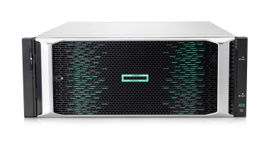

# Choose your platform

HPE provides a broad portfolio of products that integrate with Kubernetes and neighboring ecosystems. The following table provides an overview of integrations available for each primary storage platform.

| Ecosystem |    HPE Alletra 6000 and Nimble Storage |     HPE Alletra 9000, Primera and 3PAR |
| :-: | :-: | :-: |
| Kubernetes | [HPE CSI Driver](../csi_driver/index.md) with [Alletra 6000 CSP](../container_storage_provider/hpe_alletra_6000/index.md) |[HPE CSI Driver](../csi_driver/index.md) with [Alletra 9000 CSP](../container_storage_provider/hpe_alletra_9000/index.md) |

- Looking to [deploy the CSI driver](../csi_driver/deployment.md)? 

# Help me choose

Interested in acquiring a persistent storage solution for your Kubernetes project?

| Criteria        |    HPE Alletra 6000     |     HPE Alletra 9000    |
| :-------------: | :-------------------------------------------------------: | :-------------------------------------------------------: |
| Availability    | 99.9999%                                                  | 100%                                                      |
| Workloads       | Business-critical                                         | Mission-critical                                          |
| Learn&nbsp;more | [hpe.com/storage/alletra](http://hpe.com/storage/alletra) | [hpe.com/storage/alletra](http://hpe.com/storage/alletra) |

# Other HPE storage platforms

Can't find what you're looking for? Check out [hpe.com/storage](http://hpe.com/storage) for additional HPE storage platforms.
