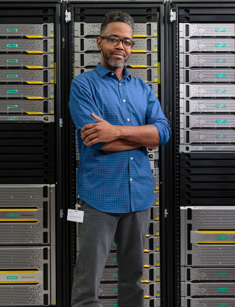
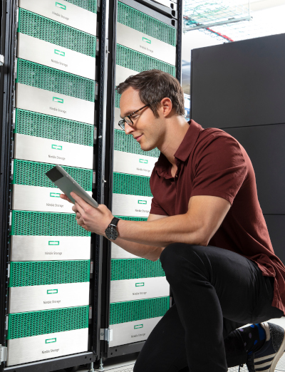

# Choose your platform

HPE provides a broad portfolio of products that integrate with Docker, Kubernetes and neighboring ecosystems. The following table provides an overview of integrations available for each primary storage platform.

| Ecosystem |     HPE 3PAR / Primera |    HPE Nimble Storage |     HPE Cloud Volumes |
| :---: | :---: | :---: | :---: |
| K8s 1.13+ | [CSI driver](../csi_driver/index.md) | [CSI driver](../csi_driver/index.md) | [FlexVolume driver](../flexvolume_driver/container_provider/index.md) |
| k8s < 1.13 | [FlexVolume driver](../flexvolume_driver/hpe_3par_primera_installer/index.md) | [FlexVolume driver](../flexvolume_driver/container_provider/index.md) | [FlexVolume driver](../flexvolume_driver/container_provider/index.md) |
| Docker | Docker Volume Plugin | [Docker Volume Plugin](../docker_volume_plugins/hpe_nimble_storage/index.md) | [Docker Volume Plugin](../docker_volume_plugins/hpe_cloud_volumes/index.md) |

# Help me choose

Interested in acquiring a persistent storage solution for your Kubernetes or Docker project?

| Criteria | HPE 3PAR and Primera | HPE Nimble Storage | HPE Cloud Volumes |
| :---: | :---: | :---: | :---: |
| Availability | 100% | 99.9999% | Cloud dependent SLA/SLO | 
| Workloads | Tier0 | Tier1 and general purpose | Tier2, backups, DR | 
| Market | Large Enterprise | Enterprise/SMB | Flexible |
| Cloud  | Private | Private and Hybrid | Public |
| Learn more | [hpe.com/storage/primera](http://hpe.com/storage/primera) [hpe.com/storage/3par](http://hpe.com/storage/3par) | [hpe.com/storage/nimble](http://hpe.com/storage/nimble) | [cloudvolumes.hpe.com](https://cloudvolumes.hpe.com) |

# Other HPE storage platforms

Can't find what you're looking for? Check out [hpe.com/storage](http://hpe.com/storage) for additional HPE storage platforms.
