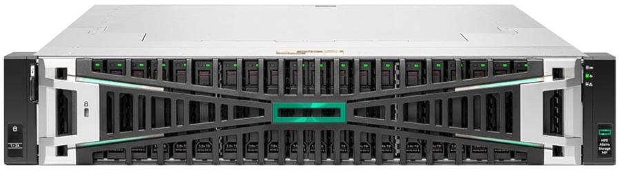

# Choose Your Platform

HPE provide a broad portfolio of storage products that integrate with Kubernetes and neighboring ecosystems. The following table provides an overview of integrations available for HPE Alletra Storage MP.

<small>
<table>
 <tr>
  <td colspan="4" align="center" style="padding-left:100px">
    
  HPE Alletra Storage MP
 </td>
 </tr>
 <tr>
  <th>
  </th>
  <th>
   HPE&nbsp;Alletra&nbsp;Storage&nbsp;MP&nbsp;B10000
  </th>
  <th>
   HPE&nbsp;GreenLake&nbsp;for&nbsp;File&nbsp;Storage
  </th>
  <th>
   HPE&nbsp;Alletra&nbsp;Storage&nbsp;MP&nbsp;X10000
  </th>
 </tr>
 <tr>
  <td align="right">
  <b>Protocol</b>
  </td>
  <td>
   Block and File
  </td>
  <td>
   File
  </td>
  <td>
   Object
  </td>
 </tr>
 <tr>
  <td align="right">
  <b>Workloads</b>
  </td>
  <td>
   Large scale and high performance containers and virtual machines.
  </td>
  <td>
   Data lakes and scalable unstructured workloads.
  </td>
  <td>
   Applications requiring fast AWS S3 compatible object storage.
  </td>
 </tr>
 <tr>
  <td align="right">
  <b>Solutions</b>
  </td>
  <td>
   <a href="../csi_driver">HPE CSI Driver for Kubernetes</a>1
  </td>
  <td>
   <a href="../filex_csi_driver">HPE GreenLake for File Storage CSI Driver</a>2
  </td>
  <td>
   <a href="../cosi_driver/">HPE COSI Driver for Kubernetes</a>
  </td>
 </tr>
</table>

1 = HPE CSI Driver for Kubernetes also supports Alletra 5000/6000/9000, Primera, 3PAR and Nimble Storage. 
2 = Currently in beta.
</small>

!!! tip "Learn more"
    Explore storage for containers on [hpe.com/storage/containers](http://hpe.com/storage/containers).

# Other HPE Storage Platforms

Can't find what you're looking for? Check out [hpe.com/storage](http://hpe.com/storage) for additional HPE storage platforms.
